# Realistic Stamina System (RSS)

[中文 README](README_CN.md) | [English README](README_EN.md)

[](https://www.gnu.org/licenses/agpl-3.0)
[](https://www.bohemia.net/games/arma-reforger)

**Realistic Stamina System (RSS)** - 一个结合体力和负重动态调整移动速度的拟真模组，基于精确的医学/生理学模型。

**English**: A realistic stamina and speed system mod for Arma Reforger that dynamically adjusts movement speed based on stamina and encumbrance, using precise medical/physiological models.

## 作者信息

- **作者**: ViVi141
- **邮箱**: 747384120@qq.com
- **许可证**: [AGPL-3.0](LICENSE)

## 许可证

本项目采用 [GNU Affero General Public License v3.0](LICENSE) 许可证。

## 功能说明

本模组根据玩家的体力值和负重动态调整移动速度，实现更真实的游戏体验。当体力充沛时，玩家可以全速移动；当体力下降时，移动速度会逐渐减慢。同时，负重也会影响移动速度。

**体力标准参考**：本模组的体力标准引用自 **ACFT (Army Combat Fitness Test)** 美国陆军战斗体能测试中22-26岁男性2英里测试100分用时15分27秒。

### 主要特性

- ✅ **双稳态-应激性能模型**：平台期（25%-100%体力）保持恒定速度，衰减期（0%-25%）平滑下降
  - 使用SmoothStep函数实现25%-5%的平滑过渡缓冲区，避免突兀的"撞墙"效果
  - 模拟意志力克服早期疲劳，生理崩溃时的平滑衰减
- ✅ **5秒阻尼过渡（"撞墙"瞬间优化）**：在体力触及25%临界点时，使用5秒时间阻尼过渡
  - 让玩家感觉角色"腿越来越重"，而不是"引擎突然断油"
  - 使用SmoothStep函数实现渐进式速度下降（从3.7 m/s逐渐降到约2.2 m/s）
- ✅ **坡度自适应步幅逻辑**：上坡时自动降低目标速度（坡度-速度负反馈）
  - 每度坡度降低2.5%速度，换取更持久的续航
  - 模拟现实中人爬坡时自动缩短步幅的行为
- ✅ **非线性坡度消耗**：使用幂函数代替线性增长
  - 小坡（5%以下）几乎无感，陡坡才真正吃力
  - 避免Everon缓坡频繁断气
- ✅ **生理上限保护**：体力消耗有生理上限（VO2 Max峰值）
  - 防止负重+坡度组合导致的数值爆炸
  - 每0.2秒最大消耗不超过0.02（每秒最多掉10%）
- ✅ **动态速度调整**：根据体力百分比动态调整移动速度（精确数学模型）
- ✅ **负重影响系统**：负重主要影响"油耗"（体力消耗）而非直接降低"最高档位"（速度）
  - 负重对速度的影响降低至20%，让30kg负重时仍能短时间跑3.7 m/s
- ✅ **移动类型系统**：支持Idle/Walk/Run/Sprint四种移动类型，每种有不同的速度和消耗特性
- ✅ **坡度影响系统**：上坡/下坡会影响体力消耗（基于[Pandolf模型](https://journals.physiology.org/doi/abs/10.1152/jappl.1977.43.4.577)，包含负重×坡度交互项）
- ✅ **跳跃/翻越体力消耗**（v2.6.0优化）：跳跃和翻越动作会消耗额外体力
  - 跳跃基础消耗3.5%，翻越起始消耗2%，使用动态负重倍率
  - 连续跳跃惩罚机制（无氧欠债）：3秒内连续跳跃，每次额外增加50%消耗
  - 跳跃冷却机制：3秒冷却时间，防止重复触发
  - 低体力禁用：体力 < 10% 时禁用跳跃
- ✅ **Sprint机制**：Sprint速度比Run快30%（v2.6.0优化），但体力消耗增加3.0倍（v2.6.0优化）
- ✅ **健康状态系统**：训练有素者（fitness=1.0）能量效率提高18%，恢复速度增加25%（基于个性化运动建模）
- ✅ **累积疲劳系统**：长时间运动后，相同速度的消耗逐渐增加（基于个性化运动建模）
- ✅ **代谢适应系统**：根据运动强度动态调整能量效率（有氧区效率高，无氧区效率低但功率高）
- ✅ **多维交互模型**：速度×负重×坡度三维交互项，更真实地模拟复杂运动场景
- ✅ **深度生理压制恢复系统**（v2.13.0）：从"净增加"改为"代谢净值"的恢复模型
  - **呼吸困顿期（RECOVERY_COOLDOWN）**：停止运动后5秒内系统完全不处理恢复
    - 医学依据：剧烈运动停止后的前10-15秒，身体处于摄氧量极度不足状态（Oxygen Deficit）
    - 游戏目的：消除"跑两步停一下瞬间回血"的游击战式打法
  - **负重对恢复的静态剥夺机制（LOAD_RECOVERY_PENALTY）**：负重越大，恢复越慢
    - 惩罚公式：Penalty = (当前总重 / 身体耐受基准)^2 × 0.0004
    - 战术意图：强迫重装兵必须趴下（通过姿态加成抵消负重扣除）
  - **边际效应衰减机制（MARGINAL_DECAY）**：体力>80%时恢复速度显著降低
    - 当体力>80%时，恢复率 = 原始恢复率 × (1.1 - 当前体力百分比)
    - 战术意图：玩家经常会处于80%-90%的"亚健康"状态
  - **最低体力阈值限制（MIN_RECOVERY_STAMINA_THRESHOLD）**：体力<20%时需要10秒休息才能开始恢复
    - 战术意图：防止玩家在极度疲劳时通过"跑两步停一下"快速回血
- ✅ **重载下恢复优化**：负重时恢复速率提升，模拟深呼吸快速调整能力
- ✅ **趴下休息负重优化**（v2.6.0）：当角色趴下休息时，负重影响降至最低（地面支撑装备重量），重装兵趴下时能够快速恢复体力
- ✅ **深度模块化架构**（v2.8.0/v2.11.0）：代码完全模块化，提高可维护性和游戏工作台兼容性
  - v2.11.0进一步优化：PlayerBase.c 减少 40%，新增游泳状态管理和体力更新协调器模块
- ✅ **环境因子系统**（v2.10.0/v2.14.0）：热应激、降雨湿重、风阻、泥泞度、气温、地表湿度系统
  - **精确降雨强度系统**（v2.14.0）：使用 `GetRainIntensity()` API 替代字符串匹配
    - 降雨强度范围：0.0-1.0（0%-100%）
    - 湿重计算：`accumulationRate = 0.5 × intensity^1.5`
    - 暴雨呼吸阻力：强度 > 80% 时触发，增加无氧代谢消耗
  - **风阻模型**（v2.14.0）：基于风速和风向计算逆风阻力
    - 风速：使用 `GetWindSpeed()` API 获取（m/s）
    - 风向：使用 `GetWindDirection()` API 获取（度）
    - 风阻系数：`windDrag = 0.05 × windSpeed × cos(angle)`
    - 顺风时减少消耗，逆风时增加消耗
  - **路面泥泞度系统**（v2.14.0）：基于积水程度计算泥泞惩罚
    - 使用 `GetCurrentWaterAccumulationPuddles()` API 获取积水程度
    - 泥泞地形系数：最大40%地形阻力增加
    - 泥泞Sprint惩罚：只在Sprint时应用（速度 ≥ 5.2 m/s）
    - 滑倒风险：基于泥泞度计算（每0.2秒滑倒概率）
  - **实时气温热应激模型**（v2.14.0）：使用 `GetTemperatureAirMinOverride()` API
    - 热应激阈值：30°C（高于此值恢复率降低2%/度）
    - 冷应激阈值：0°C（低于此值恢复率降低5%/度，静态消耗增加3%/度）
  - **地表湿度和静态恢复惩罚**（v2.14.0）：趴下时受地表湿度影响
    - 使用 `GetCurrentWetness()` API 获取地表湿度（0.0-1.0）
    - 只在趴姿（stance==2）时计算地表湿度惩罚
    - 湿地趴下时恢复率降低15%
  - **热应激系统**（v2.10.0）：基于时间段的热应激影响
    - 10:00-14:00 逐渐增加，14:00-18:00 逐渐减少
    - 峰值（14:00）时体力消耗增加30%
    - 室内豁免：在室内（头顶有遮蔽物）时热应激减少50%
    - 热应激不仅影响体力消耗，还影响恢复速度（高温让人休息不回来）
  - **降雨湿重系统**（v2.10.0）：下雨时衣服和背包增重
    - 小雨：2kg，中雨：5kg，暴雨：8kg
    - 停止降雨后湿重逐渐衰减（60秒内完全消失，使用二次方衰减模拟自然蒸发）
    - 湿重饱和上限：总湿重（游泳+降雨）不超过10kg，防止数值爆炸
    - 加权平均：游泳湿重权重0.6，降雨湿重权重0.4（更真实的物理模型）
  - **室内检测系统**（v2.10.0/v2.14.1）：向上射线检测10米，判断角色是否在室内
    - 用于热应激室内豁免
    - 每5秒检测一次（与环境因子更新同步）
    - v2.14.1更新：使用建筑物边界框检测角色是否在室内
    - v2.14.1局限性：边界框可能包含建筑物周围的空间，导致角色在建筑物附近室外时被误判为室内
- ✅ **实时状态显示**：每秒显示速度、体力、速度倍率、移动类型和坡度信息
- ✅ **调试信息增强**（v2.10.0/v2.11.0）：每5秒显示完整的环境因子信息（时间、热应激、降雨、室内状态、游泳湿重）
  - v2.11.0优化：统一调试信息输出接口，所有格式化逻辑集中在 DebugDisplay 模块
- ✅ **精确医学模型**：基于[Pandolf能量消耗模型](https://journals.physiology.org/doi/abs/10.1152/jappl.1977.43.4.577)和耐力下降模型，不使用近似
- ✅ **游泳体力管理**（v2.9.0）：3D物理模型，包含水平阻力、垂直上浮/下潜功率、静态踩水功率

## 项目结构

```
RealisticStaminaSystem/
├── LICENSE                               # AGPL-3.0 许可证
├── README.md                             # 项目说明文档
├── AUTHORS.md                            # 作者信息
├── CONTRIBUTING.md                       # 贡献指南
├── CHANGELOG.md                          # 更新日志
├── .gitignore                            # Git 忽略文件配置
├── addon.gproj                           # Arma Reforger 项目配置文件
├── scripts/                              # EnforceScript 脚本目录
│   └── Game/
│       ├── PlayerBase.c                  # 主控制器组件（速度更新和状态显示，817行）
│       └── Components/
│           └── Stamina/
│               ├── SCR_RealisticStaminaSystem.c  # 体力-速度系统核心（数学计算）
│               ├── SCR_StaminaOverride.c          # 体力系统覆盖（拦截原生系统）
│               ├── SCR_SwimmingState.c            # 游泳状态管理模块（121行，v2.11.0新增）
│               ├── SCR_StaminaUpdateCoordinator.c # 体力更新协调器模块（333行，v2.11.0新增）
│               ├── SCR_SpeedCalculation.c        # 速度计算模块（163行，v2.11.0扩展）
│               ├── SCR_StaminaConsumption.c      # 体力消耗计算模块（187行）
│               ├── SCR_StaminaRecovery.c         # 体力恢复计算模块（127行）
│               ├── SCR_DebugDisplay.c            # 调试信息显示模块（352行，v2.11.0扩展）
│               ├── SCR_CollapseTransition.c      # "撞墙"阻尼过渡模块
│               ├── SCR_ExerciseTracking.c        # 运动持续时间跟踪模块
│               ├── SCR_JumpVaultDetection.c      # 跳跃和翻越检测模块
│               ├── SCR_EncumbranceCache.c        # 负重缓存管理模块
│               ├── SCR_FatigueSystem.c           # 疲劳积累系统模块
│               ├── SCR_TerrainDetection.c        # 地形检测模块
│               ├── SCR_EnvironmentFactor.c       # 环境因子模块（v2.10.0，约1250行，v2.14.0扩展）
│               ├── SCR_EpocState.c               # EPOC状态管理模块
│               ├── SCR_NetworkSync.c             # 网络同步模块
│               ├── SCR_UISignalBridge.c          # UI信号桥接模块
│               ├── SCR_StaminaConstants.c        # 常量定义模块（445行，v2.14.0扩展）
│               └── SCR_StaminaHelpers.c          # 辅助函数模块
├── Prefabs/                              # 预制体文件
│   └── Characters/
│       └── Core/
│           └── Character_Base.et         # 角色基础预制体
└── tools/                                # 开发工具和脚本
    ├── simulate_stamina_system.py        # 基础趋势图生成脚本
    ├── generate_comprehensive_trends.py  # 综合趋势图生成脚本（包含移动类型对比）
    ├── multi_dimensional_analysis.py     # 多维度趋势分析脚本
    └── *.png                             # 生成的趋势图
```

## 趋势图 / Trend Plots

以下图表由 `tools/` 目录下脚本生成，**统一为中英双语标注**（标题/坐标轴/图例）。  
These plots are generated by scripts in `tools/` and use **bilingual (ZH/EN) labels** (title/axes/legend).

### 1) 基础趋势图 / Basic Trends

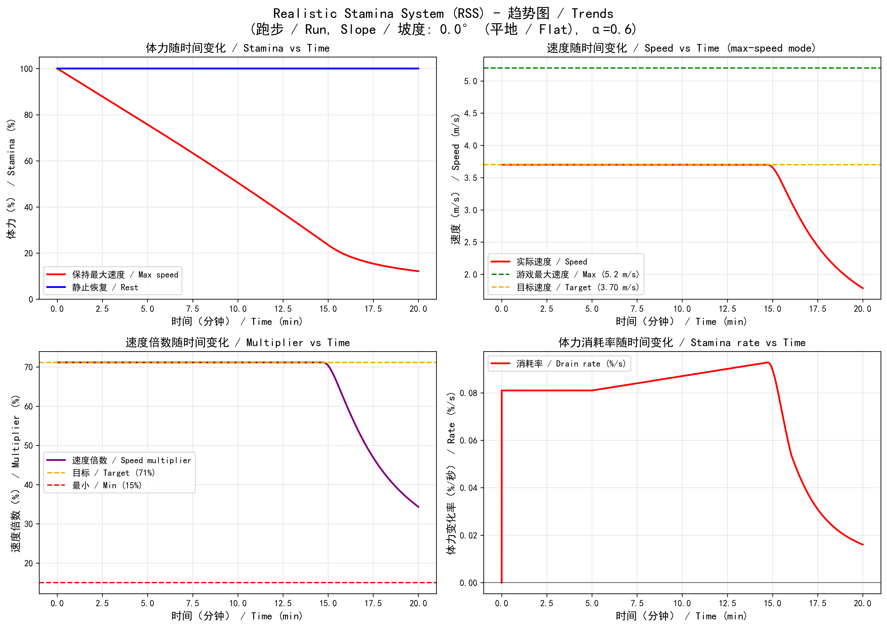

### 2) 综合趋势图 / Comprehensive Trends

以下图表由 `generate_comprehensive_trends.py` 生成，拆分为多个独立图表以便查看：

#### 2.1) 2英里测试 / 2-mile Test


#### 2.2) 不同负重对比 / Load Comparison
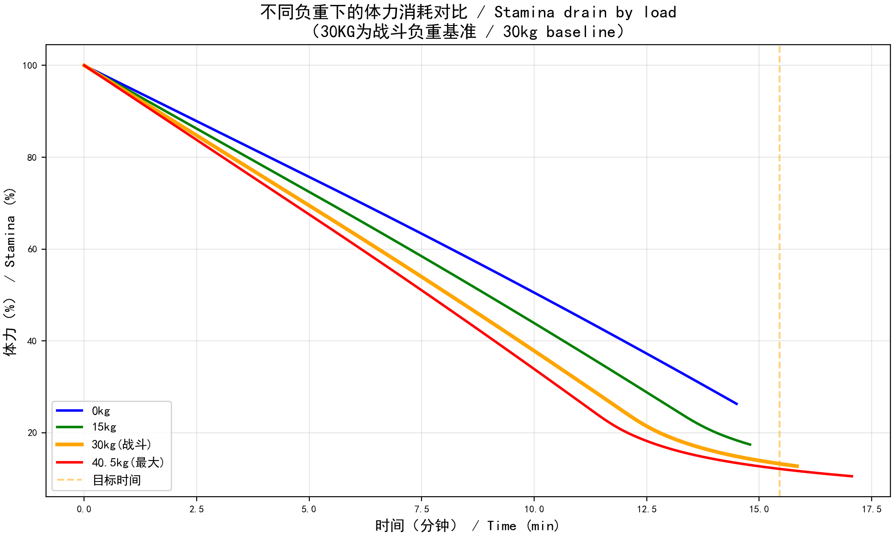

#### 2.3) 移动类型速度对比 / Movement Type Speed
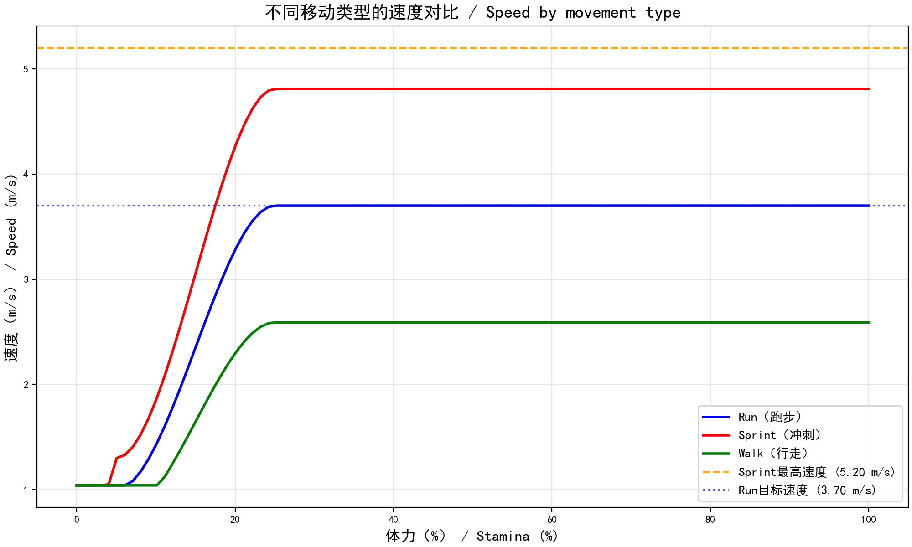

#### 2.4) 恢复速度分析 / Recovery Analysis
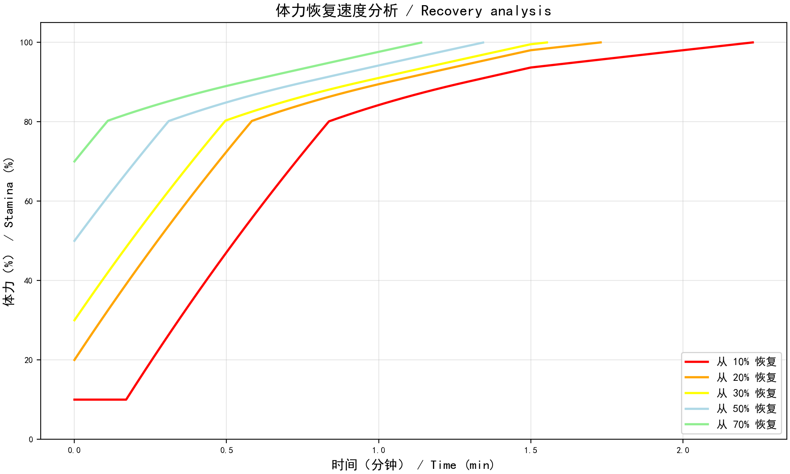

#### 2.5) 2英里测试速度变化 / 2-mile Speed Profile


#### 2.6) 负重对速度的影响 / Load vs Speed Penalty
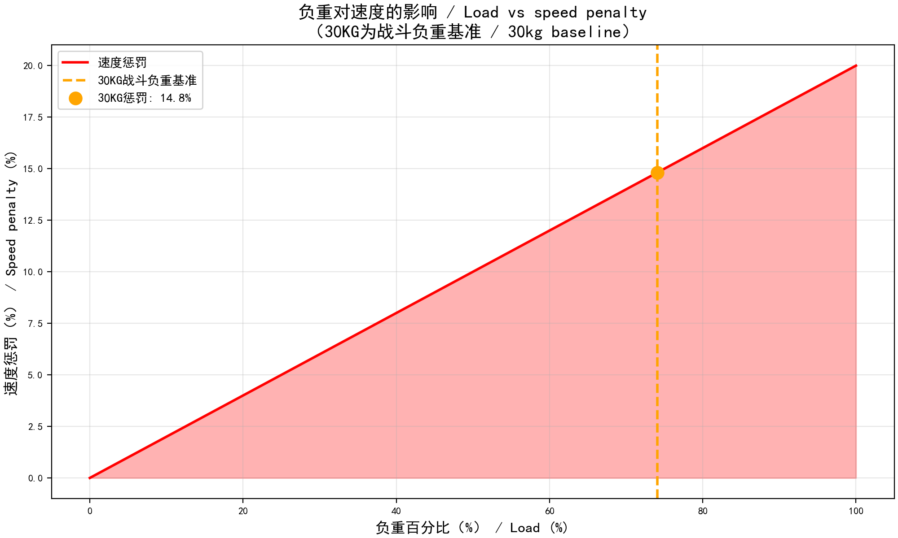

#### 2.7) 多维度对比 / Multi-factor Comparison
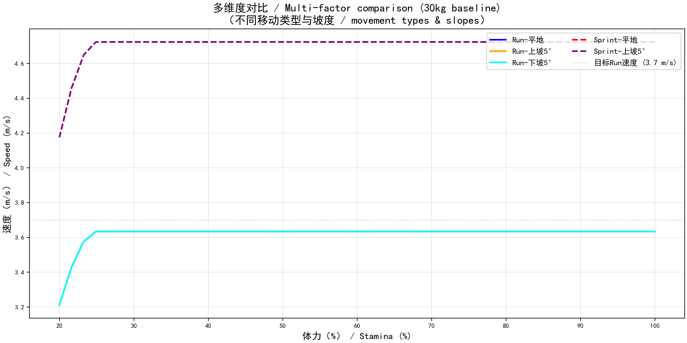

### 3) 多维度分析 / Multi-dimensional Analysis

以下图表由 `multi_dimensional_analysis.py` 生成，拆分为多个独立图表以便查看：

#### 3.1) 不同负重下的2英里测试 / 2-mile Test by Load


#### 3.2) 不同移动类型速度对比 / Speed by Movement Type
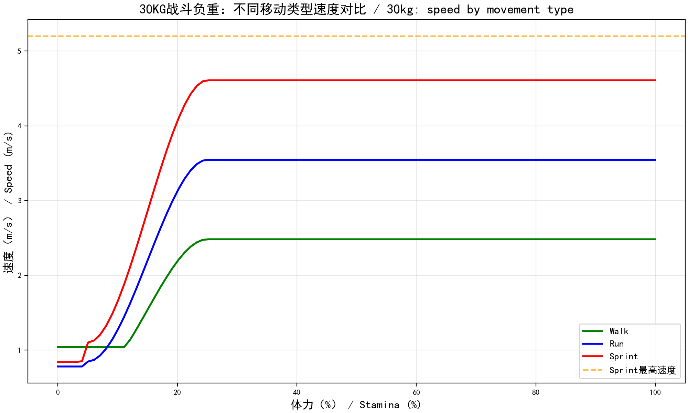

#### 3.3) 不同坡度体力消耗 / Drain by Slope
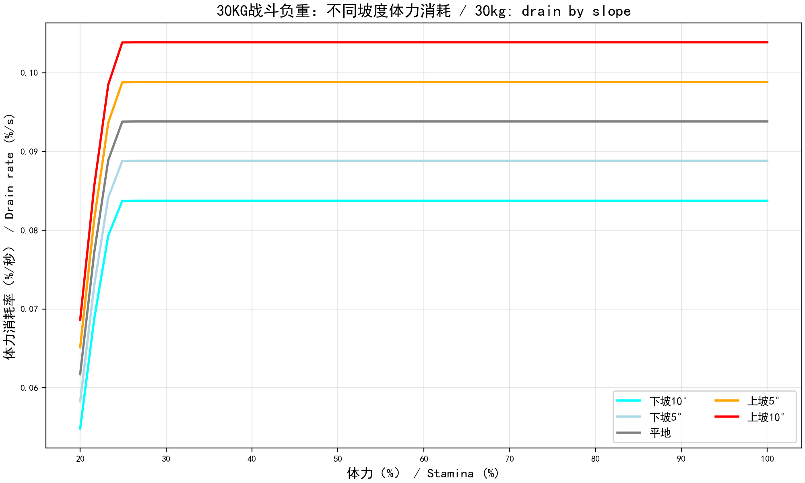

#### 3.4) 不同移动类型&坡度速度对比 / Speed (Types & Slopes)
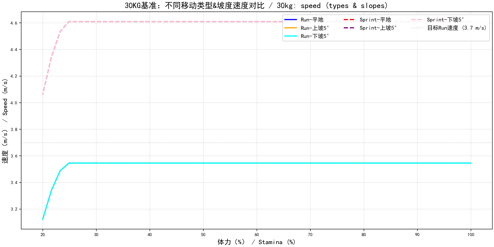

#### 3.5) 不同移动类型&坡度消耗对比 / Drain (Types & Slopes)
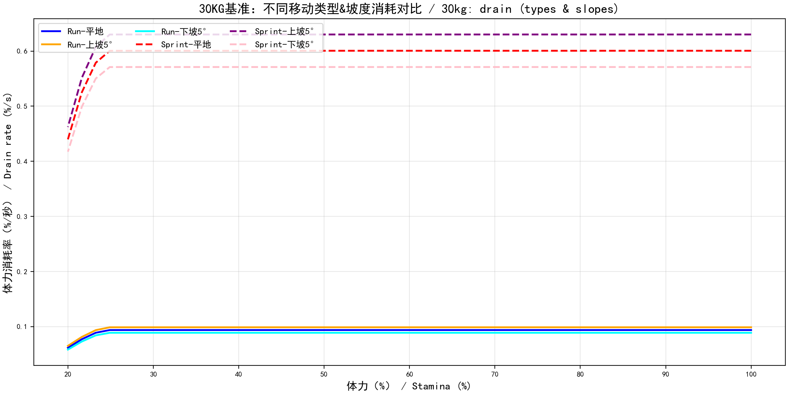

#### 3.6) 不同移动类型2英里测试 / 2-mile by Movement Type
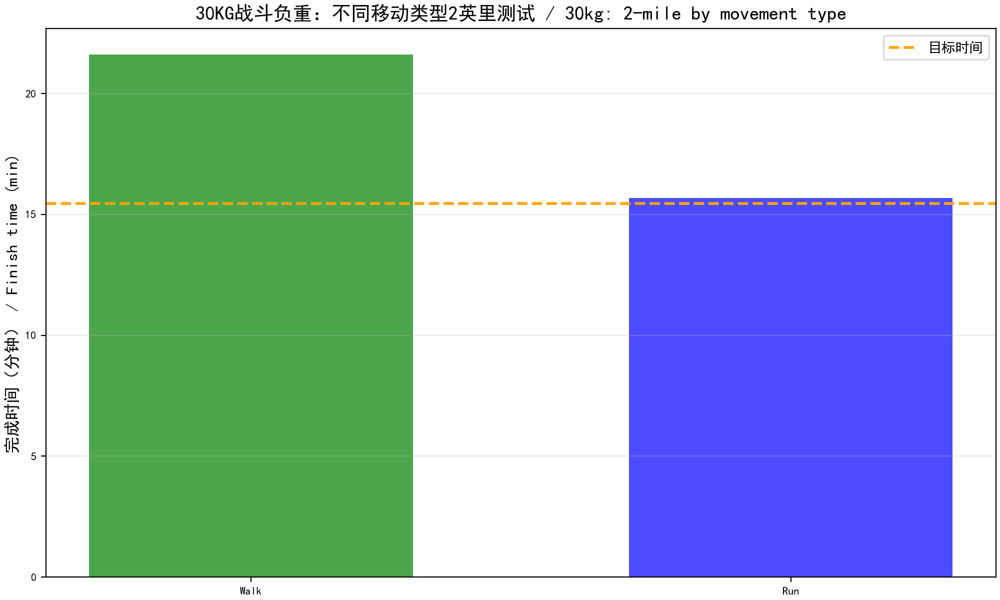

#### 3.7) 不同坡度2英里测试 / 2-mile by Slope
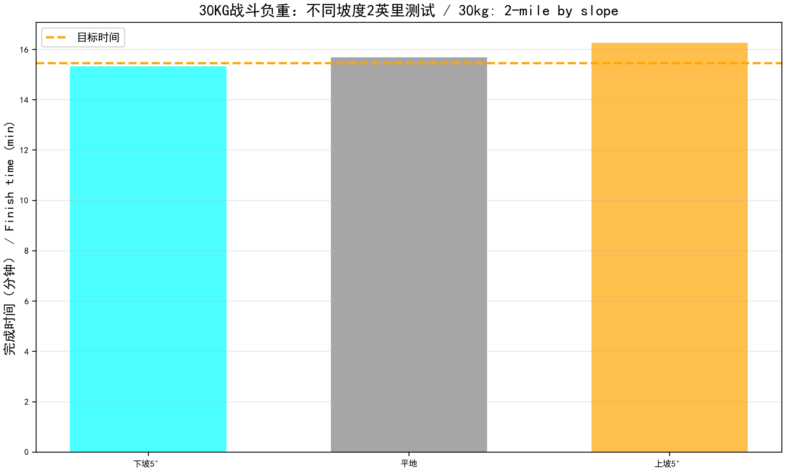

#### 3.8) 速度与消耗率关系 / Speed vs Drain Rate
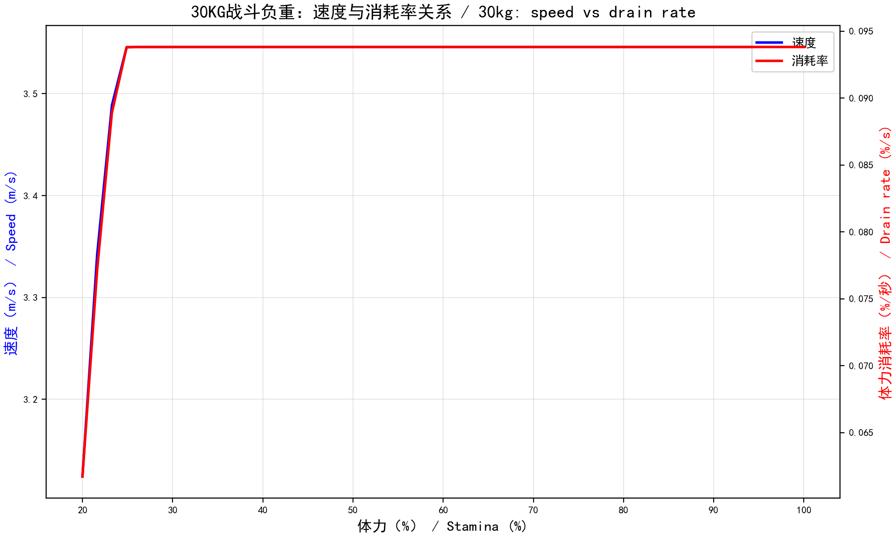

## 技术实现

### 模型架构

本项目采用**精确的医学/生理学模型**，包括：

- **双稳态-应激性能模型**：模拟意志力克服早期疲劳
- **Pandolf 能量消耗模型**：完整的能量消耗计算公式
- **Givoni-Goldman 跑步模型**：跑步时的能量消耗计算
- **Santee 下坡修正模型**：精确处理下坡时的体力消耗
- **坡度自适应目标速度模型**：坡度-速度负反馈机制
- **静态站立消耗模型**：负重下站立时的静态消耗
- **深度生理压制恢复系统**：从"净增加"改为"代谢净值"
- **累积疲劳系统**：长时间运动后，相同速度的消耗逐渐增加
- **代谢适应系统**：根据运动强度动态调整能量效率
- **多维交互模型**：速度、负重、坡度的综合影响
- **游泳体力管理（3D物理模型）**：水平阻力、垂直上浮/下潜功率、静态踩水功率
- **环境因子系统**：热应激、降雨湿重、风阻、泥泞度、气温、地表湿度
- **室内检测系统**：使用建筑物边界框检测角色是否在室内

#### 模型1：双稳态-应激性能模型

**核心概念**：士兵的性能不应是体力的简单幂函数，而应是"意志力维持"与"生理极限崩溃"的结合

**公式**：
```
S(E) = {
    TARGET_RUN_SPEED_MULTIPLIER,  if E ≥ 0.25 (平台期)
    MIN_LIMP_SPEED_MULTIPLIER + (TARGET_RUN_SPEED_MULTIPLIER - MIN_LIMP_SPEED_MULTIPLIER) × smoothstep(t),  if 0.05 ≤ E < 0.25 (平滑过渡期)
    MIN_LIMP_SPEED_MULTIPLIER × (E / 0.05),  if E < 0.05 (生理崩溃期)
}
```

**SmoothStep函数**：
```
smoothstep(t) = t² × (3 - 2t)
其中 t = (E - SMOOTH_TRANSITION_END) / (SMOOTH_TRANSITION_START - SMOOTH_TRANSITION_END)
```

**系数含义**：
- `TARGET_RUN_SPEED = 3.7` m/s：目标Run速度（匹配15:27的2英里配速）
- `TARGET_RUN_SPEED_MULTIPLIER = 0.7115`：目标Run速度倍数（3.7 / 5.2）
- `MIN_LIMP_SPEED_MULTIPLIER = 0.1923`：跛行速度倍数（1.0 / 5.2）
- `SMOOTH_TRANSITION_START = 0.25`：平滑过渡起点（25%体力）
- `SMOOTH_TRANSITION_END = 0.05`：平滑过渡终点（5%体力）
- `MIN_SPEED_MULTIPLIER = 0.15`：最小速度倍数（15%）
- `MAX_SPEED_MULTIPLIER = 1.0`：最大速度倍数（100%）

#### 模型2：Pandolf 能量消耗模型

**公式**：
```
E = M × (基础项 + 坡度项) × η

其中：
基础项 = (2.7 × fitnessBonus) + 3.2 × (V - 0.7)²
坡度项 = G × (0.23 + 1.34 × V²)
fitnessBonus = 1.0 - 0.2 × FITNESS_LEVEL
```

**系数含义**：
- `PANDOLF_BASE_COEFF = 2.7` W/kg：基础代谢系数
- `PANDOLF_VELOCITY_COEFF = 3.2` W/(kg·m²/s²)：速度平方项系数
- `PANDOLF_VELOCITY_OFFSET = 0.7` m/s：速度偏移量
- `PANDOLF_GRADE_BASE_COEFF = 0.23` W/(kg·%)：坡度基础系数
- `PANDOLF_GRADE_VELOCITY_COEFF = 1.34` W·s²/(kg·%·m²)：坡度速度平方项系数
- `FITNESS_LEVEL = 1.0`：健康状态/体能水平（0.0=未训练，1.0=训练有素）
- `ENERGY_TO_STAMINA_COEFF = 0.000035`：能量到体力转换系数
- `REFERENCE_WEIGHT = 90.0` kg：参考体重
- `terrainFactor = η`：地形系数（1.0-3.0，铺装路面=1.0，深雪=2.1-3.0）
- `M`：总重量（身体重量 + 负重）
- `V`：速度（m/s）
- `G`：坡度百分比（正数=上坡，负数=下坡）

#### 模型3：Givoni-Goldman 跑步模型

**公式**：
```
E = G × V^2.2 × M × η

其中：
G = GIVONI_CONSTANT（跑步常数）
```

**系数含义**：
- `GIVONI_CONSTANT = 0.3` W·s^2.2/(kg·m^2.2)：跑步常数
- `GIVONI_VELOCITY_EXPONENT = 2.2`：速度指数（2.0-2.4，2.2为推荐值）
- `M`：总重量（kg）
- `V`：速度（m/s）
- `η`：地形系数

#### 模型4：Santee 下坡修正模型

**公式**：
```
μ = 1.0 - [G × (1 - G/15) / 2]

其中：
G = 坡度百分比（负数=下坡）
μ = 修正系数（<1.0表示消耗增加）
```

**系数含义**：
- `GRADE_DOWNHILL_COEFF = 0.05`：下坡影响系数（每1%下坡减少5%消耗）
- `15`：陡坡阈值（%），超过此值时需要"刹车"
- `2`：分母常数

**应用条件**：仅在速度 ≤ 2.2 m/s 时使用

#### 模型5：坡度自适应目标速度模型

**公式**：
```
adaptationFactor = max(0.6, 1.0 - slopeAngleDegrees × 0.025)
adjustedSpeed = baseTargetSpeed × adaptationFactor

其中：
baseTargetSpeed = 3.7 m/s（目标Run速度）
```

**系数含义**：
- `0.025`：坡度影响系数（每1度坡度降低2.5%速度）
- `0.6`：最小适应因子（最多降低40%速度）
- `slopeAngleDegrees`：坡度角度（度，正数=上坡）

**目的**：模拟现实中人爬坡时自动缩短步幅、降低速度以维持心肺负荷

#### 模型6：静态站立消耗模型

**公式**：
```
E = M × (1.5 + 2.0 × L/M)

其中：
M = 总重量（kg）
L = 负重（kg）
```

**系数含义**：
- `PANDOLF_STATIC_COEFF_1 = 1.5` W/kg：基础静态代谢系数
- `PANDOLF_STATIC_COEFF_2 = 2.0` W/kg：负重静态系数
- `M`：总重量（kg）
- `L`：负重（kg）

**医学解释**：负重下站立时，斜方肌、腰椎和下肢肌肉仍在进行高强度静力收缩

#### 模型7：深度生理压制恢复系统

**核心公式**：
```
最终恢复率 = (基础恢复率 × 姿态修正) - (负重压制 + 氧债惩罚)
```

**7.1 呼吸困顿期（RECOVERY_COOLDOWN）**

**公式**：
```
if (restDuration < 5.0秒):
    恢复率 = 0
```

**系数含义**：
- `RECOVERY_STARTUP_DELAY_SECONDS = 5.0` 秒：恢复启动延迟
- `EPOC_DELAY_SECONDS = 2.0` 秒：EPOC延迟时间
- `EPOC_DRAIN_RATE = 0.001`：EPOC期间的基础消耗率（每0.2秒）

**医学依据**：剧烈运动停止后的前10-15秒，身体处于摄氧量极度不足状态（Oxygen Deficit）

**7.2 负重对恢复的静态剥夺机制（LOAD_RECOVERY_PENALTY）**

**公式**：
```
Penalty = (当前总重 / 身体耐受基准)^2 × 0.0004
```

**系数含义**：
- `LOAD_RECOVERY_PENALTY_COEFF = 0.0004`：负重恢复惩罚系数
- `LOAD_RECOVERY_PENALTY_EXPONENT = 2.0`：负重恢复惩罚指数（平方）
- `BODY_TOLERANCE_BASE = 30.0` kg：身体耐受基准

**测试结果**：
- 0kg负重：站姿恢复约11分钟
- 30kg负重：站姿恢复约20.0分钟（几乎不恢复），趴姿恢复约0.6分钟

**7.3 边际效应衰减机制（MARGINAL_DECAY）**

**公式**：
```
if (体力 > 0.8):
    恢复率 = 原始恢复率 × (1.1 - 当前体力百分比)
```

**系数含义**：
- `MARGINAL_DECAY_THRESHOLD = 0.8`：边际效应衰减阈值（80%体力）
- `MARGINAL_DECAY_COEFF = 1.1`：边际效应衰减系数

**测试结果**：
- 体力80%以下：恢复率正常
- 体力85%以上：恢复率显著降低（约原来的20-25%）

**7.4 最低体力阈值限制（MIN_RECOVERY_STAMINA_THRESHOLD）**

**公式**：
```
if (体力 < 0.2 && 休息时间 < 10.0秒):
    恢复率 = 0
```

**系数含义**：
- `MIN_RECOVERY_STAMINA_THRESHOLD = 0.2`：最低体力阈值（20%）
- `MIN_RECOVERY_REST_TIME_SECONDS = 10.0` 秒：最低体力时需要的休息时间

**7.5 姿态恢复加成**

**公式**：
```
恢复率 = 基础恢复率 × 姿态倍数
```

**系数含义**：
- `STANDING_RECOVERY_MULTIPLIER = 2.0`：站姿恢复倍数（从0.4提升到2.0）
- `CROUCHING_RECOVERY_MULTIPLIER = 1.5`：蹲姿恢复倍数（+50%）
- `PRONE_RECOVERY_MULTIPLIER = 2.2`：趴姿恢复倍数（+120%）

**基础恢复率**：
- `BASE_RECOVERY_RATE = 0.0003`：基础恢复率（每0.2秒恢复0.03%）
- `FITNESS_RECOVERY_COEFF = 0.25`：健康状态恢复系数（训练有素时恢复速度增加25%）

#### 模型8：累积疲劳系统

**公式**：
```
fatigue_factor = 1.0 + 0.015 × max(0, exercise_duration_minutes - 5.0)
```

**系数含义**：
- `FATIGUE_ACCUMULATION_COEFF = 0.015`：疲劳累积系数（每分钟增加1.5%消耗）
- `FATIGUE_START_TIME_MINUTES = 5.0`：疲劳开始累积的时间（分钟）
- `FATIGUE_MAX_FACTOR = 2.0`：最大疲劳因子（消耗最多增加100%）
- `FATIGUE_RECOVERY_DURATION_MINUTES = 20.0`：疲劳完全恢复所需时间（分钟）
- `FATIGUE_RECOVERY_PENALTY = 0.05`：疲劳恢复惩罚系数（最大5%恢复速度减少）

**测试结果**：
- 前5分钟无疲劳累积
- 之后每分钟增加1.5%消耗
- 30分钟后增加45%消耗
- 静止时疲劳快速恢复（恢复速度是累积速度的2倍）

#### 模型9：代谢适应系统

**公式**：
```
if (运动强度 < 0.6):  // 有氧区
    效率因子 = 0.9
elif (运动强度 < 0.8):  // 混合区
    效率因子 = 0.9 + (运动强度 - 0.6) × 1.5
else:  // 无氧区
    效率因子 = 1.2
```

**系数含义**：
- `AEROBIC_THRESHOLD = 0.6`：有氧阈值（60% VO2max）
- `ANAEROBIC_THRESHOLD = 0.8`：无氧阈值（80% VO2max）
- `AEROBIC_EFFICIENCY_FACTOR = 0.9`：有氧区效率因子（90%，更高效）
- `MIXED_EFFICIENCY_FACTOR = 1.0`：混合区效率因子（100%，标准）
- `ANAEROBIC_EFFICIENCY_FACTOR = 1.2`：无氧区效率因子（120%，低效但高功率）

**医学解释**：
- 有氧区（<60% VO2max）：效率高，主要依赖脂肪
- 混合区（60-80% VO2max）：糖原+脂肪混合
- 无氧区（≥80% VO2max）：效率低但功率高，主要依赖糖原

#### 模型10：游泳体力管理（3D物理模型）

**10.1 水平阻力**

**公式**：
```
F_d = 0.5 × ρ × v² × C_d × A
P_d = F_d × v / η_d
```

**系数含义**：
- `SWIMMING_DRAG_COEFFICIENT = 0.5`：阻力系数（C_d）
- `SWIMMING_WATER_DENSITY = 1000.0` kg/m³：水密度（ρ）
- `SWIMMING_FRONTAL_AREA = 0.5` m²：正面面积（A）
- `SWIMMING_DYNAMIC_POWER_EFFICIENCY = 2.0`：动态功率效率因子（η_d）

**10.2 垂直上浮/下潜功率**

**公式**：
```
F_g = 负重 × g × 0.15  // 有效重力
P_up = F_g × v_up / η_up
P_down = F_b × v_down / η_down
```

**系数含义**：
- `SWIMMING_VERTICAL_DRAG_COEFFICIENT = 1.2`：垂直方向阻力系数
- `SWIMMING_VERTICAL_FRONTAL_AREA = 0.8` m²：垂直方向受力面积
- `SWIMMING_EFFECTIVE_GRAVITY_COEFF = 0.15`：水中有效重力系数
- `SWIMMING_BUOYANCY_FORCE_COEFF = 0.10`：浮力对抗系数
- `SWIMMING_VERTICAL_UP_MULTIPLIER = 2.5`：上浮效率惩罚倍数
- `SWIMMING_VERTICAL_DOWN_MULTIPLIER = 1.5`：下潜效率惩罚倍数

**10.3 静态踩水功率**

**公式**：
```
P_static = 25W（维持浮力和基本动作）
```

**系数含义**：
- `SWIMMING_BASE_POWER = 25.0` W：基础游泳功率
- `SWIMMING_MAX_DRAIN_RATE = 0.15`：每秒最大消耗
- `SWIMMING_SURVIVAL_STRESS_POWER = 15.0` W：生存压力常数

**10.4 湿重效应**

**公式**：
```
总湿重 = min(游泳湿重 + 降雨湿重, 10.0 kg)
```

**系数含义**：
- `WET_WEIGHT_DURATION = 30.0` 秒：湿重持续时间
- `WET_WEIGHT_MIN = 5.0` kg：最小湿重（衣服吸水）
- `WET_WEIGHT_MAX = 10.0` kg：最大湿重（完全湿透）
- `ENV_MAX_TOTAL_WET_WEIGHT = 10.0` kg：总湿重上限（游泳+降雨）

#### 模型11：环境因子系统

**11.1 精确降雨强度系统（v2.14.0）**

**公式**：
```
accumulationRate = 0.5 × intensity^1.5
湿重 = min(湿重 + accumulationRate × Δt, 10.0 kg)
```

**系数含义**：
- `ENV_RAIN_INTENSITY_ACCUMULATION_BASE_RATE = 0.5` kg/秒：基础湿重增加速率
- `ENV_RAIN_INTENSITY_ACCUMULATION_EXPONENT = 1.5`：降雨强度指数（非线性增长）
- `ENV_RAIN_INTENSITY_THRESHOLD = 0.01`：降雨强度阈值（低于此值不计算湿重）
- `ENV_RAIN_INTENSITY_HEAVY_THRESHOLD = 0.8`：暴雨阈值（呼吸阻力触发）
- `ENV_RAIN_INTENSITY_BREATHING_PENALTY = 0.05`：暴雨时的无氧代谢增加比例

**11.2 风阻模型（v2.14.0）**

**公式**：
```
windDrag = 0.05 × windSpeed × cos(angle)
消耗修正 = 1.0 + windDrag
```

**系数含义**：
- `ENV_WIND_RESISTANCE_COEFF = 0.05`：风阻系数（体力消耗权重）
- `ENV_WIND_SPEED_THRESHOLD = 1.0` m/s：风速阈值（低于此值忽略）
- `ENV_WIND_TAILWIND_BONUS = 0.02`：顺风时的消耗减少比例
- `ENV_WIND_TAILWIND_SPEED_BONUS = 0.01`：顺风时的速度加成比例

**11.3 路面泥泞度系统（v2.14.0）**

**公式**：
```
mudTerrainFactor = min(积水程度 × 0.4, 0.4)
mudSprintPenalty = 泥泞度 × 0.1（只在Sprint时应用）
滑倒风险 = 0.001 × 泥泞度（每0.2秒）
```

**系数含义**：
- `ENV_MUD_PENALTY_MAX = 0.4`：最大泥泞惩罚（40%地形阻力增加）
- `ENV_MUD_SLIPPERY_THRESHOLD = 0.3`：积水阈值（高于此值触发滑倒风险）
- `ENV_MUD_SPRINT_PENALTY = 0.1`：泥泞时Sprint速度惩罚
- `ENV_MUD_SLIP_RISK_BASE = 0.001`：基础滑倒风险（每0.2秒）

**11.4 实时气温热应激模型（v2.14.0）**

**公式**：
```
if (气温 > 30°C):
    恢复率降低 = (气温 - 30) × 0.02
if (气温 < 0°C):
    恢复率降低 = (0 - 气温) × 0.05
    静态消耗增加 = (0 - 气温) × 0.03
```

**系数含义**：
- `ENV_TEMPERATURE_HEAT_THRESHOLD = 30.0` °C：热应激阈值
- `ENV_TEMPERATURE_HEAT_PENALTY_COEFF = 0.02`：每高1度，恢复率降低2%
- `ENV_TEMPERATURE_COLD_THRESHOLD = 0.0` °C：冷应激阈值
- `ENV_TEMPERATURE_COLD_STATIC_PENALTY = 0.03`：低温时静态消耗增加比例
- `ENV_TEMPERATURE_COLD_RECOVERY_PENALTY = 0.05`：低温时恢复率降低比例

**11.5 地表湿度和静态恢复惩罚（v2.14.0）**

**公式**：
```
if (姿态 == 趴姿 && 地表湿度 > 0.1):
    恢复率降低 = 0.15
```

**系数含义**：
- `ENV_SURFACE_WETNESS_SOAK_RATE = 1.0` kg/秒：趴下时的湿重增加速率
- `ENV_SURFACE_WETNESS_THRESHOLD = 0.1`：积水阈值（高于此值触发湿重增加）
- `ENV_SURFACE_WETNESS_MARGINAL_DECAY_ADVANCE = 0.1`：边际效应衰减提前触发比例
- `ENV_SURFACE_WETNESS_PRONE_PENALTY = 0.15`：湿地趴下时的恢复惩罚

**11.6 热应激系统（v2.10.0）**

**公式**：
```
if (10:00 ≤ 时间 < 14:00):
    热应激倍数 = 1.0 + (时间 - 10) / 4 × 0.3
elif (14:00 ≤ 时间 < 18:00):
    热应激倍数 = 1.3 - (时间 - 14) / 4 × 0.3
else:
    热应激倍数 = 1.0

if (室内):
    热应激倍数 = 热应激倍数 × (1.0 - 0.5)  // 室内豁免50%
```

**系数含义**：
- `ENV_HEAT_STRESS_START_HOUR = 10.0`：热应激开始时间（小时）
- `ENV_HEAT_STRESS_PEAK_HOUR = 14.0`：热应激峰值时间（小时，正午）
- `ENV_HEAT_STRESS_END_HOUR = 18.0`：热应激结束时间（小时）
- `ENV_HEAT_STRESS_MAX_MULTIPLIER = 1.3`：热应激最大倍数（30%消耗增加）
- `ENV_HEAT_STRESS_BASE_MULTIPLIER = 1.0`：热应激基础倍数（无影响）
- `ENV_HEAT_STRESS_INDOOR_REDUCTION = 0.5`：室内热应激减少比例（50%）

**11.7 降雨湿重系统（v2.10.0）**

**公式**：
```
if (降雨强度 < 0.3):
    湿重 = 2.0 kg
elif (降雨强度 < 0.6):
    湿重 = 5.0 kg
else:
    湿重 = 8.0 kg

停止降雨后：湿重逐渐衰减（60秒内完全消失）
```

**系数含义**：
- `ENV_RAIN_WEIGHT_MIN = 2.0` kg：小雨时的湿重
- `ENV_RAIN_WEIGHT_MAX = 8.0` kg：暴雨时的湿重
- `ENV_RAIN_WEIGHT_DURATION = 60.0` 秒：停止降雨后湿重持续时间
- `ENV_RAIN_WEIGHT_DECAY_RATE = 0.0167`：每秒衰减率（60秒内完全消失）

#### 模型12：室内检测系统（v2.10.0/v2.14.1）

**v2.10.0：向上射线检测**

**公式**：
```
向上射线检测10米，判断是否有遮蔽物
```

**系数含义**：
- `ENV_INDOOR_CHECK_HEIGHT = 10.0` 米：向上检测高度（判断是否有屋顶）

**v2.14.1：建筑物边界框检测**

**公式**：
```
if (角色X在边界框内 && 角色Y在边界框内 && 角色Z在边界框内):
    室内 = true
else:
    室内 = false
```

**局限性**：边界框可能包含建筑物周围的空间，导致角色在建筑物附近室外时被误判为室内

**性能**：每秒检测一次

#### 模型13：姿态修正系统

**公式**：
```
消耗修正 = 姿态倍数
```

**系数含义**：
- `POSTURE_STAND_MULTIPLIER = 1.0`：站立行走消耗倍数（基准）
- `POSTURE_CROUCH_MULTIPLIER = 1.8`：蹲姿行走消耗倍数（1.6-2.0倍，取1.8）
- `POSTURE_PRONE_MULTIPLIER = 3.0`：匍匐爬行消耗倍数（与中速跑步相当）

### 实现方式

- 使用 `modded class SCR_CharacterStaminaComponent` 扩展体力组件
- 使用 `modded class SCR_CharacterControllerComponent` 显示状态信息
- 通过 `OverrideMaxSpeed(fraction)` 动态设置最大速度倍数
- 每 0.2 秒更新一次速度，确保实时响应体力变化
- **使用精确的数学模型**：所有计算都基于精确的数学函数，不使用近似
- **使用完整的 [Pandolf 模型](https://journals.physiology.org/doi/abs/10.1152/jappl.1977.43.4.577)**：始终使用 Pandolf 能量消耗模型（包含坡度项）
- **限制**：只处理陆地移动（Walk/Run/Sprint），游泳时的体力管理是空白的（未来开发方向）

### 速度计算逻辑

#### 1. 体力-速度关系模型（双稳态-应激性能模型）

基于双稳态-应激性能模型（Dual-State Stress Performance Model）：
- **平台期（25%-100%体力）**：保持恒定目标速度（3.7 m/s），模拟意志力克服早期疲劳
- **衰减期（0%-25%体力）**：速度平滑下降到跛行速度，使用SmoothStep过渡（25%-5%缓冲区）

**目标速度倍数**：
- 目标Run速度：3.7 m/s（游戏倍率约 0.7115）
- 游戏最大速度：5.2 m/s
- 体力指数（α）：0.6（基于医学文献）

**精确计算结果**（无负重，双稳态模型）：
- 100%-25% 体力：71.15% 速度（3.7 m/s，平台期恒定）
- 25%-5% 体力：平滑过渡到跛行速度
- 5%-0% 体力：19.23% 速度（1.0 m/s，跛行）

**技术实现**：
- 使用双稳态-应激性能模型，而非简单的幂函数
- 体力>25%时保持恒定目标速度（意志力平台期）
- 体力<25%时使用SmoothStep函数实现平滑过渡
- 避免突兀的"撞墙"效果，提供渐进式速度下降

#### 2. 负重影响系统（精确非线性模型）

基于 US Army 背包负重实验数据（Knapik et al., 1996）：

**精确数学模型**：
**速度惩罚 = β × (负重百分比)^γ**

其中：
- β = 0.20（负重速度惩罚系数）
- γ = 1.0（负重影响指数，线性）
- 负重百分比 = 当前重量 / 40.5 kg

**配置参数**：
- **最大负重**：40.5 kg（角色可以携带的最大重量）
- **战斗负重**：30.0 kg（战斗状态下的推荐负重阈值）
- **最大速度惩罚**：20%（当负重达到最大负重时）
- **战斗负重状态**：当负重超过 30 kg 时，可能影响战斗表现

**技术实现**：使用精确的幂函数计算，不使用线性近似

#### 3. 体力消耗模型（混合模型：Pandolf + Givoni-Goldman）

**使用混合模型**（根据速度阈值选择不同的能量消耗模型）：

**速度阈值（m/s）**：
- Sprint阈值：5.2 m/s
- Run阈值：3.7 m/s（匹配15:27的2英里配速）
- Walk阈值：3.2 m/s
- 跑步/步行分界：2.2 m/s（用于选择模型）
- 恢复阈值：2.5 m/s（空载时恢复体力）
- 消耗阈值：1.5 m/s（负重30kg时开始消耗体力）

**模型选择**：
- **速度 > 2.2 m/s**（Run/Sprint）：使用 Givoni-Goldman 跑步模型
- **速度 ≤ 2.2 m/s**（Walk）：使用 Pandolf 步行模型
- **速度 < 0.1 m/s**（Idle）：使用静态站立消耗模型

**Givoni-Goldman 跑步模型**（速度 > 2.2 m/s）：
- 公式：`E = G × V^2.2`
- 其中：
  - E = 能量消耗率（W/kg）
  - V = 速度（m/s）
  - G = 跑步常数
- 特点：跑步效率比步行低，消耗随速度指数剧增

**Pandolf 步行模型**（速度 ≤ 2.2 m/s）：
- **公式**：`E = M·(2.7 + 3.2·(V-0.7)² + G·(0.23 + 1.34·V²)) · η`
- **其中**：
  - E = 能量消耗率（W/kg）
  - M = 总重量（身体重量 + 负重）
  - V = 速度（m/s）
  - G = 坡度（坡度百分比，正数=上坡，负数=下坡）
  - η = 地形系数（1.0-3.0）
- **特点**：包含坡度项，地形系数直接影响消耗
- **参考文献**：Pandolf, K. B., Givoni, B. A., & Goldman, R. F. (1977). Predicting energy expenditure with loads while standing or walking very slowly. *Journal of Applied Physiology*, 43(4), 577-581.

**静态站立消耗模型**（速度 < 0.1 m/s）：
- 公式：`E = M·(1.5 + 2.0·L/M)`
- 其中：
  - E = 能量消耗率（W/kg）
  - M = 总重量（kg）
  - L = 负重（kg）
- 特点：负重下站立时，斜方肌、腰椎和下肢肌肉仍在进行高强度静力收缩

**能量到体力转换**：
- 转换系数：0.000035
- 限制：最多每秒消耗5%（0.05）

**注意**：消耗率不是固定的，而是根据速度、负重、坡度、地形等因素动态计算

**注意**：由于几乎没有完全平地的地形，系统始终使用包含坡度的完整 Pandolf 模型

#### 4. 跳跃和翻越体力消耗（v2.6.0优化）

**跳跃体力消耗**：
- 基础消耗：3.5%（v2.6.0优化）
- 连续跳跃惩罚（无氧欠债）：2秒内连续跳跃，每次额外增加50%消耗
  - 第一次跳：3.5%，第二次跳：5.25%，第三次跳：7.0%
  - 有效防止"兔子跳"战术滥用
- 冷却机制：3秒冷却时间（15个更新周期），防止重复触发
- 低体力禁用：体力 < 10% 时禁用跳跃（肌肉在力竭时无法提供爆发力）
- 检测方式：使用动作监听器直接检测"Jump"输入动作

**翻越/攀爬体力消耗**：
- 初始消耗：2%（v2.6.0优化）
- 持续消耗：每秒1%（每0.2秒0.002）
- 冷却机制：5秒内视为同一个翻越动作，不会重复消耗初始体力
- 检测方式：`IsClimbing()` 返回true

#### 5. Sprint机制（v2.6.0优化）

**Sprint速度计算**：
- Sprint速度 = Run速度 × 1.30（v2.6.0优化，比Run快30%）
- Sprint完全基于Run的完整逻辑（双稳态-平台期、5秒阻尼过渡等）
- 最高速度限制：100%（游戏最大速度5.2 m/s）
- 仍然受体力和负重限制
- **效果**：满体力、无负重时，Sprint速度 = 5.2 m/s（100%）

**Sprint体力消耗**：
- Sprint消耗 = 0.480 pts/s（基于速度阈值系统）
- Sprint消耗 = Run消耗 × 6.4倍（0.480 / 0.075）
- Sprint消耗倍数常量：3.0倍（注意：实际消耗倍数为6.4倍，常量定义与实际计算存在差异）
- 基于医学研究：Sprint时的能量消耗约为Run的3-5倍
- 确保玩家不能长时间使用Sprint，只能作为战术爆发

**Sprint特点**：
- 速度比Run快30%（v2.6.0优化），适合短距离冲刺
- 体力消耗大幅增加（6.4倍），不适合长时间使用
- 只有在满体力、无负重时才能达到最高速度
- Sprint阈值：5.2 m/s（游戏最大速度）

#### 7. 坡度自适应目标速度模型

**坡度-速度负反馈机制**：
- 问题分析：现实中人爬坡时，会自动缩短步幅、降低速度以维持心肺负荷（体力消耗）
- 解决方案：实施"坡度-速度负反馈"，当上坡角度增加时，系统自动略微下调当前的"目标速度"
- 公式：`adaptationFactor = max(0.6, 1.0 - (slopeAngleDegrees × 0.025))`
- 效果：10度坡时，速度会降到约 3.7 × 0.75 = 2.775 m/s
- 目的：虽然慢了，但体力能多撑一倍时间

#### 8. Santee 下坡修正模型

**精确处理下坡时的体力消耗**：
- 公式：`μ = 1.0 - [G·(1 - G/15)/2]`
- 特点：缓下坡（-5%）消耗减少约 2-3%，陡下坡（-15%+）消耗回升
- 原因：超过 -15% 时需"刹车"，消耗增加
- 应用：仅在速度 ≤ 2.2 m/s 时使用

#### 9. 深度生理压制恢复系统（v2.13.0）

**从"净增加"改为"代谢净值"**：
- 最终恢复率 = (基础恢复率 × 姿态修正) - (负重压制 + 氧债惩罚)

**呼吸困顿期（RECOVERY_COOLDOWN）**：
- 停止运动后5秒内系统完全不处理恢复
- 医学依据：剧烈运动停止后的前10-15秒，身体处于摄氧量极度不足状态（Oxygen Deficit）

**负重对恢复的静态剥夺机制（LOAD_RECOVERY_PENALTY）**：
- 惩罚公式：`Penalty = (当前总重 / 身体耐受基准)^2 × 0.0004`
- 身体耐受基准：30.0 kg
- 战术意图：强迫重装兵必须趴下（通过姿态加成抵消负重扣除）

**边际效应衰减机制（MARGINAL_DECAY）**：
- 当体力>80%时，恢复率 = 原始恢复率 × (1.1 - 当前体力百分比)
- 战术意图：玩家经常会处于80%-90%的"亚健康"状态

**最低体力阈值限制（MIN_RECOVERY_STAMINA_THRESHOLD）**：
- 体力<20%时，必须静止10秒后才允许开始回血
- 战术意图：防止玩家在极度疲劳时通过"跑两步停一下"快速回血

**姿态恢复加成**：
- 站姿恢复倍数：2.0
- 蹲姿恢复倍数：1.5
- 趴姿恢复倍数：2.2

#### 10. 累积疲劳系统

**长时间运动后，相同速度的消耗逐渐增加**：
- 疲劳因子：`fatigue_factor = 1.0 + 0.015 × max(0, exercise_duration_minutes - 5.0)`
- 前5分钟无疲劳累积，之后每分钟增加1.5%消耗
- 最大疲劳因子：2.0（消耗最多增加100%）
- 静止时疲劳快速恢复（恢复速度是累积速度的2倍）

#### 11. 代谢适应系统

**根据运动强度动态调整能量效率**：
- 有氧区（<60% VO2max）：效率因子0.9（更高效）
- 混合区（60-80% VO2max）：效率因子0.9→1.2（线性插值）
- 无氧区（≥80% VO2max）：效率因子1.2（低效但高功率）

#### 12. 游泳体力管理（3D物理模型，v2.9.0）

**3D物理阻力/浮力模型**：
- 水平阻力：`F_d = 0.5 × ρ × v² × C_d × A`
- 垂直上浮功率：`P_up = F_g × v_up / η_up`
- 垂直下潜功率：`P_down = F_b × v_down / η_down`
- 静态踩水功率：25W（维持浮力和基本动作）

**湿重效应**：
- 负重阈值：25.0 kg（超过此重量时静态消耗大幅增加）
- 湿重持续时间：30秒（上岸后）
- 湿重范围：5-10 kg

#### 13. 环境因子系统（v2.10.0/v2.14.0）

**精确降雨强度系统（v2.14.0）**：
- 降雨强度范围：0.0-1.0（0%-100%）
- 湿重计算：`accumulationRate = 0.5 × intensity^1.5`
- 暴雨呼吸阻力：强度 > 80% 时触发，增加无氧代谢消耗

**风阻模型（v2.14.0）**：
- 风阻系数：`windDrag = 0.05 × windSpeed × cos(angle)`
- 顺风时减少消耗，逆风时增加消耗

**路面泥泞度系统（v2.14.0）**：
- 泥泞地形系数：最大40%地形阻力增加
- 泥泞Sprint惩罚：只在Sprint时应用（速度 ≥ 5.2 m/s）
- 滑倒风险：基于泥泞度计算（每0.2秒滑倒概率）

**实时气温热应激模型（v2.14.0）**：
- 热应激阈值：30°C（高于此值恢复率降低2%/度）
- 冷应激阈值：0°C（低于此值恢复率降低5%/度，静态消耗增加3%/度）

**地表湿度和静态恢复惩罚（v2.14.0）**：
- 只在趴姿（stance==2）时计算地表湿度惩罚
- 湿地趴下时恢复率降低15%

**热应激系统（v2.10.0）**：
- 10:00-14:00 逐渐增加，14:00-18:00 逐渐减少
- 峰值（14:00）时体力消耗增加30%
- 室内豁免：在室内时热应激减少50%

#### 14. 室内检测系统（v2.10.0/v2.14.1）

**建筑物边界框检测（v2.14.1）**：
- 检测逻辑：检查角色位置是否在建筑物的世界坐标边界框内（X、Y、Z 三个坐标都在范围内）
- 性能：使用边界框检测性能优秀，每秒检测一次
- 局限性：边界框可能包含建筑物周围的空间，导致角色在建筑物附近室外时被误判为室内

#### 15. 姿态修正系统

**不同姿态对体力的消耗不同**：
- 站立行走消耗倍数：1.0（基准）
- 蹲姿行走消耗倍数：1.8
- 匍匐爬行消耗倍数：3.0（与中速跑步相当）

```
Run速度 = 基础速度倍数（根据体力，双稳态模型） × (1 - 负重惩罚（精确计算）)
Sprint速度 = Run速度 × 1.30（v2.6.0优化，限制在100%）
Walk速度 = Run速度 × 0.7（限制在80%）
最终速度限制在 20%-100% 之间
```

**计算流程**（基于速度阈值系统）：
1. 确定移动类型和速度阈值：
   - Idle：0.0 m/s
   - Walk：≤ 3.2 m/s
   - Run：≤ 3.7 m/s
   - Sprint：≤ 5.2 m/s
2. 计算基础速度倍数：根据体力使用双稳态-应激性能模型
   - 体力>25%：恒定目标速度（3.7 m/s，游戏倍率0.7115）
   - 体力<25%：使用SmoothStep平滑过渡到跛行速度（1.0 m/s）
3. 计算负重惩罚：`P_enc = 0.20 × (W/40.5)^1.0`（W 为当前重量）
4. 根据移动类型调整：
   - Run：`S_final = S_run × (1 - P_enc)`
   - Sprint：`S_final = (S_run × 1.30)`（限制在100%）
   - Walk：`S_final = S_run × 0.7`（限制在80%）
   - Idle：`S_final = 0.0`
5. 应用限制：`S_final = clamp(S_final, 0.20, 1.0)`

**体力标准参考**：本模组的体力标准引用自 **ACFT (Army Combat Fitness Test)** 美国陆军战斗体能测试中22-26岁男性2英里测试100分用时15分27秒。

**优化目标**：2英里（3218.7米）在15分27秒（927秒）内完成

### 关键参数

**体力系统参数：**
- `STAMINA_THRESHOLD_HIGH = 0.75`：高体力阈值（75%）
- `STAMINA_THRESHOLD_MED = 0.50`：中等体力阈值（50%）
- `STAMINA_THRESHOLD_LOW = 0.25`：低体力阈值（25%）
- `WILLPOWER_THRESHOLD = 0.25`：意志力平台期阈值（25%）

**速度倍数：**
- `TARGET_RUN_SPEED = 3.7`：目标Run速度（m/s，匹配15:27的2英里配速）
- `TARGET_RUN_SPEED_MULTIPLIER = 0.7115`：目标Run速度倍数（3.7 / 5.2）
- `MIN_LIMP_SPEED_MULTIPLIER = 0.1923`：跛行速度倍数（1.0 / 5.2）

**更新频率：**
- 速度更新间隔：200 毫秒（0.2 秒）
- 状态显示间隔：1000 毫秒（1 秒）
- 环境因子检测间隔：5000 毫秒（5 秒）

## 系统特性

### 体力-速度关系

系统会根据体力百分比动态调整速度，实现以下效果：

1. **体力充沛时（75-100%）**：
   - 速度倍数：71.15%（恒定，3.7 m/s）
   - 几乎不影响移动速度（意志力平台期）
   - 适合长时间奔跑

2. **体力中等时（50-75%）**：
   - 速度倍数：71.15%（恒定，3.7 m/s）
   - 仍保持目标速度（意志力平台期）
   - 开始感到疲劳

3. **体力偏低时（25-50%）**：
   - 速度倍数：71.15%（恒定，3.7 m/s）
   - 仍保持目标速度（意志力平台期）
   - 需要休息恢复体力

4. **精疲力尽时（0%-25%）**：
   - 速度倍数：71.15% → 19.23%（平滑过渡到跛行速度）
   - 严重影响移动速度（使用SmoothStep平滑过渡）
   - 强烈建议休息

### 负重-速度关系

负重系统会根据携带物品的重量影响移动速度：

- **无负重（0 kg）**：无影响
- **轻度负重（0-15 kg）**：轻微影响，速度减少 < 7.5%
- **中度负重（15-30 kg）**：明显影响，速度减少 7.5-15%
- **战斗负重阈值（30 kg）**：达到战斗负重阈值，可能影响战斗表现
- **重度负重（30-40.5 kg）**：严重影响，速度减少 15-20%
- **最大负重（40.5 kg）**：达到最大负重，速度最多减少 20%

### 移动类型系统

系统支持四种陆地移动类型，每种类型有不同的速度特性和体力消耗：

#### 1. Idle（静止）
- **速度倍数**：0.0（完全静止）
- **体力消耗**：无（静止时恢复体力）
- **适用场景**：站立、蹲伏、休息

#### 2. Walk（行走）
- **速度倍数**：Run速度 × 0.7（约为Run的70%）
- **速度限制**：20% - 80%
- **体力消耗**：低（基础消耗 + 速度相关消耗）
- **适用场景**：正常移动、探索、节省体力

#### 3. Run（跑步）
- **速度倍数**：基础速度 × (1 - 负重惩罚)
- **速度限制**：20% - 100%
- **体力消耗**：中等（基于Pandolf模型）
- **适用场景**：正常行军、长距离移动
- **速度计算**：
  - 基础速度 = 目标速度倍数 × 体力^0.6
  - 最终速度 = 基础速度 × (1 - 负重惩罚)
  - 例如：满体力、无负重时，Run速度 = 4.78 m/s（92%）

#### 4. Sprint（冲刺）（v2.6.0优化）
- **速度倍数**：Run速度 × 1.30（v2.6.0优化，比Run快30%）
- **速度限制**：20% - 100%（最高速度 = 游戏最大速度5.2 m/s）
- **体力消耗**：高（Run消耗 × 3.0倍，v2.6.0优化）
- **适用场景**：追击、逃命、短距离冲刺
- **速度计算**（统一增量模型）：
  - Sprint速度 = Run速度 × (1 + 30%)（v2.6.0优化）
  - Sprint完全基于Run的完整逻辑（双稳态-平台期、5秒阻尼过渡等）
  - Sprint负重惩罚系数：0.15（Run为0.2），模拟爆发力克服阻力
  - 例如：Run速度80%时，Sprint速度 = 104%（限制在100%）
  - 28KG负重下，Run 3.6 m/s vs Sprint 4.7 m/s（差距 1.1 m/s）
  - 最高速度限制在5.2 m/s（基于现实情况：一般健康成年人的Sprint速度约20-30 km/h）
- **特点**：
  - 速度比Run快30%（v2.6.0优化），确保在任何负重状态下都有明显差距
  - 体力消耗大幅增加（3.0倍），不适合长时间使用
  - 确保在任何负重和体力状态下，Sprint都比Run快30%的固定阶梯
  - 只有在满体力、无负重时才能达到最高速度

**移动类型对比表**：

| 移动类型 | 速度倍数（相对于Run） | 最高速度限制 | 体力消耗倍数 | 适用场景 |
|---------|---------------------|------------|------------|---------|
| Idle | 0.0 | - | 0（恢复） | 静止、休息 |
| Walk | 0.7 | 80% | 0.8 | 正常移动、探索 |
| Run | 1.0 | 100% | 1.0 | 正常行军、长距离 |
| Sprint | 1.30（v2.6.0优化） | 100% | 6.4（v2.6.0优化） | 追击、逃命、短距离 |

### 状态显示

系统每秒输出一次状态信息，格式如下：

```
[RealisticSystem] 移动速度: 4.2 m/s | 体力: 65% | 速度倍率: 88% | 类型: Run | 坡度: 3.5° (上坡)
```

显示内容：
- **移动速度**：上一秒的水平移动速度（米/秒）
- **体力**：当前体力百分比（0-100%）
- **速度倍率**：当前速度倍数（相对于标准速度的百分比）
- **类型**：当前移动类型（Idle/Walk/Run/Sprint）
- **坡度**：当前移动坡度角度和方向（仅在坡度有意义时显示）

### 调试信息

系统每5秒输出一次详细调试信息（仅在客户端），格式如下：

```
[RealisticSystem] 调试: 类型=Sprint | 体力=100% | 基础速度倍数=0.92 | 负重惩罚=0.1 | 最终速度倍数=0.95 | 坡度=5.0% | 坡度: 5.0° (上坡) | Sprint消耗倍数: 2.5x | 负重: 15kg/40.5kg (最大:40.5kg, 战斗:30kg)
```

调试信息包含：
- **类型**：当前移动类型
- **体力**：当前体力百分比
- **基础速度倍数**：根据体力计算的基础速度倍数
- **负重惩罚**：负重对速度的影响
- **最终速度倍数**：考虑所有因素后的最终速度倍数
- **坡度**：坡度百分比（坡度已整合在Pandolf模型中）
- **坡度信息**：坡度角度和方向（仅在坡度有意义时显示）
- **Sprint消耗倍数**：Sprint时的体力消耗倍数（仅在Sprint时显示）
- **负重信息**：当前重量、最大重量、战斗负重阈值和状态

## 安装方法

1. 将整个 `RealisticStaminaSystem` 文件夹复制到 Arma Reforger 工作台的 `addons` 目录
2. 在 Arma Reforger 工作台中打开项目
3. 编译模组
4. 在游戏中选择并启用此模组

## 使用方法

1. 启动游戏并加载模组
2. 系统会自动监控体力值和负重
3. 移动速度会根据体力百分比和负重自动调整
4. 状态信息会每秒一次输出到控制台，格式如下：
   ```
   [RealisticSystem] 移动速度: 4.2 m/s | 体力: 65% | 速度倍率: 88%
   ```

## 调整系统参数

### 修改体力分段速度

编辑 `scripts/Game/Components/Stamina/SCR_RealisticStaminaSystem.c` 文件：

```c
// 速度倍数（根据体力百分比）
protected const float SPEED_MULTIPLIER_FULL = 1.0;      // 100%体力：100%速度
protected const float SPEED_MULTIPLIER_HIGH = 0.95;     // 75-100%体力：95%速度
protected const float SPEED_MULTIPLIER_MED = 0.85;      // 50-75%体力：85%速度
protected const float SPEED_MULTIPLIER_LOW = 0.70;      // 25-50%体力：70%速度
protected const float SPEED_MULTIPLIER_EXHAUSTED = 0.55; // 0-25%体力：55%速度
```

### 修改负重影响

编辑 `scripts/Game/Components/Stamina/SCR_RealisticStaminaSystem.c` 文件：

```c
protected const float ENCUMBRANCE_SPEED_INFLUENCE = 0.3; // 负重对速度的影响系数（最多30%）
```

### 修改更新频率

编辑 `scripts/Game/Components/Stamina/SCR_RealisticStaminaSystem.c` 文件：

```c
// 启动定期更新（每0.2秒更新一次速度）
GetGame().GetCallqueue().CallLater(UpdateSpeedBasedOnStamina, 200, false);
```

修改 `200` 为其他值（单位：毫秒）可以调整更新频率。

## 系统优势

### 拟真体验

- **动态响应**：速度随体力实时变化，更真实
- **平滑过渡**：体力变化时速度平滑过渡，避免突兀
- **综合影响**：同时考虑体力和负重，更全面

### 游戏平衡

- **战略考虑**：需要管理体力和负重
- **资源管理**：携带物品需要权衡重量和速度
- **战术选择**：体力管理影响战术决策

## 已知问题与限制

### 当前限制

- **状态显示**：目前仅输出到控制台，尚未实现游戏内 UI 显示
- **速度限制**：速度倍数值大于 1.0 时会被引擎限制为 1.0（无法超过标准速度）
- **游泳体力管理**：✅ **已实现（v2.9.0）**
  - 游泳时的体力管理已完整实现
  - 游泳的能量消耗远高于陆地移动（约4倍）
  - 使用 `IsSwimming()` 检测游泳状态
  - 根据游泳速度和负重计算体力消耗
  - 游泳时负重影响更大（1.5倍陆地影响）
  - 游泳速度对消耗的影响更明显（速度平方项）

## 开发说明

### 编译要求

- Arma Reforger 工作台
- EnforceScript 编译器

### 代码结构

**`scripts/Game/Components/Stamina/SCR_RealisticStaminaSystem.c`** - 体力-速度系统核心：
- `Pow()`: 精确计算幂函数（使用牛顿法，不使用近似）
- `CalculateSpeedMultiplierByStamina()`: 根据体力百分比精确计算速度倍数（S = 0.920 × E^0.6）
- `CalculateEncumbranceSpeedPenalty()`: 精确计算负重对速度的影响（P = 0.40 × (W/40.5)^1.0）
- `CalculateActionCost()`: 计算爆发性动作的体力消耗（v2.6.0新增）
  - 使用动态负重倍率：`实际消耗 = 基础消耗 × (currentWeight / 90.0) ^ 1.5`
  - 用于跳跃和翻越动作的消耗计算
- `CalculateEncumbrancePercent()`: 计算负重百分比
- `CalculateCombatEncumbrancePercent()`: 计算战斗负重百分比
- `IsOverCombatEncumbrance()`: 检查是否超过战斗负重阈值

**`scripts/Game/Components/Stamina/SCR_StaminaOverride.c`** - 体力系统覆盖：
- `OnStaminaDrain()`: 覆盖体力变化事件，拦截原生系统修改
- `SetTargetStamina()`: 设置目标体力值（唯一允许的修改方式）
- `MonitorStamina()`: 主动监控机制（每50ms检查一次）
- `CorrectStaminaToTarget()`: 纠正体力值到目标值

**`scripts/Game/PlayerBase.c`** - 主控制器组件：
- `OnInit()`: 初始化控制器组件，获取体力组件引用，禁用原生体力系统
- `UpdateSpeedBasedOnStamina()`: 根据体力、负重、移动类型和坡度精确更新速度（每0.2秒）
  - 检测移动类型（Idle/Walk/Run/Sprint）
  - 检测跳跃和翻越动作，应用额外体力消耗（v2.6.0优化：动态负重倍率、连续跳跃惩罚、冷却机制）
  - 计算坡度影响，调整体力消耗
  - 计算Sprint额外消耗（3.0倍，v2.6.0优化）
  - 实现Sprint统一增量模型（v2.6.0优化）：基于Run速度加乘，确保30%固定阶梯
  - 实现趴下休息负重优化（v2.6.0）：使用`ECharacterStance.PRONE`检测姿态
- `CollectSpeedSample()`: 每秒采集一次速度样本
- `DisplayStatusInfo()`: 显示速度、体力、速度倍率、移动类型和坡度信息

**精确体力消耗模型**（完整的 Pandolf 模型，包含健康状态、累积疲劳和代谢适应）：
- **完整 Pandolf 公式**：`E = M·(2.7 + 3.2·(V-0.7)² + G·(0.23 + 1.34·V²))`
  - E = 能量消耗率（W/kg）
  - M = 总重量（身体重量 + 负重）
  - V = 速度（m/s）
  - G = 坡度（坡度百分比，正数=上坡，负数=下坡）
- **坡度项**：`G·(0.23 + 1.34·V²)` 已直接整合在公式中，不需要单独的坡度倍数
- **效率因子和疲劳因子**：应用于完整 Pandolf 模型的结果
- **Sprint消耗倍数**：`sprint_multiplier = 2.5`（仅在Sprint时）

**效率因子**（基于[个性化运动建模](https://doi.org/10.1371/journal.pcbi.1006073)，Palumbo et al., 2018）：
- 健康状态效率因子：`fitness_efficiency_factor = 1.0 - 0.18 × fitness_level`（训练有素=1.0时，效率82%）
- 代谢适应效率因子：根据速度比动态调整
  - 有氧区（<60% VO2max）：`metabolic_efficiency_factor = 0.9`（更高效）
  - 混合区（60-80% VO2max）：`0.9 → 1.2`（线性插值）
  - 无氧区（≥80% VO2max）：`metabolic_efficiency_factor = 1.2`（低效但高功率）
- 综合效率因子：`total_efficiency_factor = fitness_efficiency_factor × metabolic_efficiency_factor`

**累积疲劳因子**（基于[个性化运动建模](https://doi.org/10.1371/journal.pcbi.1006073)，Palumbo et al., 2018）：
- 疲劳因子：`fatigue_factor = 1.0 + 0.015 × max(0, exercise_duration_minutes - 5.0)`
- 前5分钟无疲劳累积，之后每分钟增加1.5%消耗
- 最大疲劳因子：`2.0`（消耗最多增加100%）
- 静止时疲劳快速恢复（恢复速度是累积速度的2倍）

**体力恢复模型**（深度生理压制恢复系统，v2.13.0）：
- **核心概念**：从"净增加"改为"代谢净值"
- **最终恢复率** = (基础恢复率 × 姿态修正) - (负重压制 + 氧债惩罚)

**基础恢复率**：
- 基础恢复率：0.0003（每0.2秒恢复0.03%，站立基础恢复全满约11分钟）
- 健康状态恢复倍数：1.25（训练有素时，恢复速度增加25%）
- 最终基础恢复率：0.000375（训练有素时，每0.2秒恢复0.0375%）

**呼吸困顿期（RECOVERY_COOLDOWN）**：
- 停止运动后5秒内系统完全不处理恢复
- 医学依据：剧烈运动停止后的前10-15秒，身体处于摄氧量极度不足状态（Oxygen Deficit）
- 游戏目的：消除"跑两步停一下瞬间回血"的游击战式打法

**负重对恢复的静态剥夺机制（LOAD_RECOVERY_PENALTY）**：
- 惩罚公式：Penalty = (当前总重 / 身体耐受基准)^2 × 0.0004
- 身体耐受基准：30.0 kg
- 测试结果：
  - 0kg负重：站姿恢复约11分钟
  - 30kg负重：站姿恢复约20.0分钟（几乎不恢复），趴姿恢复约0.6分钟
  - 40kg负重：站姿恢复约20.0分钟（几乎不恢复），趴姿恢复约0.7分钟
- 战术意图：强迫重装兵必须趴下（通过姿态加成抵消负重扣除）

**边际效应衰减机制（MARGINAL_DECAY）**：
- 当体力>80%时，恢复率 = 原始恢复率 × (1.1 - 当前体力百分比)
- 测试结果：
  - 体力80%以下：恢复率正常
  - 体力85%以上：恢复率显著降低（约原来的20-25%）
- 战术意图：玩家经常会处于80%-90%的"亚健康"状态

**最低体力阈值限制（MIN_RECOVERY_STAMINA_THRESHOLD）**：
- 体力<20%时，必须静止10秒后才允许开始回血
- 测试结果：体力<20%且休息<10秒时，恢复率为0
- 战术意图：防止玩家在极度疲劳时通过"跑两步停一下"快速回血

**姿态恢复加成**：
- 站姿恢复倍数：2.0（从0.4提升到2.0，确保静态站立时能恢复体力）
- 蹲姿恢复倍数：1.5（+50%，从1.3提升到1.5）
- 趴姿恢复倍数：2.2（+120%，从1.7提升到2.2）

## 参考文献

本项目基于以下学术研究和数学模型：

1. **Pandolf, K. B., Givoni, B. A., & Goldman, R. F. (1977)**. Predicting energy expenditure with loads while standing or walking very slowly. *Journal of Applied Physiology*, 43(4), 577-581. https://journals.physiology.org/doi/abs/10.1152/jappl.1977.43.4.577
   - **应用**：本项目使用完整的 Pandolf 能量消耗模型计算体力消耗
   - **公式**：`E = M·(2.7 + 3.2·(V-0.7)² + G·(0.23 + 1.34·V²))`

2. **Palumbo, M. C., Morettini, M., Tieri, P., Diele, F., Sacchetti, M., & Castiglione, F. (2018)**. Personalizing physical exercise in a computational model of fuel homeostasis. *PLOS Computational Biology*, 14(4), e1006073. https://doi.org/10.1371/journal.pcbi.1006073
   - **应用**：本项目采用个性化运动建模方法，包括：
     - **健康状态系统**：训练有素者（fitness=1.0）能量效率提高18%，恢复速度增加25%
     - **累积疲劳系统**：长时间运动后，相同速度的消耗逐渐增加（每分钟增加1.5%）
     - **代谢适应系统**：根据运动强度动态调整能量效率（有氧区效率高，无氧区效率低但功率高）
   - **说明**：这些机制使体力系统能够更真实地模拟个体的生理响应

## 版本历史

- **v2.14.1** (当前版本) - 室内检测系统
  - 新增室内检测系统（Indoor Detection System）：
    - 使用建筑物边界框检测角色是否在室内
    - 检测逻辑：检查角色位置是否在建筑物的世界坐标边界框内（X、Y、Z 三个坐标都在范围内）
    - 局限性说明：边界框可能包含建筑物周围的空间，导致角色在建筑物附近室外时被误判为室内
    - 调试信息：输出中英双语调试信息，包括角色位置、建筑物边界框、室内/室外判定等
    - 性能：使用边界框检测性能优秀，每秒检测一次
- **v2.14.0** - 高级环境因子系统
  - 新增精确降雨强度系统：使用 `GetRainIntensity()` API 替代字符串匹配
  - 新增风阻模型：基于风速和风向计算逆风阻力
  - 新增路面泥泞度系统：基于积水程度计算泥泞惩罚
  - 新增实时气温热应激模型：使用 `GetTemperatureAirMinOverride()` API
  - 新增地表湿度和静态恢复惩罚：趴下时受地表湿度影响
  - 修复站姿恢复倍数：从0.4提升到2.0，确保静态站立时能恢复体力
  - 修复环境惩罚应用条件：泥泞Sprint惩罚只在Sprint时应用，地表湿度惩罚只在趴姿时应用
  - 修复滑倒风险显示精度：从2位小数提升到4位小数
  - **已知问题**：室内外检测无效，正在寻找解决方案
- **v2.13.0** - 深度生理压制恢复系统
  - 新增呼吸困顿期（RECOVERY_COOLDOWN）：停止运动后5秒内系统完全不处理恢复
  - 新增负重对恢复的静态剥夺机制（LOAD_RECOVERY_PENALTY）：负重越大，恢复越慢
  - 新增边际效应衰减机制（MARGINAL_DECAY）：体力>80%时恢复速度显著降低
  - 新增最低体力阈值限制（MIN_RECOVERY_STAMINA_THRESHOLD）：体力<20%时需要10秒休息才能开始恢复
  - 改进恢复系统参数：BASE_RECOVERY_RATE、RECOVERY_STARTUP_DELAY_SECONDS、STANDING_RECOVERY_MULTIPLIER等
- **v2.12.0** - 全面调试信息系统
  - 为所有关键功能模块添加了中英双语调试信息输出
  - 调试信息输出频率优化：大部分调试信息限制为每5秒输出一次
  - 调试显示模块扩展：SCR_DebugDisplay.c 模块所有格式化函数支持中英双语
- **v2.11.0** - 进一步模块化重构和调试信息优化
  - 代码精简：PlayerBase.c 减少 40%（1362行 → 817行）
  - 新增游泳状态管理模块（SCR_SwimmingState.c）
  - 新增体力更新协调器模块（SCR_StaminaUpdateCoordinator.c）
  - 扩展调试显示模块（SCR_DebugDisplay.c）
  - 统一调试信息输出接口
- **v2.10.0** - 环境因子系统（热应激和降雨湿重）
  - 新增热应激系统：基于时间段的热应激影响
  - 新增降雨湿重系统：下雨时衣服和背包增重
  - 新增室内检测系统：向上射线检测10米，判断角色是否在室内
  - 代码精简优化：删除服务器端验证相关代码，删除无用的兼容性代码
- **v2.9.0** - 游泳体力管理完善与游泳速度检测修复
  - 游泳体力管理：引入3D物理阻力/浮力模型，区分水平/垂直代价，包含湿重效应
  - 修复游泳速度始终为0：改为使用 `GetOrigin()` 位置差分测速
- **v2.8.0** - 深度模块化重构
  - 新增4个核心计算模块（速度计算、体力消耗、体力恢复、调试显示）
  - PlayerBase.c从1554行减少到1283行（减少17%）
- **v2.7.0** - 代码模块化重构
  - 创建10个模块化组件，提高代码可维护性
  - PlayerBase.c从2037行减少到1464行（减少28%）
- **v2.6.0** - Sprint速度系统优化和跳跃/翻越机制增强
  - 新增趴下休息时的负重优化
  - 新增跳跃冷却机制：3秒冷却时间
  - 新增连续跳跃惩罚机制（无氧欠债）
  - 新增低体力禁用跳跃：体力 < 10% 时禁用跳跃
  - Sprint速度系统优化（统一增量模型）：Sprint速度增量从15%提升到30%
  - Sprint体力消耗优化：从2.5倍提升到3.0倍
  - 跳跃和翻越消耗优化（动态负重倍率）
- **v2.5** - Pandolf 模型医疗级扩展和系统优化
  - 新增地形系数系统
  - 新增静态负重站立消耗
  - 新增 Santee 下坡修正模型
  - 新增 Givoni-Goldman 跑步模式切换
  - 新增恢复启动延迟机制
  - 新增网络同步容差优化
  - 新增疲劳积累系统
  - 新增 UI 信号桥接系统
- **v2.4** - 累积疲劳和代谢适应系统
  - 新增累积疲劳系统：长时间运动后，相同速度的消耗逐渐增加
  - 新增代谢适应系统：根据运动强度动态调整能量效率
- **v2.3** - 健康状态系统和多维交互模型
  - 新增健康状态系统：实现个性化运动建模
  - 改进多维交互模型：添加速度×负重×坡度三维交互项
- **v2.2** - 移动类型和坡度系统
  - 添加移动类型系统（Idle/Walk/Run/Sprint）
  - 添加Sprint机制（速度+15%，消耗×2.5倍）
  - 添加坡度影响系统
  - 添加跳跃和翻越体力消耗
- **v2.1** - 参数优化版本
  - 优化参数以达到2英里15分27秒目标
  - 速度倍数从0.885提升至0.920
  - 完成时间：925.8秒（15.43分钟），提前1.2秒完成目标 ✅
- **v2.0** - Realistic Stamina System (RSS) - 拟真体力-速度系统
  - 实现动态速度调整系统（根据体力百分比）
  - 实现负重影响系统（负重影响速度）
  - 实现精确数学模型（不使用近似）
  - 实现综合状态显示（速度、体力、倍率）
  - 实现平滑速度过渡机制
  - 实现原生体力系统完全覆盖
- **v1.0** - 初始版本（已废弃）
  - 实现固定速度修改功能（50%）
  - 实现速度显示功能（每秒一次）

## 贡献

欢迎提交 Issue 和 Pull Request！

## 许可证

本项目采用 [GNU Affero General Public License v3.0](LICENSE) 许可证。

## 作者

- **ViVi141**
- Email: 747384120@qq.com

---

**注意：** 本模组修改了游戏的核心速度机制，可能会影响游戏体验。建议在测试环境中使用。
