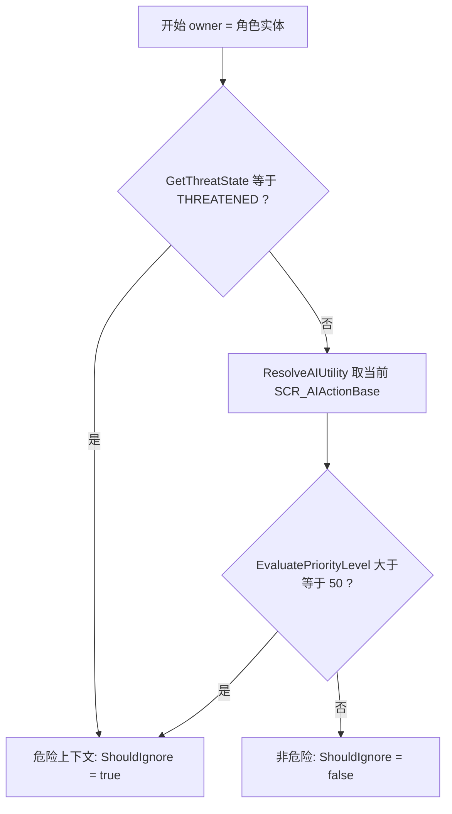
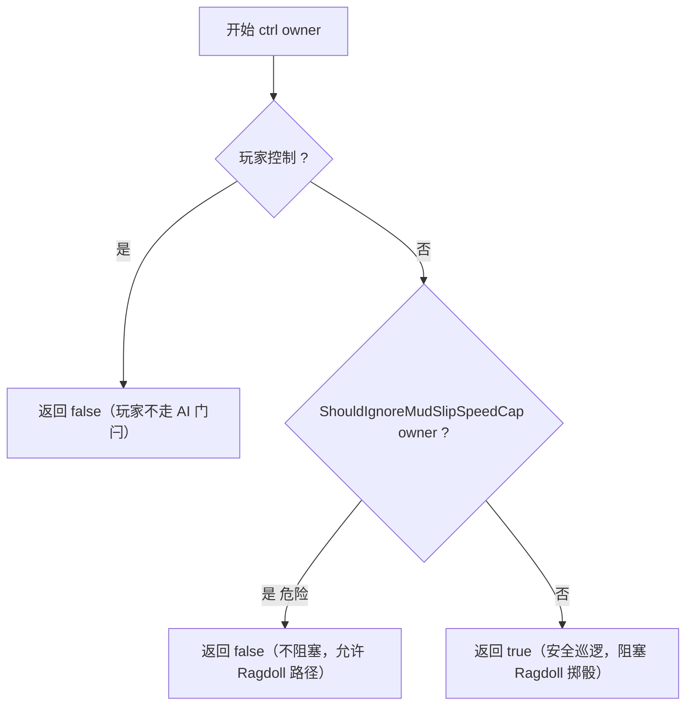
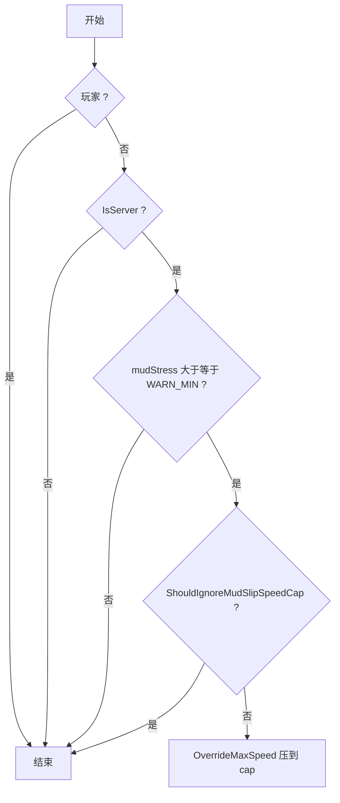
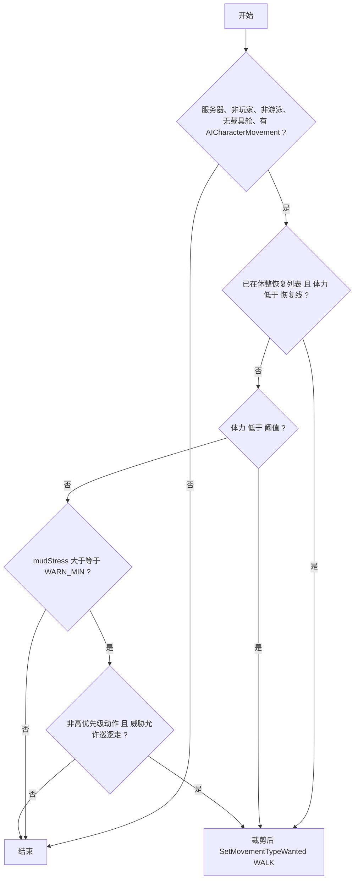

# RSS 模组下 AI 受影响说明与决策逻辑

本文说明 **Realistic Stamina System (RSS)** 对 **AI 角色** 的影响范围，以及在何种条件下模组会做出何种 **额外决策**（与纯官方 AI 行为树、移动指令的差异）。

实现集中在 `SCR_RSS_AIStaminaBridge.c`、`PlayerBase.c`（`SCR_CharacterControllerComponent` 模组化）、`SCR_RSS_AIGroupRestCoordinator.c`、`SCR_RSS_AICoverSeeker.c`、`SCR_RSS_AIRestRecoveryRegistry.c`；**泥泞滑倒**与 **体力→AI 战斗表现** 另见 `SCR_RSS_MudSlipRunner.c`、`SCR_RSS_AIStaminaCombatEffects.c` 与 `SCR_EnvironmentFactor.c`（滑倒风险）。服主开关见 **RSS JSON**：`m_bEnableMudSlipMechanism`、`m_bEnableAIStaminaCombatEffects`（`SCR_RSS_Settings.c`）；数值阈值见 `SCR_StaminaConstants.c`。

---

## 1. 总体分工：三层系统如何叠加

| 层级 | 来源 | 作用 |
|------|------|------|
| **官方 AI** | 行为树、活动（如 `SCR_AIMoveActivity`、`WP_Move`）、战斗移动请求等 | 下发目标点、意图移动类型（如 `RUN`）、是否用车等 |
| **AI 移动设置** | `SCR_AICharacterSettingsComponent` + `SCR_AICharacterMovementSpeedSettingBase` | 对「期望移动类型」做规则裁剪（关卡/预设是否允许跑步等） |
| **RSS** | 体力消耗模型 + `OverrideMaxSpeed` + 本文所述 AI 桥接逻辑 | 按体力、负重、地形、环境等 **限制最大速度**；并对 AI 施加 **泥泞与徒步策略** |

**重要**：RSS **不会**替代官方行为树做寻路、掩护、射击等高层战术；它主要提供 **生理层面的速度与体力**，并在少数情况下 **改写 AI 的「期望移动类型」**（见第 4 节）。

---

## 2. AI 会受到的「通用 RSS 影响」（与玩家同源部分）

在 **服务器端** 对 **非玩家控制角色** 仍会跑体力主循环（更新间隔见下节），因此 AI 同样会：

- 随 **移动速度、负重、坡度、地形、姿态、环境（热、雨、风等）** 消耗或恢复体力；
- 随 **体力百分比** 被 **`OverrideMaxSpeed`** 调整 **最大移动速度**（与玩家同一套速度倍率逻辑）；
- 参与 **游泳、跳跃、翻越** 等模块中与体力相关的计算（若该 AI 会触发对应状态）。

**与玩家的差异**：

- **更新频率**：AI 的体力/速度 tick 为 **每 100ms**（`RSS_AI_SPEED_UPDATE_INTERVAL_MS`），玩家侧主循环约为 **17ms**（`RSS_PLAYER_SPEED_UPDATE_INTERVAL_MS`），属性能与同步策略上的取舍。
- **执行端**：上述 AI 逻辑在 **服务器** 上执行（`Replication.IsServer()`），与常见多人架构一致。

---

## 流程图：核心判断逻辑

下列流程与 `SCR_RSS_AIStaminaBridge.c` 中函数对应，便于对照实现。

### 图 A：泥泞「危险上下文」`ShouldIgnoreMudSlipSpeedCap(owner)`

用于：**泥泞 Ragdoll 是否允许**、**预警压速 `MaybeApplyMudSlipSpeedCap`**、以及 `IsMudSlipBlockedBySafety` 的推导。

### 图 B：`IsMudSlipBlockedBySafety`（AI 泥泞「安全门闩」）

### 图 C：服务器 `MaybeApplyMudSlipSpeedCap`（泥泞预警压速）

### 图 D：`ApplyOnFootMovementPolicy`（低体力或泥泞巡逻 → WALK）

**图 D 说明**：若 **`SCR_RSS_AIRestRecoveryRegistry`** 登记在案且体力 **低于 `RSS_AI_REST_RECOVERY_RESUME_STAMINA_MIN`（默认 0.5）**，**优先** 强制 WALK（休整恢复锁定）。否则低体力分支 **无条件** 改 WALK；泥泞分支只要应激达阈值且 **非危险优先级**、**ThreatStateAllowsMudPatrolWalk**（与图 A 威胁一致：非 **THREATENED**）即改 WALK。

**体力 tick 顺序**（`PlayerBase`）：先 **`TickAbortRestRecoveryIfBattlefieldDanger`**（见第 5.4 节），再 **`ApplyOnFootMovementPolicy`**，再 **`TryScheduleGroupRestFromStamina`**，再 **`TryCompleteGroupRestDefendWaypointIfReady`**（见第 5.5 节），再 **`TickVerifyCombatCover`**（若其它逻辑分配了掩护则校验）。

---

## 3. 「危险上下文」与「安全上下文」（泥泞相关）

以下 **§3～§3.3** 及 **Runner 掷骰 / Ragdoll** 仅在 **`m_bEnableMudSlipMechanism` 为 true** 时生效；关闭时无滑倒风险与相关压速逻辑（见 **§3.4**）。

泥泞相关逻辑区分两类 AI 情形（由 `ShouldIgnoreMudSlipSpeedCap` / `IsMudSlipBlockedBySafety` 判定）。

### 3.1 危险上下文（更偏交战 / 高压力）

满足 **任一** 条件时，视为 **危险上下文**（泥泞上 **不按「安全 AI」那套限制**）：

- **`GetThreatState()` = `EAIThreatState.THREATENED`**（受压制；**不再**把 VIGILANT/ALERTED 算作危险，否则无敌人时路点移动也常处于警戒态，会误开 Ragdoll 掷骰并取消预警压速）；
- 或 **当前 AI 动作的 `EvaluatePriorityLevel()` ≥ `ENV_MUD_SLIP_AI_UNSAFE_PRIORITY_MIN`（50.0）**（高优先级行为，如强压制等）。

**在此上下文中，AI 会**：

- **允许** 参与泥泞 **滑倒 Ragdoll 掷骰**（若底层 Runner 决定触发）；
- **不** 因泥泞预警对 **最大速度** 做额外的「压到约 1.6 m/s 档」的 **OverrideMaxSpeed**（见 3.3）；
- **不** 因泥泞应激而 **按第 4.2 节的「巡逻徒步」规则** 强制 WALK（该规则与全量「危险上下文」不完全相同，见 4.2）。

### 3.2 安全上下文（巡逻、低威胁等）

非上述危险情形时，对 AI 而言属于 **安全上下文**（`IsMudSlipBlockedBySafety` 为真）。

**在此上下文中，AI 会**：

- **不** 执行泥泞滑倒的 **Ragdoll 掷骰**（避免巡逻兵在泥里频繁摔倒）；
- 仍可能受 **泥泞应激** 数值（`RSS_GetMudSlipCameraShake01()`）影响，用于 **预警限速** 与 **徒步降速决策**（见 3.3、第 4 节）。

---

## 3.3 泥泞应激下的「预警限速」（仅服务器 AI）

当 **泥泞应激** ≥ **`ENV_MUD_SLIP_AI_WARN_STRESS_MIN`（0.015）**，且 **非危险上下文** 时：

- 调用 **`OverrideMaxSpeed`**，把最大速度 **压到** 与 `ENV_MUD_SLIP_MIN_SPEED_MS / GAME_MAX_SPEED` 等效的倍率（预警式减速，与滑倒判定阈值对齐思路）；**每帧满足条件即施加**，不依赖「上次倍率是否已低于 cap」。

**危险上下文** 下 **不** 应用本条压速。

### 3.4 泥泞滑倒机制总开关（JSON）

- **配置项**：`m_bEnableMudSlipMechanism`（默认 **`false`**）。  
- **判定**：`StaminaConstants.IsMudSlipMechanismEnabled()`（全预设生效，与 Custom 泥泞惩罚开关无关）。  
- **关闭时**：不执行 `RSS_MudSlipRunner` 的滑倒/镜头应力逻辑；**不** 调用 `MaybeApplyMudSlipSpeedCap`；环境侧滑倒风险计算为 0；泥泞相关流程图（图 B～D 中与 Runner/压速/应激相关的分支）**不生效**。  
- **开启时**：行为与第 3～4 节、Runner 实现一致。  
- **网络**：该布尔参与 `WriteSettingsToArrays` / 客户端配置哈希（含布尔数组），避免仅改开关时客户端误判未同步。

---

## 4. 徒步 AI 的「移动类型决策」：何时降为 WALK（低体力 / 泥泞巡逻）

在 **`ApplyOnFootMovementPolicy`** 中，仅当 **同时满足** 以下 **场景前提** 时才会改写移动类型：

- **服务器**；
- **非玩家**；
- **非游泳**；
- **不在载具舱位内**（`CompartmentAccessComponent` 无占用舱位）；
- 存在 **`AICharacterMovementComponent`**。

**不会**用本逻辑「抬速」；仅在下面两条分支之一成立时 **`SetMovementTypeWanted(WALK)`**（经 `SCR_AICharacterMovementSpeedSettingBase.GetSpeed` 裁剪）。

### 4.1 低体力 → 强制降为行走（与交战/泥泞无关）

- 当 **当前体力比例** **&lt; `RSS_AI_ONFOOT_STAMINA_WALK_THRESHOLD`（0.28）** 时，将意图降为 **WALK**，并 **return**（不再走泥泞分支）。

**含义**：体力过低时模组 **优先改为走**，以减轻消耗并与 RSS 速度模型一致。

### 4.2 泥泞滑倒预警 → 降为行走（巡逻徒步）

**前提**：`m_bEnableMudSlipMechanism` 为 **`true`**（否则镜头应力为 0，**泥泞应激** 达不到阈值，本分支不触发；见 3.4）。

若 **未** 因低体力触发 4.1，且 **泥泞应激** ≥ **`ENV_MUD_SLIP_AI_WARN_STRESS_MIN`（0.015）**，则还需同时满足：

- **当前动作优先级** **&lt;** `ENV_MUD_SLIP_AI_UNSAFE_PRIORITY_MIN`（50.0）（高优先级行为不强制改走）；  
- **`GetThreatState()` ≠ `EAIThreatState.THREATENED`**（受压制时不再强制改走，避免与交火机动冲突）。

满足时，将意图降为 **WALK**（**不** 先要求 `GetMovementTypeWanted()` 为 RUN/SPRINT：行为树有时未标快跑，仍应在此场景走路通过）。

**说明**：`SCR_AIUtilityComponent` 在官方脚本中挂在 **AIAgent** 上，实现里会通过 **`AIControlComponent` → Agent** 解析 Utility，否则优先级判断会失效。**SAFE / VIGILANT / ALERTED** 下仍可在泥泞预警区走路通过；**THREATENED** 下不强制 WALK。第 3 节中威胁部分与第 4.2 节一致：**仅 THREATENED** 与「高优先级」会解除泥泞安全巡逻（Ragdoll/预警压速）；**警戒/警报 alone** 不再算作危险。

### 4.3 恢复与官方指令的关系

- 本条 **不** 在条件恢复后主动 **把 WALK 改回 RUN**；当体力恢复、行为树再次给出 **RUN** 等指令时，由 **官方 AI** 重新设置意图。
- 若关卡 **禁止跑步**，`GetSpeed` 仍会裁剪到允许的类型，与官方 **`SCR_AICharacterSetMovementSpeed`** 行为一致。

### 4.4 休整恢复锁定（与第 5 节联动）

- 群组成功插入 **防守路点** 后，会对 **全队** 登记休整恢复（`MarkRestRecoveryForGroup`）。
- 登记期间且体力 **仍低于** `RSS_AI_REST_RECOVERY_RESUME_STAMINA_MIN`（默认 **50%**）时，第 4 节 **`ApplyOnFootMovementPolicy`** 会 **强制 WALK**，作为「未恢复到安全体力前限制快跑意图」的手段。
- 体力 **达到或超过** 该阈值时，从列表中 **清除** 该实体，不再因本条强制行走。

### 4.5 体力与 AI 感知 / 射速 / 战斗技能（JSON，可选）

- **配置项**：`m_bEnableAIStaminaCombatEffects`（默认 **`false`**）。  
- **判定**：`StaminaConstants.IsAIStaminaCombatEffectsEnabled()`；实现类 **`SCR_RSS_AIStaminaCombatEffects`**，在 **`PlayerBase` 体力 tick** 中、**服务器**、**非玩家** 时调用。  
- **不修改** 游戏原版 `SCR_AICombatComponent` / `SCR_AIGetAimErrorOffset` 源码，仅调用 **`SCR_AICombatComponent`** 公开 API：  
  - **感知**：`SetPerceptionFactor`（体力越低，系数越接近 `RSS_AI_STAMINA_COMBAT_PERCEPTION_MIN`；满体力为 `1.0`）。官方注释：主要影响 **视觉发现** 速度。  
  - **射速**：`SetFireRateCoef`（体力越低越接近 `RSS_AI_STAMINA_COMBAT_FIRE_RATE_MIN`；满体力为 `1.0`）。  
  - **战斗技能（影响行为树瞄准误差）**：以 **`GetAISkillDefault()`** 对应 **数值** `vRef` 为 **100% 基准**，有效值 **`vRef × 体力比例`**，再映射为 **`EAISkill`**；体力 **≥ 0.999** 时 **`ResetAISkill()`** 恢复预制体默认，**不会**把服主已设为最弱的单位抬成高档位。  
- **与第 3～4 节关系**：与泥泞、徒步 WALK 策略 **独立**；可同时开启。  
- **曲线参数**：`RSS_AI_STAMINA_COMBAT_PERCEPTION_MIN`、`RSS_AI_STAMINA_COMBAT_FIRE_RATE_MIN` 在 **`SCR_StaminaConstants.c`**，不走 JSON（与体力战斗开关分离）。

---

## 5. 群组低体力休整（动态防守路点 + 可选引擎 Cover）

**总开关**：`RSS_AI_GROUP_REST_ENABLED`（默认 **`false`**：功能仍完善中，勿在生产环境默认开启；需在 `SCR_StaminaConstants.c` 中显式改为 `true` 并自行验证后再用）。

### 5.1 触发与门禁

在 **服务器**、**非玩家**、**非载具舱**、**非游泳** 的前提下，当 **所属 `SCR_AIGroup` 内任一员** 的体力比例 **低于** `RSS_AI_GROUP_REST_STAMINA_THRESHOLD`（默认 0.25）时，可能触发整队休整调度。

**不进入**休整路线（与泥泞「危险上下文」一致，见 **`IsBattlefieldDangerContext` / `ShouldBlockAutonomousRest`**）：

- `GetThreatState() == THREATENED`；或  
- 当前 AI 动作 **`EvaluatePriorityLevel()` ≥ `ENV_MUD_SLIP_AI_UNSAFE_PRIORITY_MIN`（50）**。

另受 **群组冷却** `RSS_AI_GROUP_REST_COOLDOWN_SEC` 限制，避免短时间内重复插入路点。

### 5.2 决策流程（队长 Cover → 全队防守路点）

1. 取 **群组重心** `GetCenterOfMass()` 作为 Cover 查询的 **扇区中心**。
2. 解析 **队长**（优先 `GetLeaderEntity()` / `GetLeaderAgent().GetControlledEntity()`）；若队长 **无 `AIPathfindingComponent`**，则依次回退到 **触发者**、群内 **第一个** 具备 pathfinding 的成员。
3. 若 **`RSS_AI_GROUP_REST_USE_ENGINE_COVER` = true**：由队长（或回退实体）对重心调用 **`ChimeraCoverManagerComponent.GetBestCover`**（**仅取世界坐标**，不写入 `SCR_AICombatMoveState`，不发起单人 `CombatMoveRequest`）。  
   - **失败**时回退为 **水平射线** 近似蔽护点（`FindApproxCoverWorldPos`，与旧逻辑一致）。
4. 若 **`RSS_AI_GROUP_REST_USE_ENGINE_COVER` = false**：跳过引擎 Cover，**仅**用射线近似点。
5. 在求得的位置 **动态插入** 路点：`SCR_AIGroup.AddWaypointsDynamic`，预制体为 **`RSS_AI_GROUP_REST_DEFEND_WAYPOINT_PREFAB`**（默认 **`{93291E72AC23930F}Prefabs/AI/Waypoints/AIWaypoint_Defend.et`**），停留时间等由 `RSS_AI_GROUP_REST_DEFEND_HOLD_SEC` 等配置。
6. 成功后 **`MarkRestRecoveryForGroup`**，全队进入 **第 4.4 节** 的恢复锁定，直至体力恢复至 **`RSS_AI_REST_RECOVERY_RESUME_STAMINA_MIN`**。

### 5.3 与官方行为树的分工

- RSS **不** 替代行为树做完整战术；**仅**通过**动态路点**把「全队靠拢到某防御点」交给 **官方 `SCR_AIGroup` 路点管线**。
- 引擎 Cover **只用于选点**；**不** 对每名 AI 单独 `AssignCover` / `ApplyNewRequest`（避免与全队路点指令冲突）。

### 5.4 休整中途变为战场危险：终止休整

每帧体力 tick 中调用 **`TickAbortRestRecoveryIfBattlefieldDanger`**（在 **`ApplyOnFootMovementPolicy`** 之前）：

- 若实体 **仍在** 休整恢复列表中，且当前 **`IsBattlefieldDangerContext` 为真**，则：
  - **清除** 恢复锁定；
  - **`SCR_AICombatMoveState.CancelRequest()`** + **`ReleaseCover()`**（若存在由其它系统分配的掩护/移动请求）。
- **不** 保证脚本层删除已插入的 **群组动态路点**；遇险后 AI 行为以引擎与行为树为准。

### 5.5 防守路点完成：全员体力达标

插入 RSS 防守路点后，脚本会记录 **`SCR_AIGroup` 路点列表** 中新增的那条 **`AIWaypoint`**（通过插入前后 `GetWaypoints` 数量差判断）。

每帧在 **`TryScheduleGroupRestFromStamina` 之后** 调用 **`TryCompleteGroupRestDefendWaypointIfReady`（`SCR_RSS_AIGroupRestCoordinator`）**：

- 当群内 **每一名** 可控实体（`GetAgents`）的 **RSS 体力**（`SCR_CharacterStaminaComponent.GetTargetStamina()`）均 **≥ `RSS_AI_REST_RECOVERY_RESUME_STAMINA_MIN`（默认 0.5，即 50%）** 时，对该路点调用 **`SCR_AIGroup.CompleteWaypoint`**，从队列中完成并移除该路点，使群组可继续执行 **后续路点**。
- 若路点已被引擎或其它逻辑移除，则仅清除记录，不再调用 `CompleteWaypoint`。

---

## 6. 本模组 **不会** 自动做的事（补充）

以下仍 **不在** RSS 脚本内实现，或仅部分覆盖：

- **遇险时** 自动删除已插入的群组动态路点（见第 5.4 节；**全员体力达标** 时的完成见第 5.5 节）；
- **载具内** 的详细体力策略（载具内通常走 RSS 其它分支，且本徒步/休整策略会跳过舱内单位）；
- 对 **无 `AICharacterMovementComponent`** 的特殊实体的移动类型控制；
- **休整恢复锁定** 仅通过 **强制 WALK** 限制移动意图，**不** 单独屏蔽射击、换弹等行为树节点（除非另行扩展）。

---

## 7. 调试

开启 RSS 调试输出时，非玩家实体可额外在批次中输出 **AI 体力/速度/倍率** 等行（见 `AppendAIDebugLine` / `FlushAIDebugLinesToBatch`），便于对照 **行为树意图** 与 **RSS 实际结果**。

---

## 8. 常量与 JSON 速查（与 AI 直接相关）

### 8.1 服主 JSON（`SCR_RSS_Settings`）

| 字段 | 默认 | 含义 |
|------|------|------|
| `m_bEnableMudSlipMechanism` | `false` | 是否启用泥泞滑倒机制（Runner、滑倒风险、AI 泥泞压速/徒步等，见 §3.4） |
| `m_bEnableAIStaminaCombatEffects` | `false` | 是否按体力缩放 AI 感知/射速/战斗技能（见 §4.5） |

### 8.2 代码常量（`SCR_StaminaConstants.c` 等）

| 常量 | 含义 |
|------|------|
| `RSS_AI_SPEED_UPDATE_INTERVAL_MS` | AI 体力/速度主循环间隔（ms） |
| `RSS_AI_ONFOOT_STAMINA_WALK_THRESHOLD` | 低于该体力比例时，强制 WALK |
| `RSS_AI_STAMINA_COMBAT_PERCEPTION_MIN` | 体力→AI 感知：`SetPerceptionFactor` 在体力为 0 时的下限系数 |
| `RSS_AI_STAMINA_COMBAT_FIRE_RATE_MIN` | 体力→AI 射速：`SetFireRateCoef` 在体力为 0 时的下限系数 |
| `RSS_AI_GROUP_REST_ENABLED` | 是否启用群组低体力休整（动态防守路点） |
| `RSS_AI_GROUP_REST_STAMINA_THRESHOLD` | 任一员低于该比例时可触发全队休整调度 |
| `RSS_AI_GROUP_REST_COOLDOWN_SEC` | 同一群组再次触发休整的最短间隔（秒） |
| `RSS_AI_GROUP_REST_DEFEND_WAYPOINT_PREFAB` | 动态插入的防守路点预制体 ResourceName |
| `RSS_AI_GROUP_REST_USE_ENGINE_COVER` | 是否由队长对重心执行 `GetBestCover` 定隐蔽点（失败则射线近似） |
| `RSS_AI_REST_RECOVERY_RESUME_STAMINA_MIN` | 休整恢复锁定解除的体力比例（默认 0.5） |
| `ENV_MUD_SLIP_AI_WARN_STRESS_MIN` | 泥泞应激达此值时，安全 AI 可能触发预警限速 + 徒步降行走 |
| `ENV_MUD_SLIP_AI_UNSAFE_PRIORITY_MIN` | 动作优先级 ≥ 此视为危险上下文（泥泞策略放宽） |
| `ENV_MUD_SLIP_MIN_SPEED_MS` | 预警限速与滑倒低速阈对齐（m/s） |

---

*文档版本与实现对齐：请以仓库内 `SCR_RSS_AIStaminaBridge.c`、`SCR_RSS_AIStaminaCombatEffects.c`、`SCR_RSS_AIGroupRestCoordinator.c`、`SCR_RSS_AICoverSeeker.c`、`SCR_RSS_AIRestRecoveryRegistry.c`、`SCR_StaminaConstants.c`、`SCR_RSS_Settings.c` 与 `PlayerBase.c` 为准。*
