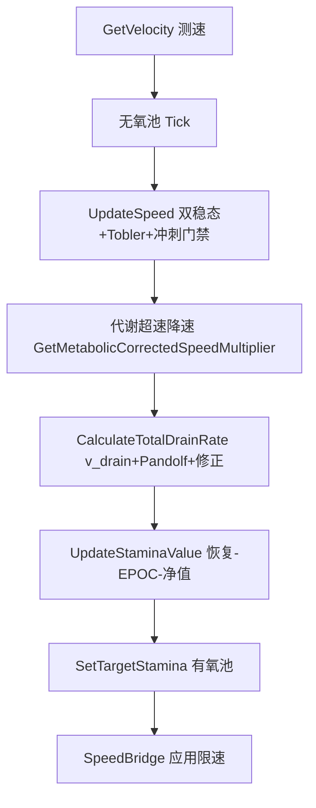

# RSS v5.0.0 计算模型审查报告

| 项 | 内容 |
|----|------|
| **审查对象** | Realistic Stamina System (RSS) v5.0.0 运行时计算模型 |
| **审查日期** | 2026-06-04 |
| **代码基线** | `079a419`（v5.0.0 发布）及工作区最新脚本 |
| **审查方法** | 源码走读、常量/配置交叉核对、Python 烟雾测试执行、文档一致性比对 |
| **自动化验证** | `python tools/test_v5_smoke.py` → **8/8 PASS** |

---

## 1. 执行摘要

RSS v5 将体力系统重构为 **有氧池（引擎条）+ 无氧池（冲刺资格）** 的双池架构，陆地消耗以 **Pandolf (1977)** 为唯一主模型，并引入 **v_drain 测速封顶** 与 **sustainable_watts 代谢降速闭环**。整体分层清晰（Integration 薄壳 / Core 公式 / Environment 自建栈），符合 `docs/RSS_CODING_STANDARDS.md` 的设计意图。

**总体评价：架构合理、可维护性较 v3 明显提升，但存在若干「v5 新语义与 v4 遗留参数/文档/速度标尺未完全对齐」的问题，可能影响平衡调参与玩家体感一致性。**

### 1.1 风险矩阵

| 等级 | 问题 | 影响 |
|------|------|------|
| **高** | v5 行军档理论速度（Walk 1.4 / Run 2.8 / Sprint 4.0 m/s）与双稳态速度目标（Run 3.8 / Sprint 5.5 m/s）不一致，导致 **v_drain 消耗封顶偏低** | 高 Run/Sprint 速度下有氧消耗可能被低估 |
| **高** | 玩家用 **双稳态平台模型**，AI 用 **STAMINA_EXPONENT 幂函数**，同一 `staminaPercent` 下速度曲线不同 | PvE 中 AI 与玩家体力—速度语义不一致 |
| **中** | `sprint_stamina_drain_multiplier` 等 v4 参数仍存在于 JSON/Settings，**运行时未引用** | 调参误导、文档与 UI 描述失真 |
| **中** | `docs/体力系统计算逻辑文档.md`、README 仍描述 25% 平台期、Givoni 分支、旧文件名 | 维护者与贡献者易按错误模型改代码 |
| **中** | Python 数字孪生 (`rss_digital_twin_fix.py`) 仍引用 v3 类名，且注释写「冲刺消耗用引擎 5.5/3.8」与 v5 v_drain 不一致 | 优化器/回归测试与运行时漂移 |
| **低** | `CalculatePandolfDrain` 与 `CalculatePandolfEnergyExpenditure` 两套 Pandolf 实现并存 | 仅 legacy 路径调用简化版，长期易分叉 |
| **低** | 代谢降速在同一 tick 内 **先于** 消耗汇总应用，单 tick 内存在顺序近似 | 极端坡度+高负重下可能有 1 tick 滞后 |

### 1.2 结论建议（优先级）

1. **统一速度标尺**：明确 v5 是以「引擎实测上限（3.8/5.5）」还是「行军档（2.8/4.0）」作为 v_drain 与 ACFT 标定基准，并改代码或改默认值使二者一致。
2. **清理死参数**：标记废弃或删除 `sprint_stamina_drain_multiplier` 的运行时同步字段，避免 Optimizer 继续优化无效维度。
3. **同步文档与数字孪生**：更新 `体力系统计算逻辑文档.md` 为 v5 权威版；扩展 `test_v5_smoke.py` 覆盖 ACFT 2 mile 与 35kg 行军场景。
4. **AI 速度曲线**：评估是否让 AI 复用 `CalculateSpeedMultiplierByStamina`，或文档中明确「AI 简化模型」为设计选择。

---

## 2. 审查范围

### 2.1 纳入

| 模块 | 文件（代表） |
|------|----------------|
| 主循环 | `PlayerBase_UpdateLoop.c`, `SCR_PlayerBaseLoop.c` |
| 消耗协调 | `SCR_RSS_UpdateCoordinator.c`, `SCR_RSS_StaminaConsumptionCalculator.c` |
| 代谢公式 | `SCR_RSS_MetabolismMath.c`, `SCR_RSS_DrainCalculator.c` |
| 恢复 | `SCR_RSS_RecoveryCalculator.c`, `SCR_RSS_EpocState.c` |
| 速度 | `SCR_RSS_SpeedCalculator.c`, `SCR_RSS_CollapseTransition.c`, `SCR_RSS_SpeedBridge.c` |
| 双池 | `SCR_RSS_StaminaState.c`, `SCR_RSS_AnaerobicBurst.c` |
| 修正层 | `SCR_RSS_FatigueSystem.c`, `SCR_RSS_EncumbranceCache.c`, `SCR_RSS_EnvironmentFactor.c` |
| 游泳 | `SCR_RSS_SwimmingStaminaModel.c` |
| 配置 | `SCR_RSS_Constants.c`, `SCR_RSS_ConfigBridge.c`, `SCR_RSS_Settings.c` |
| 拦截壳 | `SCR_StaminaOverride.c` |
| 工具 | `tools/test_v5_smoke.py`, `tools/rss_digital_twin_fix.py` |

### 2.2 不纳入

- 表现层（FOV、屏效、相机）数值
- 泥泞滑倒概率模型细节（见 `docs/泥泞滑倒判定模型.md`）
- 联机反作弊完整威胁模型

---

## 3. 模型架构（当前实现）

### 3.1 时间步长

| 环节 | 间隔 | 说明 |
|------|------|------|
| 玩家主 tick | **17 ms**（`RSS_PLAYER_SPEED_UPDATE_INTERVAL_MS`） | 速度、消耗、恢复均在此循环 |
| 速率设计基准 | **0.2 s** | 所有 drain/recovery 率按 0.2 s 定义 |
| 时间缩放 | `tickScale = clamp(Δt/0.2, 0.01, 2.0)` | 17 ms tick 下 scale≈0.085，数学自洽 |
| 引擎条监控 | **200 ms**（`STAMINA_MONITOR_INTERVAL_MS`） | 纠正非 RSS 来源的体力变化 |

**评价**：主循环高频 + 0.2 s 归一化设计合理；注释中「200 ms 主循环」已过时，应更新为 17 ms。

### 3.2 单 tick 顺序（玩家）



**审查意见**：

- 代谢降速（步骤 D）使用 **当前实测速度** 与 **已应用倍率** 计算 Pandolf 功率，再缩放倍率；消耗（步骤 E）使用 **v_drain 封顶后的速度**。两者口径不完全相同，但在「封顶速度 ≤ 实测速度」时一致。
- 当实测速度 **高于** v5 行军档上限时，消耗按封顶速度算、代谢降速按实测算 → **消耗侧更乐观**，见 §4.2。

---

## 4. 子模型审查

### 4.1 有氧池：Pandolf 消耗

**公式（`CalculatePandolfEnergyExpenditure`）**：

\[
E_{\text{W}} = \frac{M}{M_{\text{ref}}} \cdot \bigl(\text{baseTerm} + \text{gradeTerm} + \text{steepDownhillPenalty}\bigr) \cdot \eta \cdot M_{\text{ref}}
\]

其中 `baseTerm = 0.8×2.7 + 3.2(V-0.7)²`（fitness bonus），坡度项含缓下坡省能与陡下坡 Santee 惩罚，再经 `energy_to_stamina_coeff` 转为 **%/s**。

**优点**：

- Pandolf 系数标注 `[HARD]`，与论文一致；坡度项有 `maxGradeTerm = baseTerm × 3` 防爆。
- 静止时用静态站立成本，避免低速误触发「负消耗恢复」。
- Givoni 分支已移除（`UpdateCoordinator` 注释 v3.12+）。

**问题**：

1. **简化版 `CalculatePandolfDrain`** 仍存在于 `MetabolismMath.c`（无地形 η、无 Santee），仅被 legacy 辅助路径调用；与完整版单位/质量处理略有差异（`M = totalMass/REF` vs `weightMultiplier × REFERENCE_WEIGHT`）。
2. **`GRADE_UPHILL_COEFF` 等常量** 在 `Constants.c` 中保留，但主路径已用 Pandolf 坡度项；易造成「改常量无效」的维护陷阱。
3. **预设 `energy_to_stamina_coeff`** 来自 v4 NSGA-II（约 `7.17e-7`），与 v5 双池、新行军档 **未联合重优化**。

### 4.2 v_drain 与速度标尺冲突（高优先级）

**实现**（`SCR_RSS_DrainCalculator`）：

```c
v_drain = clamp(v_measured, 0, v_theoretical_max(phase, encPenalty))
```

默认理论上限（`ApplyV5ParamsDefaults`）：

| 相位 | v5 默认 (m/s) | 引擎/双稳态目标 (m/s) |
|------|---------------|------------------------|
| Walk | 1.4 | ~2.2（Walk 阈值 3.2 为阶段边界，非步行速度） |
| Run | **2.8** | **3.8**（`TARGET_RUN_SPEED`） |
| Sprint | **4.0** | **5.5**（`GAME_MAX_SPEED`） |

**场景分析**：玩家在平台期以 3.8 m/s Run 移动时，`v_drain` 最多按 **2.8 m/s** 计入 Pandolf → 相对真实移动速度 **约少算 26%** 有氧功率。Sprint 差距更大（4.0 vs 5.5，约 **27%**）。

**设计意图推测**：v5 行军档代表「可持续行军速度」，与 ACFT 平均 3.47 m/s 更接近；但 **未同步修改** `CalculateSpeedMultiplierByStamina` 仍瞄准 3.8 m/s 平台期，形成「跑得快、算得慢」的分裂。

**建议**：二选一或显式拆分：

- **方案 A**：`v_theoretical_max` 改用 `TARGET_RUN_SPEED` / `GAME_MAX_SPEED`（与表现一致）；
- **方案 B**：双稳态平台目标改为 v5_run/sprint 默认，并重新标定 `energy_to_stamina_coeff`；
- **方案 C**：v_drain 用 `min(v_measured, v_theoretical_max)` 但 `v_theoretical_max` 取 **当前 RSS 限速后的实际可达速度**，而非固定行军档。

### 4.3 代谢超速闭环（sustainable_watts）

\[
\text{metaFactor} = \max\left(\text{V5\_MIN},\ \frac{W_{\text{sustainable}}}{W_{\text{pandolf}}}\right)
\]

默认 `sustainable_watts = 400 W`，下限倍率 `0.35`。

**优点**：

- 将「功率—速度—消耗」连成负反馈，缓解陡坡暴扣体力的旧问题。
- Python 孪生已实现同名函数，烟雾测试覆盖边界（400 W → 1.0，800 W → 0.5）。

**问题**：

- `sustainable_watts` 与 v4 优化出的 `energy_to_stamina_coeff` **未联合校准**；400 W 阈值的生理含义（相对 90 kg、fitness 1.0）文档中未给出推导。
- 精疲力尽（`isExhausted`）时跳过降速，可能与崩溃期低速仍高功率消耗并存。

### 4.4 无氧池（`SCR_RSS_AnaerobicBurst`）

| 行为 | 参数默认 |
|------|----------|
| Sprint 消耗 | `anaerobic_drain_per_sec = 0.12`（池单位/s） |
| 恢复 | `0.08`/s（非冷却期） |
| 门禁阈值 | 池 ≤ 0.20 禁 Sprint |
| 冷却 | 全耗尽 180 s / 短爆发 75 s（可配置） |

**优点**：

- 与引擎条解耦，符合 v5 编码规范「无氧 never 写入引擎条」。
- 服务端 RplProp 同步，客户端只读复制。

**问题**：

- 无氧消耗率 **未与 Sprint 持续时间、ACFT 标定** 在文档或测试中量化。
- `SPRINT_ENABLE_THRESHOLD = 0.25`（有氧）与 `anaerobic_sprint_enable_threshold = 0.20`（无氧）两套门槛，README 仍写「25% 平台期」，而 Hardcore fallback 平台起点为 **35%**（`willpower_threshold`）。

### 4.5 速度：双稳态—应激性能模型

**玩家**（`CalculateSpeedMultiplierByStamina`）：

| 有氧区间 | 行为 |
|----------|------|
| ≥ `willpower_threshold`（默认 0.35） | 恒定 `TARGET_RUN_SPEED_MULTIPLIER`（3.8/5.5） |
| 5% ~ 35% | SmoothStep 过渡到跛行 |
| < 5% | 线性崩溃至 `MIN_LIMP_SPEED_MULTIPLIER` |

另：`SCR_RSS_CollapseTransition` 5 s 阻尼；Tobler + 上下坡 boost；Sprint 门禁与 `SCR_RSS_SprintBlockSpeedTransition`。

**优点**：

- 「意志力平台 + 末段崩溃」符合军事体能主观体验，比纯幂函数更易调平台期手感。
- 坡度速度 5 s 平滑（`SCR_RSS_SlopeSpeedTransition`）减少 Tobler 阶跃感。

**问题**：

- README / 旧文档写 **25%** 平台期，代码 Hardcore 默认 **35%** → 文档严重过时。
- `STAMINA_EXPONENT = 0.6` 在 Constants 中标注 `[HARD]` 且引用 Minetti，但 **玩家速度路径未使用该指数**（仅 AI 连续曲线使用）→ 注释与实现不符。

### 4.6 AI 速度模型（与玩家不一致）

`SCR_RSS_AISpeedCap.GetContinuousSpeedMultiplier`：

\[
\text{SpeedMul} = 0.3 + 0.7 \times \text{stamina}^{0.6}
\]

另有 6 态 FSM 离散档位（FRESH → COLLAPSED）。

**评价**：AI 路径更简单、LOD 友好，但与玩家 **双稳态** 行为不同。若设计目标为「AI 可耗尽但曲线不同」，需在 `docs/RSS_AI_行为说明.md` 中升格为正式说明；否则建议复用玩家公式。

### 4.7 恢复模型

**多维度恢复**（`CalculateMultiDimensionalRecoveryRate`）：

- 基础率 × 体力非线性 × 健康/年龄 × 休息阶段（快/中/慢）× 姿态 × 负重惩罚 × 边际衰减
- EPOC：停跑后延迟期内 **`CalculateEpocDrainRate`** 替代正向恢复
- 保护：体力 < 2% 绝境呼吸；静止轻载静态保护

**优点**：层次完整，符合「深度生理压制恢复」产品描述。

**问题**：

- v3.6.1 后 **移除运动中恢复率惩罚**（`speedBasedRecoveryMultiplier = 1.0`），依赖「消耗 > 恢复」实现净耗；在 v_drain 低估时，可能出现 **移动中净恢复** 边缘情况。
- `REST_RECOVERY_PER_TICK` 等 idle 回退路径与多维度恢复 **并存**，phase==0 且低速时走简单 Rest 恢复，逻辑分支多。

### 4.8 疲劳系统（`SCR_RSS_FatigueSystem`）

- 超出生理上限的消耗 → 疲劳积累（最高 **30%** 有效体力上限）
- 静止 15 s 后开始衰减（已从 60 s 下调以提高可玩性）

**评价**：与 Pandolf 无硬上限设计配合合理；`FATIGUE_CONVERSION_COEFF = 0.05` 需靠实测验证是否易触顶。

### 4.9 环境栈（RSS 自建）

热应激、冷应激、降雨湿重、风阻、泥泞、温度物理模型、室内坡度抑制等。

**评价**：符合编码规范「Official-first 的环境例外」；`GetQuickEnvironmentMultiplier` 快路径与完整路径在 Sprint 时切换，性能/精度权衡合理。

**风险**：环境因子多、耦合高，**缺少**与 v5 双池联合的集成测试场景（仅 v4 管线场景）。

### 4.10 游泳模型

独立 **3D 阻力 + 踩水静态功率 + 负重幂惩罚**（Holmer / Pendergast 引用）。

**评价**：与陆地 Pandolf 分离清晰；`swimming_energy_to_stamina_coeff` 与陆地系数独立，避免混用。

---

## 5. 配置与参数 hygiene

### 5.1 运行时有效 vs 遗留

| 参数 | Settings/JSON | 运行时消费 |
|------|---------------|------------|
| `energy_to_stamina_coeff` | ✅ v4 优化值 | ✅ |
| `sustainable_watts`, `v5_*_speed_ms`, `anaerobic_*` | ✅ v5 默认 | ✅ |
| `willpower_threshold` | ✅ 默认 0.35 | ✅（= SmoothTransitionStart） |
| `sprint_stamina_drain_multiplier` | ✅ 仍写入 3.5 | ❌ **无引用** |
| `sprint_speed_boost` | ✅ | ⚠️ 需确认是否仍影响 Sprint 速度倍率（v5 行军档可能覆盖语义） |

### 5.2 三档预设

Elite / Standard / Tactical 的 v4 优化参数 **保留**，v5 字段经 `ApplyV5ParamsDefaults` 统一写入相同默认值（400 W、1.4/2.8/4.0 m/s 等）。即 **三档差异主要在 v4 维度，v5 双池参数尚未分档优化**。

---

## 6. 测试与工具链

| 资产 | 状态 | 缺口 |
|------|------|------|
| `test_v5_smoke.py` | 8/8 通过 | 仅单元级；`v5_load_dampening`/`api_additive_fields` 为占位 True |
| `rss_digital_twin_fix.py` | 体量大，注释指向 v3 类名 | 与 v5 v_drain / 17 ms tick 未声明对齐 |
| `rss_pipeline_v5.py` | CHANGELOG 记为 stub | 无法自动重标定 v5 |
| `bench_physio_anchors.py` | 存在 | 未纳入 CI |
| `check_script_size.py` / `check_enforce_syntax.py` | pre-commit | 不验证数值 |

**建议**：新增 `test_v5_acft_2mile.py`（目标 927 s ± 容差）、`test_v_drain_vs_measured_speed` 回归。

---

## 7. 文档一致性

| 文档 | 问题 |
|------|------|
| `README.md` | 25% 平台期、Sprint 3× 消耗、旧目录树 |
| `docs/体力系统计算逻辑文档.md` | 标头 v5 重写中，正文仍含 Givoni 决策树、旧模块名 |
| `docs/RSS_CODING_STANDARDS.md` | ✅ 与 v5 实现一致，应作权威引用 |
| `CHANGELOG.md` | ✅ v5 双池说明准确 |

---

## 8. 优点总结

1. **科学锚点明确**：Pandolf 硬系数、ACFT 2 mile、Tobler、Santee 下坡均有代码级注释。
2. **架构分层**：公式不进 `StaminaOverride`；Integration 与 Core 边界清楚。
3. **v5 语义创新有效**：双池分离 Sprint 爆发与有氧续航；代谢降速闭环方向正确。
4. **工程防护**：EnforceScript 体积/语法检查、析构与 CallLater 清理（v3.22.x 崩溃教训）。
5. **引擎兼容**：SpeedBridge 合并灌木限速；体力拦截壳设计正确。

---

## 9. 改进建议（可执行）

### P0 — 数值一致性

- [ ] 决策 v_drain 理论上限与 `TARGET_RUN_SPEED` / `GAME_MAX_SPEED` 的统一策略（§4.2 方案 A/B/C）。
- [ ] 用 Workbench 或数字孪生跑 **3.8 m/s Run @ 0 kg 平地** 与 **5.5 m/s Sprint**，对比 Pandolf W 与 `sustainable_watts` 触发频率。

### P1 — 配置与文档

- [ ] 废弃或迁移 `sprint_stamina_drain_multiplier`；Settings UI 隐藏 v4 无效项。
- [ ] 重写 `docs/体力系统计算逻辑文档.md` v5 章节（删除 Givoni 树，更新 tick=17 ms、双池、v_drain）。
- [ ] 更新 README 平台期为 `willpower_threshold`（35% fallback），注明无氧池独立。

### P2 — 测试与优化

- [ ] 扩展 `test_v5_smoke.py`：v_drain 在 measured=3.8、cap=2.8 的行为断言（迫使讨论是否 bug）。
- [ ] 完成 `rss_pipeline_v5.py` 或在 v4 管线中增加 v5 约束目标。
- [ ] 同步 `rss_digital_twin_fix.py` 类名与 v5 测速逻辑。

### P3 — AI 与代码卫生

- [ ] 文档化或统一 AI/玩家速度曲线。
- [ ] 删除或合并 `CalculatePandolfDrain` 至单一实现。
- [ ] 清理未使用的 `GRADE_UPHILL_COEFF` 等 dead constants 或标注 `@deprecated`。

---

## 10. 附录

### 10.1 关键公式速查

**Pandolf（完整路径，%/s）**：

\[
\text{drainRate} = E_W \times k_{\text{energy→stamina}}
\]

**有氧净值（每 tick）**：

\[
\Delta \text{STA}_{\text{aerobic}} = (\text{recoveryRate} - \text{finalDrainRate}) \times \frac{\Delta t}{0.2}
\]

**v_drain**：

\[
v_{\text{drain}} = \min(v_{\text{measured}}, v_{\text{theoretical_max}}(\text{phase}, \text{enc}))
\]

**代谢降速**：

\[
m_{\text{meta}} = \max\left(0.35,\ \frac{W_{\text{sust}}}{W_{\text{pandolf}}(v_{\text{drain}})}\right)
\]

### 10.2 核心文件索引

| 职责 | 文件 |
|------|------|
| 主循环 | `scripts/Game/Integration/PlayerBase_UpdateLoop.c` |
| 消耗汇总 | `scripts/Game/RSS/Core/SCR_RSS_UpdateCoordinator.c` |
| Pandolf | `scripts/Game/RSS/Core/SCR_RSS_MetabolismMath.c` |
| v_drain / 代谢降速 | `scripts/Game/RSS/Core/SCR_RSS_DrainCalculator.c` |
| 双池状态 | `scripts/Game/RSS/Core/SCR_RSS_StaminaState.c` |
| 无氧 | `scripts/Game/RSS/Core/SCR_RSS_AnaerobicBurst.c` |
| 常量 | `scripts/Game/RSS/Core/SCR_RSS_Constants.c` |
| v5 预设 | `scripts/Game/RSS/NetworkConfig/SCR_RSS_Settings.c` → `ApplyV5ParamsDefaults` |

### 10.3 审查执行记录

```text
python tools/test_v5_smoke.py
  [PASS] drain_velocity_walk
  [PASS] drain_velocity_sprint_cap
  [PASS] metabolic_at_sustainable
  [PASS] metabolic_over_limit
  [PASS] anaerobic_drain
  [PASS] anaerobic_cooldown
  [PASS] v5_load_dampening
  [PASS] api_additive_fields
test_v5_smoke: 8/8 passed
```

---

*本报告由代码审查生成，供 v5.0.0 后续迭代与调参决策使用。若修复 P0 项，建议 bump 补丁版本并更新 CHANGELOG「计算模型」小节。*

---

## 11. v6.0.0 拟真重构结案（2026-06-04）

| 项 | 状态 |
|----|------|
| P0 v_drain 统一 | ✅ `m_fAppliedSpeedLimitMs` + `CalculateLandBaseDrainRate` |
| CP–W′ 焦耳池 | ✅ `SCR_RSS_CriticalPowerModel` + `TickPower` |
| 动态 CP (LF/TF/fatigue) | ✅ `ComputeCpBaseWatts` / `SetRuntimeContext` |
| Skiba 双指数 W′（Elite） | ✅ `UsesSkibaRecovery` |
| 移除意志力平台期 | ✅ `CalculateV6PhaseSpeedMultiplier` |
| AI 同源 | ✅ `SCR_RSS_AISpeedCap` |
| 积分疲劳 I(t) | ✅ `ProcessFatigueIntegral` |
| Python 孪生 | ✅ `tools/test_v6_smoke.py` 6/6；`bench_physio_anchors` v6 sprint PASS |

**验收命令**：

```text
python tools/test_v5_smoke.py   # 8/8
python tools/test_v6_smoke.py   # 6/6
python tools/bench_physio_anchors.py
python tools/test_acft_2mile.py
```

**Phase 4+ 可选（未默认启用）**：HPTF、Fitts、SOPMOD、背包晃动、Yerkes-Dodson、SAFTE — 见 plan Phase 4+。
