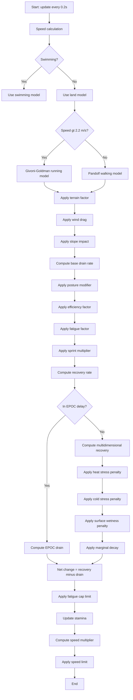
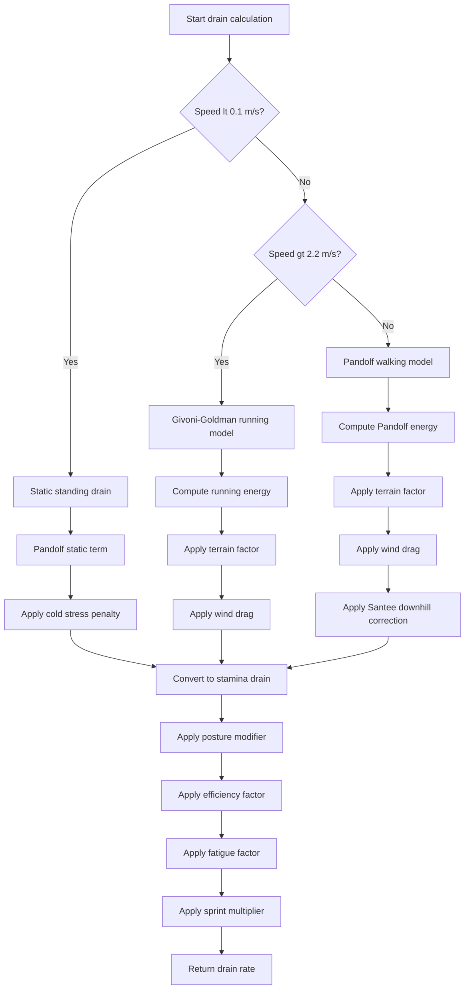
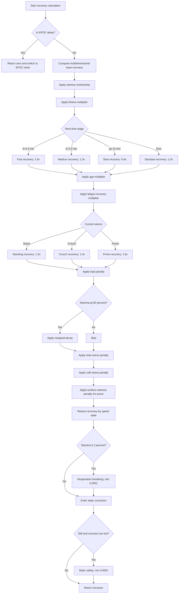
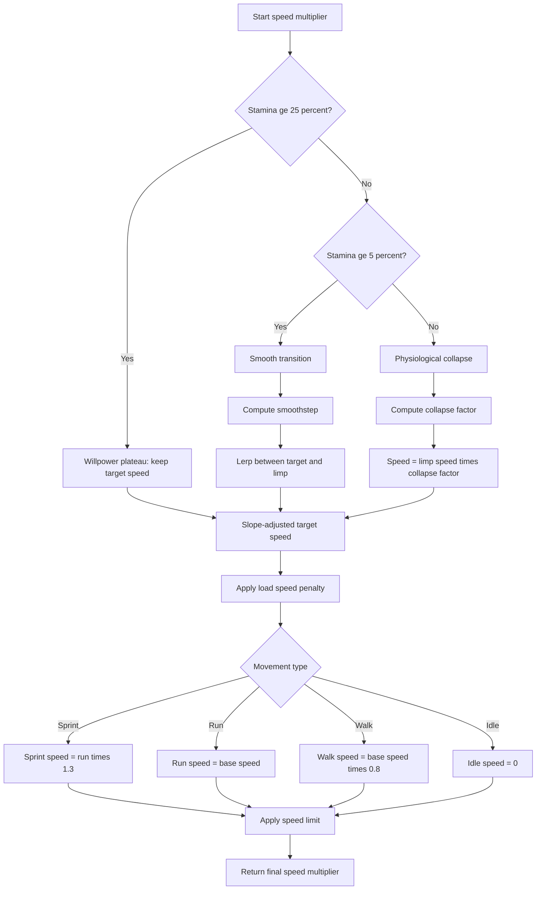
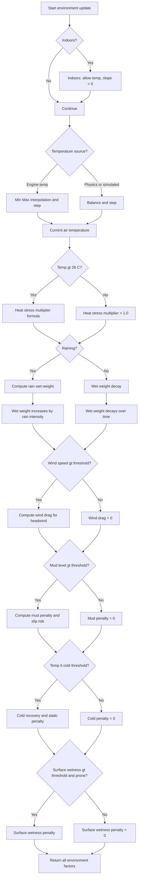

# Stamina System Computation Logic

## Table of Contents
- [1. System Architecture](#1-system-architecture)
- [2. Decision Trees](#2-decision-trees)
- [3. Core Formulas](#3-core-formulas)
- [4. Value Categories](#4-value-categories)
- [4.1 Hardcoded Constants](#41-hardcoded-constants)
- [4.2 Dynamic Config Values](#42-dynamic-config-values)

---

## 1. System Architecture

### 1.1 Module Structure

```
Stamina System (Realistic Stamina System)
├── Constants (SCR_StaminaConstants.c)
├── Consumption (SCR_StaminaConsumption.c)
├── Recovery (SCR_StaminaRecovery.c)
├── Core System (SCR_RealisticStaminaSystem.c)
├── Update Coordinator (SCR_StaminaUpdateCoordinator.c)
├── Speed Calculation (SCR_SpeedCalculation.c)
├── Environment Factors (SCR_EnvironmentFactor.c)
├── Fatigue System (SCR_FatigueSystem.c)
└── Exercise Tracking (SCR_ExerciseTracking.c)
```

### 1.2 Update Cycle

- Update frequency: every 0.2 seconds
- Update flow: speed calculation -> drain calculation -> recovery calculation -> net change -> speed update

---

## 2. Decision Trees

### 2.1 Main Flow



### 2.2 Drain Calculation



### 2.3 Recovery Calculation



### 2.4 Speed Calculation



### 2.5 Environment Factors



---

## 3. Core Formulas

**Parameters:**
- `E`: energy expenditure rate (W)
- `M`: weight multiplier = (body + load) / reference weight (90 kg)
- `V`: speed (m/s)
- `G`: grade percent (for example 5 percent = 0.05)
- `eta`: terrain factor (1.0 to 1.8)
- `windDrag`: wind drag factor (0.0 to 1.0)

**Stamina drain conversion:**
```
staminaDrainRate = E * ENERGY_TO_STAMINA_COEFF
```

File location: SCR_RealisticStaminaSystem.c L852-L921

---

### 3.2 Givoni-Goldman Running Model *(legacy, replaced by Pandolf)*

> Historically the module used the Givoni-Goldman formula for run/sprint cost,
> but as of v3.12.0 all movement expenditure is computed with the Pandolf model
> (see §3.1). The information below is kept for reference only.

**Formula:**
```
E_run = M * GIVONI_CONSTANT * V^alpha
```

**Parameters:**
- `E_run`: running energy expenditure (W)
- `M`: weight multiplier
- `GIVONI_CONSTANT`: running constant = 0.8
- `V`: speed (m/s)
- `alpha`: speed exponent = 2.2

**Stamina drain conversion:**
```
runningDrainRate = E_run * ENERGY_TO_STAMINA_COEFF
```

File location: SCR_RealisticStaminaSystem.c L1147-L1177

---

### 3.3 Static Standing Drain

**Pandolf static term:**
```
E_standing = 1.2 * W_body + 1.6 * (W_body + L) * (L / W_body)^2
```

**Parameters:**
- `E_standing`: static energy expenditure (W)
- `W_body`: body weight (90 kg)
- `L`: load weight (kg)

**Stamina drain conversion:**
```
staticDrainRate = E_standing * ENERGY_TO_STAMINA_COEFF
```

Note: current implementation uses lower static coefficients (1.2/1.6) to reduce standing drain.

---

### 3.4 Stamina to Speed Mapping (Dual State Model)

**Piecewise:**

```python
if staminaPercent >= 0.25:
    speedMultiplier = TARGET_RUN_SPEED_MULTIPLIER  # 0.7115 (3.7 m/s)
elif staminaPercent >= 0.05:
    t = (staminaPercent - 0.05) / (0.25 - 0.05)
    smoothT = t * t * (3 - 2 * t)
    speedMultiplier = MIN_LIMP_SPEED_MULTIPLIER + (TARGET_RUN_SPEED_MULTIPLIER - MIN_LIMP_SPEED_MULTIPLIER) * smoothT
else:
    collapseFactor = staminaPercent / 0.05
    speedMultiplier = MIN_LIMP_SPEED_MULTIPLIER * collapseFactor
    speedMultiplier = max(speedMultiplier, MIN_LIMP_SPEED_MULTIPLIER * 0.8)

speedMultiplier = max(speedMultiplier, MIN_SPEED_MULTIPLIER)
speedMultiplier = min(speedMultiplier, MAX_SPEED_MULTIPLIER)
```

File location: SCR_RealisticStaminaSystem.c L124-L169

---

### 3.5 Load Speed Penalty

**Formula:**
```
effectiveLoad = max(currentWeight - baseWeight, 0.0)
weightPercent = effectiveLoad / characterWeight
speedPenalty = ENCUMBRANCE_SPEED_PENALTY_COEFF * weightPercent
speedPenalty = clamp(speedPenalty, 0.0, 0.5)
```

Example:
- 30 kg load (effectiveLoad = 28.64 kg, weightPercent = 0.318)
- speedPenalty = 0.20 * 0.318 = 0.064 (6.4 percent speed reduction)

File location: SCR_RealisticStaminaSystem.c L300-L332

---

### 3.6 Load Drain Multiplier

**Formula:**
```
effectiveLoad = max(currentWeight - baseWeight, 0.0)
weightPercent = effectiveLoad / characterWeight
drainMultiplier = 1.0 + ENCUMBRANCE_STAMINA_DRAIN_COEFF * weightPercent
drainMultiplier = clamp(drainMultiplier, 1.0, 3.0)
```

Example:
- 30 kg load (weightPercent = 0.318)
- drainMultiplier = 1.0 + 2.0 * 0.318 = 1.636 (63.6 percent more drain)

File location: SCR_RealisticStaminaSystem.c L644-L679

---

### 3.7 Multidimensional Recovery

**Base recovery:**
```
staminaRecoveryMultiplier = 1.0 + RECOVERY_NONLINEAR_COEFF * (1.0 - staminaPercent)
baseRecoveryRate = BASE_RECOVERY_RATE * staminaRecoveryMultiplier
```

**Combined recovery:**
```
combinedRecovery = baseRecoveryRate
                * fitnessMultiplier
                * restTimeMultiplier
                * ageMultiplier
                * fatigueRecoveryMultiplier
                * postureRecoveryMultiplier
                * marginalDecay
                - loadPenalty
```

**Factors:**

```python
fitnessMultiplier = 1.0 + FITNESS_RECOVERY_COEFF * FITNESS_LEVEL
fitnessMultiplier = clamp(fitnessMultiplier, 1.0, 1.5)

if restTimeMinutes <= 0.4:
    restTimeMultiplier = FAST_RECOVERY_MULTIPLIER
elif restTimeMinutes <= 5.0:
    restTimeMultiplier = MEDIUM_RECOVERY_MULTIPLIER
elif restTimeMinutes >= 10.0:
    restTimeMultiplier = SLOW_RECOVERY_MULTIPLIER
else:
    restTimeMultiplier = 1.0

ageMultiplier = 1.0 + AGE_RECOVERY_COEFF * (AGE_REFERENCE - characterAge) / AGE_REFERENCE
ageMultiplier = clamp(ageMultiplier, 0.8, 1.2)

fatigueRecoveryPenalty = FATIGUE_RECOVERY_PENALTY * min(exerciseMinutes / FATIGUE_RECOVERY_DURATION, 1.0)
fatigueRecoveryMultiplier = 1.0 - fatigueRecoveryPenalty
fatigueRecoveryMultiplier = clamp(fatigueRecoveryMultiplier, 0.7, 1.0)

if stance == STAND:
    postureRecoveryMultiplier = STANDING_RECOVERY_MULTIPLIER
elif stance == CROUCH:
    postureRecoveryMultiplier = CROUCHING_RECOVERY_MULTIPLIER
elif stance == PRONE:
    postureRecoveryMultiplier = PRONE_RECOVERY_MULTIPLIER

loadRatio = currentWeight / BODY_TOLERANCE_BASE
loadRatio = clamp(loadRatio, 0.0, 2.0)
loadPenalty = (loadRatio ^ LOAD_RECOVERY_PENALTY_EXPONENT) * LOAD_RECOVERY_PENALTY_COEFF

if staminaPercent > MARGINAL_DECAY_THRESHOLD:
    marginalDecayMultiplier = MARGINAL_DECAY_COEFF - staminaPercent
    marginalDecayMultiplier = clamp(marginalDecayMultiplier, 0.2, 1.0)
else:
    marginalDecayMultiplier = 1.0

if speed >= 5.0:
    speedRecoveryMultiplier = 0.1
elif speed >= 3.2:
    speedRecoveryMultiplier = 0.3
elif speed >= 0.1:
    speedRecoveryMultiplier = 0.8
else:
    speedRecoveryMultiplier = 1.0

if staminaPercent < 0.02:
    recoveryRate = max(recoveryRate, 0.0001)

if baseDrainRateByVelocity > 0 and speed < 0.1:
    recoveryRate = max(recoveryRate - baseDrainRateByVelocity, 0.00005)

if speed < 0.1 and currentWeight < 40.0 and recoveryRate < 0.00005:
    recoveryRate = 0.0001
```

File location: SCR_RealisticStaminaSystem.c L425-L553

---

### 3.8 Metabolic Net Change

**Formula:**
```
tickScale = clamp(timeDeltaSeconds / 0.2, 0.01, 2.0)
netChange = (recoveryRate - totalDrainRate) * tickScale
newTargetStamina = currentStamina + netChange
newTargetStamina = clamp(newTargetStamina, 0.0, maxStaminaCap)
```

**During EPOC delay:**
```
if isInEpocDelay:
    epocDrainRate = EPOC_DRAIN_RATE * (1.0 + speedRatioBeforeStop * 0.5)
    totalDrainRate = totalDrainRate + epocDrainRate
```

File location: SCR_StaminaUpdateCoordinator.c L330-L464

---

### 3.9 Heat Stress

**Current temperature:**
```
currentTemp = engine temperature interpolation or physical balance
```

**Multiplier:**
```
if currentTemp > 26.0:
    heatStressMultiplier = 1.0 + (currentTemp - 26.0) * 0.02
    if indoors:
        heatStressMultiplier = heatStressMultiplier * (1.0 - ENV_HEAT_STRESS_INDOOR_REDUCTION)
else:
    heatStressMultiplier = 1.0

heatStressMultiplier = clamp(heatStressMultiplier, 1.0, ENV_HEAT_STRESS_MAX_MULTIPLIER)
```

File location: SCR_EnvironmentFactor.c L327-L388

---

### 3.10 Rain Wet Weight

**Increase:**
```
if outdoors and raining:
    wetWeightRate = ENV_RAIN_INTENSITY_ACCUMULATION_BASE_RATE * (rainIntensity ^ ENV_RAIN_INTENSITY_ACCUMULATION_EXPONENT)
    wetWeight = clamp(wetWeight + wetWeightRate * dt, 0.0, ENV_MAX_TOTAL_WET_WEIGHT)
```

**Decay:**
```
else:
    wetWeightDecayRate = wetWeight / ENV_RAIN_WEIGHT_DURATION
    wetWeight = max(wetWeight - wetWeightDecayRate * dt, 0.0)
```

File location: SCR_EnvironmentFactor.c L895-L941

---

### 3.11 Wind Drag

**Formula:**
```
if windSpeed > ENV_WIND_SPEED_THRESHOLD:
    playerVelocity = (vx, 0, vz)
    if playerSpeed > 0.1:
        windVector = (sin(windDir * pi/180), 0, cos(windDir * pi/180))
        projection = dot(normalize(playerVelocity), windVector)

        if projection < 0:
            windDrag = abs(projection) * windSpeed * ENV_WIND_RESISTANCE_COEFF
            windDrag = clamp(windDrag, 0.0, 1.0)
        else:
            windDrag = 0.0
    else:
        windDrag = 0.0
else:
    windDrag = 0.0
```

File location: SCR_EnvironmentFactor.c L823-L852

---

### 3.12 Swimming Stamina Drain (3D Model)

**Total power:**
```
P_total = P_static + P_horizontal + P_vertical + P_survival
```

**Static power:**
```
if effectiveLoad > SWIMMING_ENCUMBRANCE_THRESHOLD:
    loadFactor = (effectiveLoad - 25) / (SWIMMING_FULL_PENALTY_WEIGHT - 25)
    loadFactor = clamp(loadFactor, 0.0, 1.0)
    P_static = SWIMMING_BASE_POWER * (1.0 + loadFactor^2 * (SWIMMING_STATIC_DRAIN_MULTIPLIER - 1.0))
else:
    P_static = SWIMMING_BASE_POWER
```

**Horizontal drag power:**
```
if vH > SWIMMING_MIN_SPEED:
    vTotal = sqrt(vH^2 + vY^2)
    vTotal3 = vTotal * vTotal * vTotal
    P_horizontal = 0.5 * SWIMMING_WATER_DENSITY * vTotal3 * SWIMMING_DRAG_COEFFICIENT * SWIMMING_FRONTAL_AREA * SWIMMING_DYNAMIC_POWER_EFFICIENCY
else:
    P_horizontal = 0.0
```

**Vertical power:**
```
if abs(vY) > SWIMMING_VERTICAL_SPEED_THRESHOLD:
    vY3 = abs(vY) * abs(vY) * abs(vY)
    P_vertical_drag = 0.5 * SWIMMING_WATER_DENSITY * vY3 * SWIMMING_VERTICAL_DRAG_COEFFICIENT * SWIMMING_VERTICAL_FRONTAL_AREA

    if vY > 0:
        P_vertical = ((bodyWeight * 9.81 * SWIMMING_VERTICAL_UP_BASE_BODY_FORCE_COEFF + effectiveLoad * 9.81 * SWIMMING_EFFECTIVE_GRAVITY_COEFF) * vY + P_vertical_drag) * SWIMMING_VERTICAL_UP_MULTIPLIER
    else:
        buoyancy = bodyWeight * 9.81 * SWIMMING_BUOYANCY_FORCE_COEFF
        loadRelief = min(effectiveLoad * 9.81 * SWIMMING_VERTICAL_DOWN_LOAD_RELIEF_COEFF, buoyancy)
        P_vertical = ((buoyancy - loadRelief) * abs(vY) + P_vertical_drag) * SWIMMING_VERTICAL_DOWN_MULTIPLIER
else:
    P_vertical = 0.0
```

**Stamina drain:**
```
swimmingDrainRate = P_total * SWIMMING_ENERGY_TO_STAMINA_COEFF
swimmingDrainRate = clamp(swimmingDrainRate, 0.0, SWIMMING_MAX_DRAIN_RATE)
```

File location: SCR_RealisticStaminaSystem.c L1282-L1377

---

### 3.13 Fatigue Accumulation

**Accumulation:**
```
if excessDrain > 0.0:
    fatigueIncrease = excessDrain * FATIGUE_CONVERSION_COEFF
    fatigueAccumulation = clamp(fatigueAccumulation + fatigueIncrease, 0.0, MAX_FATIGUE_PENALTY)
```

**Recovery:**
```
if still and restTime >= FATIGUE_DECAY_MIN_REST_TIME:
    fatigueDecrease = FATIGUE_DECAY_RATE * (timeDelta / 0.2)
    fatigueAccumulation = max(fatigueAccumulation - fatigueDecrease, 0.0)
```

**Max stamina cap:**
```
maxStaminaCap = 1.0 - fatigueAccumulation
```

File location: SCR_FatigueSystem.c L26-L93

---

### 3.14 Grade Correction

**Uphill:**
```
if slopeAngle > 0:
    normalizedGrade = slopeAngle / 100.0
    gradePower = normalizedGrade ^ 1.2
    kGrade = 1.0 + gradePower * 5.0
    kGrade = min(kGrade, 3.0)
```

**Downhill (mild):**
```
elif slopeAngle < 0 and abs(slopeAngle) <= 15:
    kGrade = 1.0 + slopeAngle * GRADE_DOWNHILL_COEFF
    kGrade = max(kGrade, 0.5)
```

**Downhill (steep):**
```
elif slopeAngle < 0 and abs(slopeAngle) > 15:
    steepGradePenalty = (abs(slopeAngle) - 15.0) * 0.02
    kGrade = 1.0 + steepGradePenalty
    kGrade = min(kGrade, 1.5)
```

File location: SCR_RealisticStaminaSystem.c L779-L825

---

### 3.15 Santee Downhill Correction

**Formula:**
```
if gradePercent < 0 and abs(gradePercent) > 15:
    correctionTerm = abs(gradePercent) * (1.0 - abs(gradePercent) / 15.0) / 2.0
    correctionFactor = 1.0 - correctionTerm
    correctionFactor = clamp(correctionFactor, 0.5, 1.0)
    gradeTerm = gradeTerm / correctionFactor
else:
    correctionFactor = 1.0
```

File location: SCR_RealisticStaminaSystem.c L1110-L1131

---

## 4. Value Categories

### 4.1 Hardcoded Constants

The following constants are hardcoded and cannot be changed via config:

#### 4.1.1 Game Config Constants

| Constant | Value | Description | File Location |
|---------|-------|-------------|---------------|
| `GAME_MAX_SPEED` | 5.2 m/s | Game max speed | SCR_StaminaConstants.c L9 |
| `CHARACTER_WEIGHT` | 90.0 kg | Character weight | SCR_StaminaConstants.c L109 |
| `CHARACTER_AGE` | 22.0 years | Character age | SCR_StaminaConstants.c L113 |
| `BASE_WEIGHT` | 1.36 kg | Base load | SCR_StaminaConstants.c L232 |
| `MAX_ENCUMBRANCE_WEIGHT` | 40.5 kg | Max load | SCR_StaminaConstants.c L235 |
| `COMBAT_ENCUMBRANCE_WEIGHT` | 30.0 kg | Combat load threshold | SCR_StaminaConstants.c L238 |

#### 4.1.2 Speed Thresholds

| Constant | Value | Description | File Location |
|---------|-------|-------------|---------------|
| `SPRINT_VELOCITY_THRESHOLD` | 5.2 m/s | Sprint speed threshold | SCR_StaminaConstants.c L16 |
| `RUN_VELOCITY_THRESHOLD` | 3.7 m/s | Run speed threshold | SCR_StaminaConstants.c L17 |
| `WALK_VELOCITY_THRESHOLD` | 3.2 m/s | Walk speed threshold | SCR_StaminaConstants.c L18 |
| `RECOVERY_THRESHOLD_NO_LOAD` | 2.5 m/s | Recovery threshold without load | SCR_StaminaConstants.c L21 |
| `DRAIN_THRESHOLD_COMBAT_LOAD` | 1.5 m/s | Drain threshold at 30 kg | SCR_StaminaConstants.c L22 |

#### 4.1.3 Stamina Thresholds

| Constant | Value | Description | File Location |
|---------|-------|-------------|---------------|
| `INITIAL_STAMINA_AFTER_ACFT` | 1.0 (100 percent) | Initial stamina | SCR_StaminaConstants.c L41 |
| `EXHAUSTION_THRESHOLD` | 0.0 (0 percent) | Exhaustion threshold | SCR_StaminaConstants.c L44 |
| `EXHAUSTION_LIMP_SPEED` | 1.0 m/s | Base limp speed (used as minimum; actual exhaustion speed now scales with encumbrance) | SCR_StaminaConstants.c L45 |
| `SPRINT_ENABLE_THRESHOLD` | 0.20 (20 percent) | Min stamina to sprint | SCR_StaminaConstants.c L46 |
| `MIN_RECOVERY_STAMINA_THRESHOLD` | 0.2 (20 percent) | Min recovery stamina | SCR_StaminaConstants.c L212 |
| `MIN_RECOVERY_REST_TIME_SECONDS` | 3.0 s | Rest time at low stamina | SCR_StaminaConstants.c L213 |

#### 4.1.4 Drain Rate Constants *(legacy)*

> **Note:** starting with v3.12.0 the simple constant drain rates for Walk/Run/Sprint
> are no longer used by the runtime system. all movement costs are now computed
> using the Pandolf energy expenditure model (see §4.1.6). these constants remain
> in the codebase only for backward compatibility and toolchain support.

| Constant | Value | Description | File Location |
|---------|-------|-------------|---------------|
| `SPRINT_BASE_DRAIN_RATE` | 0.480 pts/s | (legacy) Sprint base drain rate | SCR_StaminaConstants.c L27 |
| `RUN_BASE_DRAIN_RATE` | 0.075 pts/s | (legacy) Run base drain rate | SCR_StaminaConstants.c L28 |
| `WALK_BASE_DRAIN_RATE` | 0.045 pts/s | (legacy) Walk base drain rate | SCR_StaminaConstants.c L29 |
| `REST_RECOVERY_RATE` | 0.250 pts/s | Rest recovery rate | SCR_StaminaConstants.c L30 |

#### 4.1.5 Posture Drain Multipliers

| Constant | Value | Description | File Location |
|---------|-------|-------------|---------------|
| `POSTURE_STAND_MULTIPLIER` | 1.0x | Standing drain multiplier | SCR_StaminaConstants.c L340 |
| `POSTURE_CROUCH_MULTIPLIER` | 1.8x | Crouch drain multiplier | SCR_StaminaConstants.c L338 |
| `POSTURE_PRONE_MULTIPLIER` | 3.0x | Prone drain multiplier | SCR_StaminaConstants.c L339 |

#### 4.1.6 Pandolf Model Constants

| Constant | Value | Description | File Location |
|---------|-------|-------------|---------------|
| `PANDOLF_BASE_COEFF` | 2.7 | Base coefficient (W/kg) | SCR_StaminaConstants.c L292 |
| `PANDOLF_VELOCITY_COEFF` | 3.2 | Velocity coefficient (W/kg) | SCR_StaminaConstants.c L293 |
| `PANDOLF_VELOCITY_OFFSET` | 0.7 | Velocity offset (m/s) | SCR_StaminaConstants.c L294 |
| `PANDOLF_GRADE_BASE_COEFF` | 0.23 | Grade base coefficient (W/kg) | SCR_StaminaConstants.c L295 |
| `PANDOLF_GRADE_VELOCITY_COEFF` | 1.34 | Grade velocity coefficient (W/kg) | SCR_StaminaConstants.c L296 |
| `PANDOLF_STATIC_COEFF_1` | 1.2 | Static base coefficient (W/kg) | SCR_StaminaConstants.c L299 |
| `PANDOLF_STATIC_COEFF_2` | 1.6 | Static load coefficient (W/kg) | SCR_StaminaConstants.c L300 |
| `REFERENCE_WEIGHT` | 90.0 kg | Reference weight | SCR_StaminaConstants.c L307 |

#### 4.1.7 Givoni-Goldman Model Constants

| Constant | Value | Description | File Location |
|---------|-------|-------------|---------------|
| `GIVONI_CONSTANT` | 0.8 | Running constant (W/kg*m^2/s^2) | SCR_StaminaConstants.c L310 |
| `GIVONI_VELOCITY_EXPONENT` | 2.2 | Velocity exponent | SCR_StaminaConstants.c L311 |

#### 4.1.8 Terrain Factors

| Constant | Value | Description | File Location |
|---------|-------|-------------|---------------|
| `TERRAIN_FACTOR_PAVED` | 1.0 | Paved road | SCR_StaminaConstants.c L314 |
| `TERRAIN_FACTOR_DIRT` | 1.1 | Gravel | SCR_StaminaConstants.c L315 |
| `TERRAIN_FACTOR_GRASS` | 1.2 | Grass | SCR_StaminaConstants.c L316 |
| `TERRAIN_FACTOR_BRUSH` | 1.5 | Brush | SCR_StaminaConstants.c L317 |
| `TERRAIN_FACTOR_SAND` | 1.8 | Sand | SCR_StaminaConstants.c L318 |

#### 4.1.9 Recovery Constants

| Constant | Value | Description | File Location |
|---------|-------|-------------|---------------|
| `RECOVERY_STARTUP_DELAY_SECONDS` | 3.0 s | Recovery startup delay | SCR_StaminaConstants.c L326 |
| `EPOC_DELAY_SECONDS` | 0.5 s | EPOC delay | SCR_StaminaConstants.c L332 |
| `EPOC_DRAIN_RATE` | 0.001 per 0.2s | EPOC base drain rate | SCR_StaminaConstants.c L333 |

#### 4.1.10 Fitness Constants

| Constant | Value | Description | File Location |
|---------|-------|-------------|---------------|
| `FITNESS_LEVEL` | 1.0 | Fitness level (trained) | SCR_StaminaConstants.c L120 |
| `FITNESS_EFFICIENCY_COEFF` | 0.35 | Efficiency coefficient | SCR_StaminaConstants.c L125 |
| `FITNESS_RECOVERY_COEFF` | 0.25 | Recovery coefficient | SCR_StaminaConstants.c L129 |

#### 4.1.11 Slope Constants

| Constant | Value | Description | File Location |
|---------|-------|-------------|---------------|
| `SLOPE_UPHILL_COEFF` | 0.08 | Uphill coefficient | SCR_StaminaConstants.c L269 |
| `SLOPE_DOWNHILL_COEFF` | 0.03 | Downhill coefficient | SCR_StaminaConstants.c L270 |
| `SLOPE_MAX_MULTIPLIER` | 2.0 | Max slope multiplier | SCR_StaminaConstants.c L271 |
| `SLOPE_MIN_MULTIPLIER` | 0.7 | Min slope multiplier | SCR_StaminaConstants.c L272 |

#### 4.1.12 Sprint Constants

| Constant | Value | Description | File Location |
|---------|-------|-------------|---------------|
| `SPRINT_SPEED_BOOST` | 0.30 (30 percent) | Sprint speed boost | SCR_StaminaConstants.c L282 |
| `SPRINT_MAX_SPEED_MULTIPLIER` | 1.0 | Sprint max speed multiplier | SCR_StaminaConstants.c L285 |

#### 4.1.13 Speed Transition Constants

| Constant | Value | Description | File Location |
|---------|-------|-------------|---------------|
| `TARGET_RUN_SPEED` | 3.7 m/s | Target run speed | SCR_StaminaConstants.c L60 |
| `TARGET_RUN_SPEED_MULTIPLIER` | 0.7115 | Target run speed multiplier | SCR_StaminaConstants.c L61 |
| `WILLPOWER_THRESHOLD` | 0.25 (25 percent) | Willpower threshold | SCR_StaminaConstants.c L65 |
| `SMOOTH_TRANSITION_START` | 0.25 (25 percent) | Smooth transition start | SCR_StaminaConstants.c L70 |
| `SMOOTH_TRANSITION_END` | 0.05 (5 percent) | Smooth transition end | SCR_StaminaConstants.c L71 |
| `MIN_LIMP_SPEED_MULTIPLIER` | 0.1923 | Limp speed multiplier | SCR_StaminaConstants.c L74 |
| `MIN_SPEED_MULTIPLIER` | 0.15 | Min speed multiplier | SCR_StaminaConstants.c L100 |
| `MAX_SPEED_MULTIPLIER` | 1.0 | Max speed multiplier | SCR_StaminaConstants.c L103 |

#### 4.1.14 Stamina Exponent

| Constant | Value | Description | File Location |
|---------|-------|-------------|---------------|
| `STAMINA_EXPONENT` | 0.6 | Stamina exponent | SCR_StaminaConstants.c L86 |

#### 4.1.15 Load Constants

| Constant | Value | Description | File Location |
|---------|-------|-------------|---------------|
| `ENCUMBRANCE_SPEED_PENALTY_COEFF` | 0.20 | Speed penalty coefficient | SCR_StaminaConstants.c L91 |
| `ENCUMBRANCE_SPEED_EXPONENT` | 1.5 | Speed penalty exponent | SCR_StaminaConstants.c L92 |
| `ENCUMBRANCE_SLOPE_INTERACTION_COEFF` | 0.15 | Load x slope interaction | SCR_StaminaConstants.c L275 |
| `SPEED_ENCUMBRANCE_SLOPE_INTERACTION_COEFF` | 0.10 | Speed x load x slope interaction | SCR_StaminaConstants.c L278 |
| `BODY_TOLERANCE_BASE` | 90.0 kg | Body tolerance base | SCR_StaminaConstants.c L196 |

#### 4.1.16 Recovery Model Constants

| Constant | Value | Description | File Location |
|---------|-------|-------------|---------------|
| `RECOVERY_NONLINEAR_COEFF` | 0.5 | Recovery nonlinearity | SCR_StaminaConstants.c L143 |
| `FAST_RECOVERY_DURATION_MINUTES` | 0.4 min | Fast recovery duration | SCR_StaminaConstants.c L149 |
| `FAST_RECOVERY_MULTIPLIER` | 1.6x | Fast recovery multiplier | SCR_StaminaConstants.c L150 |
| `MEDIUM_RECOVERY_START_MINUTES` | 0.4 min | Medium recovery start | SCR_StaminaConstants.c L154 |
| `MEDIUM_RECOVERY_DURATION_MINUTES` | 5.0 min | Medium recovery duration | SCR_StaminaConstants.c L156 |
| `MEDIUM_RECOVERY_MULTIPLIER` | 1.3x | Medium recovery multiplier | SCR_StaminaConstants.c L157 |
| `SLOW_RECOVERY_START_MINUTES` | 10.0 min | Slow recovery start | SCR_StaminaConstants.c L162 |
| `SLOW_RECOVERY_MULTIPLIER` | 0.6x | Slow recovery multiplier | SCR_StaminaConstants.c L163 |

#### 4.1.17 Age Constants

| Constant | Value | Description | File Location |
|---------|-------|-------------|---------------|
| `AGE_RECOVERY_COEFF` | 0.2 | Age recovery coefficient | SCR_StaminaConstants.c L166 |
| `AGE_REFERENCE` | 30.0 years | Age reference | SCR_StaminaConstants.c L167 |

#### 4.1.18 Fatigue Constants

| Constant | Value | Description | File Location |
|---------|-------|-------------|---------------|
| `FATIGUE_RECOVERY_PENALTY` | 0.05 | Fatigue recovery penalty | SCR_StaminaConstants.c L171 |
| `FATIGUE_RECOVERY_DURATION_MINUTES` | 20.0 min | Fatigue recovery duration | SCR_StaminaConstants.c L172 |

#### 4.1.19 Posture Recovery Multipliers

| Constant | Value | Description | File Location |
|---------|-------|-------------|---------------|
| `STANDING_RECOVERY_MULTIPLIER` | 1.3x | Standing recovery multiplier | SCR_StaminaConstants.c L182 |
| `CROUCHING_RECOVERY_MULTIPLIER` | 1.4x | Crouch recovery multiplier | SCR_StaminaConstants.c L183 |
| `PRONE_RECOVERY_MULTIPLIER` | 1.6x | Prone recovery multiplier | SCR_StaminaConstants.c L184 |

#### 4.1.20 Marginal Decay Constants

| Constant | Value | Description | File Location |
|---------|-------|-------------|---------------|
| `MARGINAL_DECAY_THRESHOLD` | 0.8 (80 percent) | Marginal decay threshold | SCR_StaminaConstants.c L203 |
| `MARGINAL_DECAY_COEFF` | 1.1 | Marginal decay coefficient | SCR_StaminaConstants.c L204 |

#### 4.1.21 Metabolic Adaptation

| Constant | Value | Description | File Location |
|---------|-------|-------------|---------------|
| `AEROBIC_THRESHOLD` | 0.6 | Aerobic threshold | SCR_StaminaConstants.c L224 |
| `ANAEROBIC_THRESHOLD` | 0.8 | Anaerobic threshold | SCR_StaminaConstants.c L225 |
| `AEROBIC_EFFICIENCY_FACTOR` | 0.9 | Aerobic efficiency factor | SCR_StaminaConstants.c L226 |
| `MIXED_EFFICIENCY_FACTOR` | 1.0 | Mixed efficiency factor | SCR_StaminaConstants.c L227 |
| `ANAEROBIC_EFFICIENCY_FACTOR` | 1.2 | Anaerobic efficiency factor | SCR_StaminaConstants.c L228 |

#### 4.1.22 Action Costs

| Constant | Value | Description | File Location |
|---------|-------|-------------|---------------|
| `JUMP_STAMINA_BASE_COST` | 0.035 (3.5 percent) | Jump base cost | SCR_StaminaConstants.c L244 |
| `VAULT_STAMINA_START_COST` | 0.02 (2 percent) | Vault start cost | SCR_StaminaConstants.c L247 |
| `CLIMB_STAMINA_TICK_COST` | 0.01 (1 percent per s) | Climb tick cost | SCR_StaminaConstants.c L250 |
| `JUMP_MIN_STAMINA_THRESHOLD` | 0.10 (10 percent) | Min stamina to jump | SCR_StaminaConstants.c L253 |
| `JUMP_CONSECUTIVE_WINDOW` | 2.0 s | Consecutive jump window | SCR_StaminaConstants.c L256 |
| `JUMP_CONSECUTIVE_PENALTY` | 0.5 (50 percent) | Consecutive jump penalty | SCR_StaminaConstants.c L259 |
| `JUMP_VERTICAL_VELOCITY_THRESHOLD` | 2.0 m/s | Jump vertical velocity threshold | SCR_StaminaConstants.c L262 |
| `VAULT_VERTICAL_VELOCITY_THRESHOLD` | 1.5 m/s | Vault vertical velocity threshold | SCR_StaminaConstants.c L265 |

#### 4.1.23 Swimming Model Constants

| Constant | Value | Description | File Location |
|---------|-------|-------------|---------------|
| `SWIMMING_DRAG_COEFFICIENT` | 0.5 | Drag coefficient | SCR_StaminaConstants.c L350 |
| `SWIMMING_WATER_DENSITY` | 1000.0 kg/m^3 | Water density | SCR_StaminaConstants.c L351 |
| `SWIMMING_FRONTAL_AREA` | 0.5 m^2 | Frontal area | SCR_StaminaConstants.c L352 |
| `SWIMMING_BASE_POWER` | 20.0 W | Base swim power | SCR_StaminaConstants.c L353 |
| `SWIMMING_ENCUMBRANCE_THRESHOLD` | 25.0 kg | Load threshold | SCR_StaminaConstants.c L356 |
| `SWIMMING_STATIC_DRAIN_MULTIPLIER` | 3.0 | Static drain multiplier | SCR_StaminaConstants.c L357 |
| `SWIMMING_FULL_PENALTY_WEIGHT` | 40.0 kg | Full penalty weight | SCR_StaminaConstants.c L358 |
| `SWIMMING_LOW_INTENSITY_DISCOUNT` | 0.7 | Low intensity discount | SCR_StaminaConstants.c L359 |
| `SWIMMING_LOW_INTENSITY_VELOCITY` | 0.2 m/s | Low intensity speed | SCR_StaminaConstants.c L360 |
| `SWIMMING_ENERGY_TO_STAMINA_COEFF` | 0.00005 | Swim energy to stamina | SCR_StaminaConstants.c L364 |
| `SWIMMING_DYNAMIC_POWER_EFFICIENCY` | 2.0 | Dynamic power efficiency | SCR_StaminaConstants.c L365 |
| `SWIMMING_VERTICAL_DRAG_COEFFICIENT` | 1.2 | Vertical drag coefficient | SCR_StaminaConstants.c L368 |
| `SWIMMING_VERTICAL_FRONTAL_AREA` | 0.8 m^2 | Vertical frontal area | SCR_StaminaConstants.c L369 |
| `SWIMMING_VERTICAL_SPEED_THRESHOLD` | 0.05 m/s | Vertical speed threshold | SCR_StaminaConstants.c L370 |
| `SWIMMING_EFFECTIVE_GRAVITY_COEFF` | 0.15 | Effective gravity coefficient | SCR_StaminaConstants.c L371 |
| `SWIMMING_BUOYANCY_FORCE_COEFF` | 0.10 | Buoyancy coefficient | SCR_StaminaConstants.c L372 |
| `SWIMMING_VERTICAL_UP_MULTIPLIER` | 2.5 | Vertical up multiplier | SCR_StaminaConstants.c L373 |
| `SWIMMING_VERTICAL_DOWN_MULTIPLIER` | 1.5 | Vertical down multiplier | SCR_StaminaConstants.c L374 |
| `SWIMMING_MAX_DRAIN_RATE` | 0.15 | Max drain rate | SCR_StaminaConstants.c L375 |
| `SWIMMING_VERTICAL_UP_BASE_BODY_FORCE_COEFF` | 0.02 | Vertical up base body force | SCR_StaminaConstants.c L380 |
| `SWIMMING_VERTICAL_DOWN_LOAD_RELIEF_COEFF` | 0.50 | Vertical down load relief | SCR_StaminaConstants.c L381 |
| `SWIMMING_SURVIVAL_STRESS_POWER` | 15.0 W | Survival stress power | SCR_StaminaConstants.c L384 |
| `SWIMMING_MAX_TOTAL_POWER` | 2000.0 W | Max total power | SCR_StaminaConstants.c L387 |
| `WET_WEIGHT_DURATION` | 30.0 s | Wet weight duration | SCR_StaminaConstants.c L390 |
| `WET_WEIGHT_MIN` | 5.0 kg | Min wet weight | SCR_StaminaConstants.c L391 |
| `WET_WEIGHT_MAX` | 10.0 kg | Max wet weight | SCR_StaminaConstants.c L392 |
| `SWIMMING_MIN_SPEED` | 0.1 m/s | Min swim speed | SCR_StaminaConstants.c L395 |
| `SWIMMING_VERTICAL_VELOCITY_THRESHOLD` | -0.5 m/s | Vertical velocity threshold | SCR_StaminaConstants.c L396 |

#### 4.1.24 Environment Constants

| Constant | Value | Description | File Location |
|---------|-------|-------------|---------------|
| `ENV_HEAT_STRESS_START_HOUR` | 10.0 | Heat stress start hour | SCR_StaminaConstants.c L400 |
| `ENV_HEAT_STRESS_PEAK_HOUR` | 14.0 | Heat stress peak hour | SCR_StaminaConstants.c L401 |
| `ENV_HEAT_STRESS_END_HOUR` | 18.0 | Heat stress end hour | SCR_StaminaConstants.c L402 |
| `ENV_HEAT_STRESS_MAX_MULTIPLIER` | 1.5 | Heat stress max multiplier | SCR_StaminaConstants.c L403 |
| `ENV_HEAT_STRESS_BASE_MULTIPLIER` | 1.0 | Heat stress base multiplier | SCR_StaminaConstants.c L404 |
| `ENV_HEAT_STRESS_INDOOR_REDUCTION` | 0.5 | Indoor heat stress reduction | SCR_StaminaConstants.c L405 |
| `ENV_RAIN_WEIGHT_MIN` | 2.0 kg | Light rain wet weight | SCR_StaminaConstants.c L408 |
| `ENV_RAIN_WEIGHT_MAX` | 8.0 kg | Heavy rain wet weight | SCR_StaminaConstants.c L409 |
| `ENV_RAIN_WEIGHT_DURATION` | 60.0 s | Wet weight duration | SCR_StaminaConstants.c L410 |
| `ENV_RAIN_WEIGHT_DECAY_RATE` | 0.0167 | Per second decay rate | SCR_StaminaConstants.c L411 |
| `ENV_MAX_TOTAL_WET_WEIGHT` | 10.0 kg | Max total wet weight | SCR_StaminaConstants.c L414 |
| `ENV_CHECK_INTERVAL` | 5.0 s | Environment check interval | SCR_StaminaConstants.c L417 |
| `ENV_INDOOR_CHECK_HEIGHT` | 10.0 m | Indoor check height | SCR_StaminaConstants.c L420 |
| `ENV_RAIN_INTENSITY_ACCUMULATION_BASE_RATE` | 0.5 | Wet weight base accumulation | SCR_StaminaConstants.c L425 |
| `ENV_RAIN_INTENSITY_ACCUMULATION_EXPONENT` | 1.5 | Rain intensity exponent | SCR_StaminaConstants.c L426 |
| `ENV_RAIN_INTENSITY_THRESHOLD` | 0.01 | Rain intensity threshold | SCR_StaminaConstants.c L427 |
| `ENV_RAIN_INTENSITY_HEAVY_THRESHOLD` | 0.8 | Heavy rain threshold | SCR_StaminaConstants.c L428 |
| `ENV_RAIN_INTENSITY_BREATHING_PENALTY` | 0.05 | Heavy rain breathing penalty | SCR_StaminaConstants.c L429 |
| `ENV_WIND_RESISTANCE_COEFF` | 0.05 | Wind resistance coefficient | SCR_StaminaConstants.c L432 |
| `ENV_WIND_SPEED_THRESHOLD` | 1.0 m/s | Wind speed threshold | SCR_StaminaConstants.c L433 |
| `ENV_WIND_TAILWIND_BONUS` | 0.02 | Tailwind drain reduction | SCR_StaminaConstants.c L434 |
| `ENV_WIND_TAILWIND_SPEED_BONUS` | 0.01 | Tailwind speed bonus | SCR_StaminaConstants.c L435 |
| `ENV_MUD_PENALTY_MAX` | 0.4 | Max mud penalty | SCR_StaminaConstants.c L438 |
| `ENV_MUD_SLIPPERY_THRESHOLD` | 0.3 | Slippery threshold | SCR_StaminaConstants.c L439 |
| `ENV_MUD_SPRINT_PENALTY` | 0.1 | Mud sprint penalty | SCR_StaminaConstants.c L440 |
| `ENV_MUD_SLIP_RISK_BASE` | 0.001 | Base slip risk | SCR_StaminaConstants.c L441 |
| `ENV_TEMPERATURE_HEAT_THRESHOLD` | 30.0 deg C | Heat threshold | SCR_StaminaConstants.c L444 |
| `ENV_TEMPERATURE_HEAT_PENALTY_COEFF` | 0.02 | Heat recovery penalty per deg | SCR_StaminaConstants.c L445 |
| `ENV_TEMPERATURE_COLD_THRESHOLD` | 0.0 deg C | Cold threshold | SCR_StaminaConstants.c L446 |
| `ENV_TEMPERATURE_COLD_STATIC_PENALTY` | 0.03 | Cold static penalty | SCR_StaminaConstants.c L447 |
| `ENV_TEMPERATURE_COLD_RECOVERY_PENALTY` | 0.05 | Cold recovery penalty | SCR_StaminaConstants.c L448 |
| `ENV_SURFACE_WETNESS_SOAK_RATE` | 1.0 | Surface wetness soak rate | SCR_StaminaConstants.c L451 |
| `ENV_SURFACE_WETNESS_THRESHOLD` | 0.1 | Surface wetness threshold | SCR_StaminaConstants.c L452 |
| `ENV_SURFACE_WETNESS_MARGINAL_DECAY_ADVANCE` | 0.1 | Marginal decay advance | SCR_StaminaConstants.c L453 |
| `ENV_SURFACE_WETNESS_PRONE_PENALTY` | 0.15 | Prone wetness recovery penalty | SCR_StaminaConstants.c L454 |

#### 4.1.25 Stance Transition Costs

| Constant | Value | Description | File Location |
|---------|-------|-------------|---------------|
| `STANCE_COST_PRONE_TO_STAND` | 0.015 (1.5 percent) | Prone to stand | SCR_StaminaConstants.c L813 |
| `STANCE_COST_PRONE_TO_CROUCH` | 0.010 (1.0 percent) | Prone to crouch | SCR_StaminaConstants.c L814 |
| `STANCE_COST_CROUCH_TO_STAND` | 0.005 (0.5 percent) | Crouch to stand | SCR_StaminaConstants.c L815 |
| `STANCE_COST_STAND_TO_PRONE` | 0.003 (0.3 percent) | Stand to prone | SCR_StaminaConstants.c L816 |
| `STANCE_COST_OTHER` | 0.003 (0.3 percent) | Other transitions | SCR_StaminaConstants.c L817 |
| `STANCE_FATIGUE_ACCUMULATION` | 1.0 | Stance fatigue accumulation | SCR_StaminaConstants.c L826 |
| `STANCE_FATIGUE_DECAY` | 0.3 | Stance fatigue decay | SCR_StaminaConstants.c L829 |
| `STANCE_FATIGUE_MAX` | 10.0 | Max stance fatigue | SCR_StaminaConstants.c L832 |
| `STANCE_WEIGHT_BASE` | 90.0 kg | Stance weight base | SCR_StaminaConstants.c L840 |
| `STANCE_TRANSITION_MIN_STAMINA_THRESHOLD` | 0.10 (10 percent) | Min stamina for transition | SCR_StaminaConstants.c L847 |

---

### 4.2 Dynamic Config Values

These values are pulled from SCR_RSS_ConfigManager and can be edited via config.

#### 4.2.1 Base Recovery Rate

| Config | Default | Description | Getter |
|---------|--------|-------------|--------|
| `base_recovery_rate` | 0.00035 per 0.2s | Base recovery rate | GetBaseRecoveryRate() |

#### 4.2.2 Energy to Stamina Coefficient

| Config | Default | Description | Getter |
|---------|--------|-------------|--------|
| `energy_to_stamina_coeff` | 0.000035 | Energy to stamina coeff | GetEnergyToStaminaCoeff() |

#### 4.2.3 Posture Recovery Multipliers

| Config | Default | Description | Getter |
|---------|--------|-------------|--------|
| `standing_recovery_multiplier` | 1.5x | Standing recovery multiplier | GetStandingRecoveryMultiplier() |
| `prone_recovery_multiplier` | 1.8x | Prone recovery multiplier | GetProneRecoveryMultiplier() |

#### 4.2.4 Load Recovery Penalty

| Config | Default | Description | Getter |
|---------|--------|-------------|--------|
| `load_recovery_penalty_coeff` | 0.0004 | Load recovery penalty coeff | GetLoadRecoveryPenaltyCoeff() |
| `load_recovery_penalty_exponent` | 2.0 | Load recovery penalty exponent | GetLoadRecoveryPenaltyExponent() |

#### 4.2.5 Load Speed Penalty

| Config | Default | Description | Getter |
|---------|--------|-------------|--------|
| `encumbrance_speed_penalty_coeff` | 0.20 | Load speed penalty coeff | GetEncumbranceSpeedPenaltyCoeff() |

#### 4.2.6 Load Stamina Drain

| Config | Default | Description | Getter |
|---------|--------|-------------|--------|
| `encumbrance_stamina_drain_coeff` | 1.5 | Load stamina drain coeff | GetEncumbranceStaminaDrainCoeff() |

#### 4.2.7 Sprint Drain Multiplier

| Config | Default | Description | Getter |
|---------|--------|-------------|--------|
| `sprint_stamina_drain_multiplier` | 3.0 | Sprint drain multiplier | GetSprintStaminaDrainMultiplier() |

#### 4.2.8 Fatigue Accumulation

| Config | Default | Description | Getter |
|---------|--------|-------------|--------|
| `fatigue_accumulation_coeff` | 0.015 | Fatigue accumulation coeff | GetFatigueAccumulationCoeff() |
| `fatigue_max_factor` | 2.0 | Max fatigue factor | GetFatigueMaxFactor() |

#### 4.2.9 Posture Drain Multipliers

| Config | Default | Description | Getter |
|---------|--------|-------------|--------|
| `posture_crouch_multiplier` | 2.0x | Crouch drain multiplier | GetPostureCrouchMultiplier() |
| `posture_prone_multiplier` | 2.5x | Prone drain multiplier | GetPostureProneMultiplier() |

#### 4.2.10 Custom Preset Overrides

These only apply in the Custom preset:

| Config | Default | Description | Getter |
|---------|--------|-------------|--------|
| `m_fStaminaDrainMultiplier` | 1.0 | Stamina drain multiplier | GetStaminaDrainMultiplier() |
| `m_fStaminaRecoveryMultiplier` | 1.0 | Stamina recovery multiplier | GetStaminaRecoveryMultiplier() |
| `m_fEncumbranceSpeedPenaltyMultiplier` | 1.0 | Load speed penalty multiplier | GetEncumbranceSpeedPenaltyMultiplier() |
| `m_fSprintSpeedMultiplier` | 1.3 | Sprint speed multiplier | GetSprintSpeedMultiplier() |

#### 4.2.11 System Toggles

These only apply in the Custom preset:

| Config | Default | Description | Getter |
|---------|--------|-------------|--------|
| `m_bEnableHeatStress` | true | Enable heat stress system | IsHeatStressEnabled() |
| `m_bEnableRainWeight` | true | Enable rain wet weight system | IsRainWeightEnabled() |
| `m_bEnableWindResistance` | true | Enable wind resistance system | IsWindResistanceEnabled() |
| `m_bEnableMudPenalty` | true | Enable mud penalty system | IsMudPenaltyEnabled() |
| `m_bEnableFatigueSystem` | true | Enable fatigue system | IsFatigueSystemEnabled() |
| `m_bEnableMetabolicAdaptation` | true | Enable metabolic adaptation | IsMetabolicAdaptationEnabled() |
| `m_bEnableIndoorDetection` | true | Enable indoor detection | IsIndoorDetectionEnabled() |

#### 4.2.12 Update Intervals

| Config | Default | Description | Getter |
|---------|--------|-------------|--------|
| `m_iTerrainUpdateInterval` | 5000 ms | Terrain update interval | GetTerrainUpdateInterval() |
| `m_iEnvironmentUpdateInterval` | 5000 ms | Environment update interval | GetEnvironmentUpdateInterval() |

---

## Appendix

### A. Config Structure

Config path: scripts/Game/Components/Stamina/SCR_RSS_Settings.c

```c
class SCR_RSS_Params
{
    float base_recovery_rate = 0.00035;
    float energy_to_stamina_coeff = 0.000035;

    float standing_recovery_multiplier = 1.5;
    float prone_recovery_multiplier = 1.8;

    float load_recovery_penalty_coeff = 0.0004;
    float load_recovery_penalty_exponent = 2.0;

    float encumbrance_speed_penalty_coeff = 0.20;
    float encumbrance_stamina_drain_coeff = 1.5;

    float sprint_stamina_drain_multiplier = 3.0;

    float fatigue_accumulation_coeff = 0.015;
    float fatigue_max_factor = 2.0;

    float posture_crouch_multiplier = 2.0;
    float posture_prone_multiplier = 2.5;

    float m_fStaminaDrainMultiplier = 1.0;
    float m_fStaminaRecoveryMultiplier = 1.0;
    float m_fEncumbranceSpeedPenaltyMultiplier = 1.0;
    float m_fSprintSpeedMultiplier = 1.3;

    bool m_bEnableHeatStress = true;
    bool m_bEnableRainWeight = true;
    bool m_bEnableWindResistance = true;
    bool m_bEnableMudPenalty = true;
    bool m_bEnableFatigueSystem = true;
    bool m_bEnableMetabolicAdaptation = true;
    bool m_bEnableIndoorDetection = true;

    int m_iTerrainUpdateInterval = 5000;
    int m_iEnvironmentUpdateInterval = 5000;
}
```

### B. Presets

Supported presets:

1. EliteStandard
2. StandardMilsim
3. TacticalAction
4. Custom

Only the Custom preset reads user overrides. Others use hardcoded defaults.

### C. Debug Config

| Config | Default | Description |
|---------|--------|-------------|
| `m_bDebugLogEnabled` | false | Enable debug logs |
| `m_bVerboseLogging` | false | Enable verbose logs |
| `m_iDebugUpdateInterval` | 5000 ms | Debug refresh interval |

---

## Document Version

- Version: 1.0
- Last updated: 2026-01-30
- Author: Realistic Stamina System Team

## References

- SCR_StaminaConstants.c
- SCR_StaminaConsumption.c
- SCR_StaminaRecovery.c
- SCR_RealisticStaminaSystem.c
- SCR_StaminaUpdateCoordinator.c
- SCR_SpeedCalculation.c
- SCR_EnvironmentFactor.c
- SCR_FatigueSystem.c
- SCR_ExerciseTracking.c
