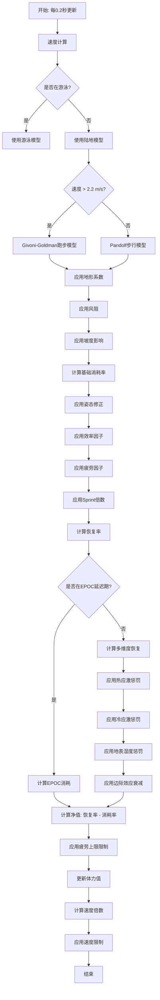
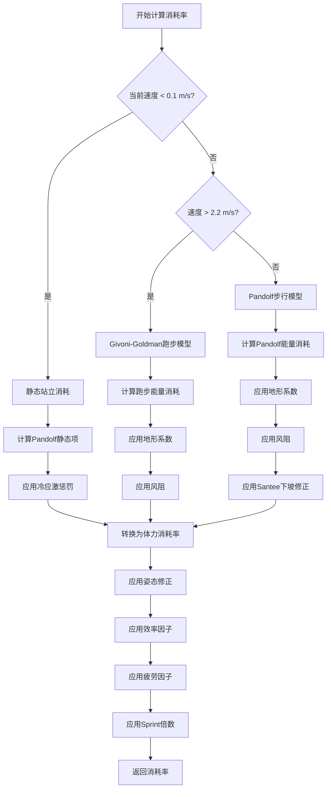
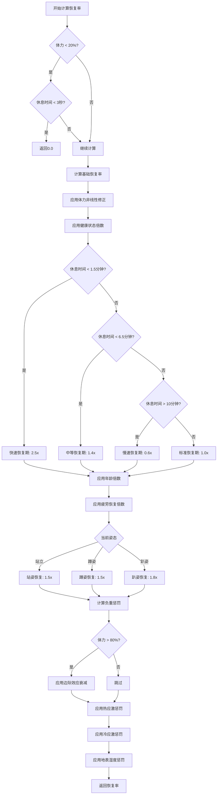

# 体力系统计算逻辑文档

## 目录
- [一、系统架构](#一系统架构)
- [二、决策树](#二决策树)
- [三、核心公式](#三核心公式)
- [四、数值分类](#四数值分类)
  - [4.1 硬编码常量](#41-硬编码常量)
  - [4.2 动态配置值](#42-动态配置值)

---

## 一、系统架构

### 1.1 模块结构

```
体力系统 (Realistic Stamina System)
├── 常量定义 (SCR_StaminaConstants.c)
├── 消耗计算 (SCR_StaminaConsumption.c)
├── 恢复计算 (SCR_StaminaRecovery.c)
├── 核心系统 (SCR_RealisticStaminaSystem.c)
├── 更新协调 (SCR_StaminaUpdateCoordinator.c)
├── 速度计算 (SCR_SpeedCalculation.c)
├── 环境因子 (SCR_EnvironmentFactor.c)
├── 疲劳系统 (SCR_FatigueSystem.c)
└── 运动跟踪 (SCR_ExerciseTracking.c)
```

### 1.2 更新周期

- **更新频率**: 每0.2秒执行一次
- **更新流程**: 速度计算 → 消耗率计算 → 恢复率计算 → 净值计算 → 速度更新

---

## 二、决策树

### 2.1 主流程决策树



### 2.2 消耗率计算决策树



### 2.3 恢复率计算决策树



### 2.4 速度计算决策树


### 2.5 环境因子决策树

```mermaid
graph TD
    A[开始环境因子更新] --> B{是否在室内?}
    B -->|是| C[豁免热应激和坡度]
    B -->|否| D[计算热应激]
    
    D --> E{虚拟气温 > 26°C?}
    E -->|是| F[热应激倍数 = 1.0 + (气温-26) × 0.02]
    E -->|否| G[热应激倍数 = 1.0]
    
    F --> H{是否在下雨?}
    G --> H
    
    H -->|是| I[计算降雨湿重]
    H -->|否| J[湿重衰减]
    
    I --> K[湿重 += 0.5 × 降雨强度^1.5 × dt]
    J --> L[湿重 -= 湿重 / 60 × dt]
    
    K --> M{风速 > 1.0 m/s?}
    L --> M
    
    M -->|是| N[计算风阻]
    M -->|否| O[风阻 = 0]
    
    N --> P{是否逆风?}
    P -->|是| Q[风阻 = 逆风投影 × 风速 × 0.05]
    P -->|否| R[风阻 = 0]
    
    Q --> S{泥泞度 > 0?}
    R --> S
    O --> S
    
    S -->|是| T[计算泥泞惩罚]
    S -->|否| U[泥泞惩罚 = 0]
    
    T --> V[泥泞地形系数 = 泥泞度 × 0.4]
    V --> W[泥泞Sprint惩罚 = 泥泞度 × 0.1]
    
    W --> X{气温 < 0°C?}
    U --> X
    
    X -->|是| Y[计算冷应激惩罚]
    X -->|否| Z[冷应激惩罚 = 0]
    
    Y --> AA[冷应激恢复惩罚 = (0-气温) × 0.05]
    AA --> AB[冷应激静态惩罚 = (0-气温) × 0.03]
    
    AB --> AC{地表湿度 > 0.1?}
    Z --> AC
    
    AC -->|是且趴姿| AD[地表湿度惩罚 = 湿度 × 0.15]
    AC -->|否| AE[地表湿度惩罚 = 0]
    
    AD --> AF[返回所有环境因子]
    AE --> AF
```

---

## 三、核心公式

### 3.1 Pandolf能量消耗模型

**完整公式**:
```
E = M × (2.7 + 3.2×(V-0.7)² + G×(0.23 + 1.34×V²)) × η × (1 + windDrag)
```

**参数说明**:
- `E`: 能量消耗率 (W/kg)
- `M`: 总重量倍数 = (体重 + 负重) / 参考体重 (90kg)
- `V`: 速度 (m/s)
- `G`: 坡度百分比 (例如 5% = 0.05)
- `η`: 地形系数 (1.0-1.8)
- `windDrag`: 风阻系数 (0.0-1.0)

**体力消耗率转换**:
```
staminaDrainRate = E × ENERGY_TO_STAMINA_COEFF
```

**文件位置**: [SCR_RealisticStaminaSystem.c#L852-L921](file:///c:\Users\74738\Documents\My Games\ArmaReforgerWorkbench\addons\Realistic Stamina System Dev\scripts\Game\Components\Stamina\SCR_RealisticStaminaSystem.c#L852-L921)

---

### 3.2 Givoni-Goldman跑步模型

**公式**:
```
E_run = M × GIVONI_CONSTANT × V^α
```

**参数说明**:
- `E_run`: 跑步能量消耗率 (W/kg)
- `M`: 总重量倍数
- `GIVONI_CONSTANT`: 跑步常数 = 0.6
- `V`: 速度 (m/s)
- `α`: 速度指数 = 2.2

**体力消耗率转换**:
```
runningDrainRate = E_run × ENERGY_TO_STAMINA_COEFF
```

**文件位置**: [SCR_RealisticStaminaSystem.c#L1147-L1177](file:///c:\Users\74738\Documents\My Games\ArmaReforgerWorkbench\addons\Realistic Stamina System Dev\scripts\Game\Components\Stamina\SCR_RealisticStaminaSystem.c#L1147-L1177)

---

### 3.3 静态站立消耗

**Pandolf静态项公式**:
```
E_standing = 1.5×W_body + 2.0×(W_body + L)×(L/W_body)²
```

**参数说明**:
- `E_standing`: 静态能量消耗率 (W)
- `W_body`: 身体重量 (90kg)
- `L`: 负重 (kg)

**体力消耗率转换**:
```
staticDrainRate = E_standing × ENERGY_TO_STAMINA_COEFF
```

**文件位置**: [SCR_RealisticStaminaSystem.c#L1069-L1099](file:///c:\Users\74738\Documents\My Games\ArmaReforgerWorkbench\addons\Realistic Stamina System Dev\scripts\Game\Components\Stamina\SCR_RealisticStaminaSystem.c#L1069-L1099)

---

### 3.4 体力→速度映射（双稳态模型）

**分段函数**:

```python
if staminaPercent >= 0.25:  # 体力 ≥ 25%
    speedMultiplier = TARGET_RUN_SPEED_MULTIPLIER  # 0.7115 (3.7 m/s)
    
elif staminaPercent >= 0.05:  # 5% ≤ 体力 < 25%
    t = (staminaPercent - 0.05) / (0.25 - 0.05)  # 0.0-1.0
    smoothT = t² × (3 - 2t)  # smoothstep函数
    speedMultiplier = MIN_LIMP_SPEED_MULTIPLIER + 
                     (TARGET_RUN_SPEED_MULTIPLIER - MIN_LIMP_SPEED_MULTIPLIER) × smoothT
    
else:  # 体力 < 5%
    collapseFactor = staminaPercent / 0.05  # 0.0-1.0
    speedMultiplier = MIN_LIMP_SPEED_MULTIPLIER × collapseFactor
```

**文件位置**: [SCR_RealisticStaminaSystem.c#L124-L169](file:///c:\Users\74738\Documents\My Games\ArmaReforgerWorkbench\addons\Realistic Stamina System Dev\scripts\Game\Components\Stamina\SCR_RealisticStaminaSystem.c#L124-L169)

---

### 3.5 负重速度惩罚

**公式**:
```
有效负重 = max(当前重量 - 基准重量, 0.0)
体重百分比 = 有效负重 / 角色体重
速度惩罚 = ENCUMBRANCE_SPEED_PENALTY_COEFF × 体重百分比
速度惩罚 = clamp(速度惩罚, 0.0, 0.5)  # 最多减少50%速度
```

**示例计算**:
- 30kg负重 (有效负重 = 28.64kg, 体重百分比 = 0.318)
- 速度惩罚 = 0.20 × 0.318 = 0.064 (减少6.4%速度)

**文件位置**: [SCR_RealisticStaminaSystem.c#L300-L332](file:///c:\Users\74738\Documents\My Games\ArmaReforgerWorkbench\addons\Realistic Stamina System Dev\scripts\Game\Components\Stamina\SCR_RealisticStaminaSystem.c#L300-L332)

---

### 3.6 负重体力消耗倍数

**公式**:
```
有效负重 = max(当前重量 - 基准重量, 0.0)
体重百分比 = 有效负重 / 角色体重
消耗倍数 = 1.0 + ENCUMBRANCE_STAMINA_DRAIN_COEFF × 体重百分比
消耗倍数 = clamp(消耗倍数, 1.0, 3.0)  # 最多3倍消耗
```

**示例计算**:
- 30kg负重 (体重百分比 = 0.318)
- 消耗倍数 = 1.0 + 2.0 × 0.318 = 1.636倍 (增加63.6%消耗)

**文件位置**: [SCR_RealisticStaminaSystem.c#L644-L679](file:///c:\Users\74738\Documents\My Games\ArmaReforgerWorkbench\addons\Realistic Stamina System Dev\scripts\Game\Components\Stamina\SCR_RealisticStaminaSystem.c#L644-L679)

---

### 3.7 多维度恢复率

**基础恢复率**:
```
体力恢复倍数 = 1.0 + RECOVERY_NONLINEAR_COEFF × (1.0 - 体力百分比)
基础恢复率 = BASE_RECOVERY_RATE × 体力恢复倍数
```

**综合恢复率**:
```
综合恢复率 = 基础恢复率 
            × 健康状态倍数 
            × 休息时间倍数 
            × 年龄倍数 
            × 疲劳恢复倍数 
            × 姿态恢复倍数 
            × 边际效应衰减 
            - 负重惩罚
```

**各因子计算**:

```python
# 健康状态倍数
健康状态倍数 = 1.0 + FITNESS_RECOVERY_COEFF × FITNESS_LEVEL
健康状态倍数 = clamp(健康状态倍数, 1.0, 1.5)

# 休息时间倍数
if 休息时间 <= 1.5分钟:
    休息时间倍数 = FAST_RECOVERY_MULTIPLIER  # 2.5x
elif 休息时间 <= 6.5分钟:
    休息时间倍数 = MEDIUM_RECOVERY_MULTIPLIER  # 1.4x
elif 休息时间 >= 10分钟:
    transitionProgress = min((休息时间 - 10.0) / 10.0, 1.0)
    休息时间倍数 = 1.0 - transitionProgress × (1.0 - SLOW_RECOVERY_MULTIPLIER)  # 0.6x
else:
    休息时间倍数 = 1.0

# 年龄倍数
年龄倍数 = 1.0 + AGE_RECOVERY_COEFF × (AGE_REFERENCE - 角色年龄) / AGE_REFERENCE
年龄倍数 = clamp(年龄倍数, 0.8, 1.2)

# 疲劳恢复倍数
疲劳恢复惩罚 = FATIGUE_RECOVERY_PENALTY × min(运动时间 / FATIGUE_RECOVERY_DURATION, 1.0)
疲劳恢复倍数 = 1.0 - 疲劳恢复惩罚
疲劳恢复倍数 = clamp(疲劳恢复倍数, 0.7, 1.0)

# 姿态恢复倍数
if 姿态 == 站立:
    姿态恢复倍数 = STANDING_RECOVERY_MULTIPLIER  # 1.5x
elif 姿态 == 蹲姿:
    姿态恢复倍数 = CROUCHING_RECOVERY_MULTIPLIER  # 1.5x
elif 姿态 == 趴姿:
    姿态恢复倍数 = PRONE_RECOVERY_MULTIPLIER  # 1.8x

# 负重惩罚
负重比例 = 当前重量 / BODY_TOLERANCE_BASE
负重比例 = clamp(负重比例, 0.0, 2.0)
负重惩罚 = (负重比例)^LOAD_RECOVERY_PENALTY_EXPONENT × LOAD_RECOVERY_PENALTY_COEFF

# 边际效应衰减
if 体力百分比 > MARGINAL_DECAY_THRESHOLD:  # 80%
    边际衰减倍数 = MARGINAL_DECAY_COEFF - 体力百分比
    边际衰减倍数 = clamp(边际衰减倍数, 0.2, 1.0)
else:
    边际衰减倍数 = 1.0
```

**文件位置**: [SCR_RealisticStaminaSystem.c#L425-L553](file:///c:\Users\74738\Documents\My Games\ArmaReforgerWorkbench\addons\Realistic Stamina System Dev\scripts\Game\Components\Stamina\SCR_RealisticStaminaSystem.c#L425-L553)

---

### 3.8 代谢净值计算

**公式**:
```
netChange = recoveryRate - totalDrainRate
newTargetStamina = currentStamina + netChange
newTargetStamina = clamp(newTargetStamina, 0.0, maxStaminaCap)
```

**EPOC延迟期间**:
```
if isInEpocDelay:
    epocDrainRate = EPOC_DRAIN_RATE × (1.0 + 停止前速度比率 × 0.5)
    totalDrainRate = totalDrainRate + epocDrainRate
```

**文件位置**: [SCR_StaminaUpdateCoordinator.c#L330-L464](file:///c:\Users\74738\Documents\My Games\ArmaReforgerWorkbench\addons\Realistic Stamina System Dev\scripts\Game\Components\Stamina\SCR_StaminaUpdateCoordinator.c#L330-L464)

---

### 3.9 热应激计算

**虚拟气温**:
```
虚拟气温 = 15.0 + 12.0 × cos((当前小时 - 14.0) × π / 12.0)
```

**热应激倍数**:
```
if 虚拟气温 > 26.0°C:
    热应激倍数 = 1.0 + (虚拟气温 - 26.0) × 0.02
    if 在室内:
        热应激倍数 = 热应激倍数 × (1.0 - ENV_HEAT_STRESS_INDOOR_REDUCTION)  # × 0.5
else:
    热应激倍数 = 1.0

热应激倍数 = clamp(热应激倍数, 1.0, ENV_HEAT_STRESS_MAX_MULTIPLIER)  # 1.0-1.5
```

**文件位置**: [SCR_EnvironmentFactor.c#L327-L388](file:///c:\Users\74738\Documents\My Games\ArmaReforgerWorkbench\addons\Realistic Stamina System Dev\scripts\Game\Components\Stamina\SCR_EnvironmentFactor.c#L327-L388)

---

### 3.10 降雨湿重计算

**湿重增加**:
```
if 在室外且正在下雨:
    湿重增加速率 = ENV_RAIN_INTENSITY_ACCUMULATION_BASE_RATE × 
                   降雨强度^ENV_RAIN_INTENSITY_ACCUMULATION_EXPONENT
    湿重 = clamp(湿重 + 湿重增加速率 × dt, 0.0, ENV_MAX_TOTAL_WET_WEIGHT)
```

**湿重衰减**:
```
else:
    湿重衰减速率 = 湿重 / ENV_RAIN_WEIGHT_DURATION
    湿重 = max(湿重 - 湿重衰减速率 × dt, 0.0)
```

**文件位置**: [SCR_EnvironmentFactor.c#L895-L941](file:///c:\Users\74738\Documents\My Games\ArmaReforgerWorkbench\addons\Realistic Stamina System Dev\scripts\Game\Components\Stamina\SCR_EnvironmentFactor.c#L895-L941)

---

### 3.11 风阻计算

**公式**:
```
if 风速 > ENV_WIND_SPEED_THRESHOLD:
    玩家速度向量 = (玩家速度[0], 0, 玩家速度[2])  # 水平分量
    if 玩家速度 > 0.1:
        风向向量 = (sin(风向×π/180), 0, cos(风向×π/180))
        风投影 = dot(玩家速度向量.归一化(), 风向向量)
        
        if 风投影 < 0:  # 逆风
            风阻 = abs(风投影) × 风速 × ENV_WIND_RESISTANCE_COEFF
            风阻 = clamp(风阻, 0.0, 1.0)
        else:
            风阻 = 0.0  # 顺风
    else:
        风阻 = 0.0
else:
    风阻 = 0.0
```

**文件位置**: [SCR_EnvironmentFactor.c#L823-L852](file:///c:\Users\74738\Documents\My Games\ArmaReforgerWorkbench\addons\Realistic Stamina System Dev\scripts\Game\Components\Stamina\SCR_EnvironmentFactor.c#L823-L852)

---

### 3.12 游泳体力消耗（3D模型）

**总功率公式**:
```
P_total = P_static + P_horizontal + P_vertical + P_survival
```

**静态功率**:
```
if 有效负重 > SWIMMING_ENCUMBRANCE_THRESHOLD:  # 25kg
    loadFactor = (有效负重 - 25kg) / (SWIMMING_FULL_PENALTY_WEIGHT - 25kg)
    loadFactor = clamp(loadFactor, 0.0, 1.0)
    P_static = SWIMMING_BASE_POWER × (1.0 + loadFactor² × (SWIMMING_STATIC_DRAIN_MULTIPLIER - 1.0))
else:
    P_static = SWIMMING_BASE_POWER
```

**水平阻力功率**:
```
if vH > SWIMMING_MIN_SPEED:
    vTotal = sqrt(vH² + vY²)
    vTotal³ = vTotal × vTotal × vTotal
    P_horizontal = 0.5 × SWIMMING_WATER_DENSITY × vTotal³ × 
                  SWIMMING_DRAG_COEFFICIENT × SWIMMING_FRONTAL_AREA × 
                  SWIMMING_DYNAMIC_POWER_EFFICIENCY
else:
    P_horizontal = 0.0
```

**垂直功率**:
```
if abs(vY) > SWIMMING_VERTICAL_SPEED_THRESHOLD:
    vY³ = abs(vY) × abs(vY) × abs(vY)
    P_vertical_drag = 0.5 × SWIMMING_WATER_DENSITY × vY³ × 
                     SWIMMING_VERTICAL_DRAG_COEFFICIENT × SWIMMING_VERTICAL_FRONTAL_AREA
    
    if vY > 0:  # 上浮
        P_vertical = ((身体重量×9.81×SWIMMING_VERTICAL_UP_BASE_BODY_FORCE_COEFF + 
                     有效负重×9.81×SWIMMING_EFFECTIVE_GRAVITY_COEFF) × vY + 
                     P_vertical_drag) × SWIMMING_VERTICAL_UP_MULTIPLIER
    else:  # 下潜
        浮力 = 身体重量×9.81×SWIMMING_BUOYANCY_FORCE_COEFF
        负重抵消 = min(有效负重×9.81×SWIMMING_VERTICAL_DOWN_LOAD_RELIEF_COEFF, 浮力)
        P_vertical = ((浮力 - 负重抵消) × abs(vY) + P_vertical_drag) × 
                    SWIMMING_VERTICAL_DOWN_MULTIPLIER
else:
    P_vertical = 0.0
```

**体力消耗率**:
```
swimmingDrainRate = P_total × SWIMMING_ENERGY_TO_STAMINA_COEFF
swimmingDrainRate = clamp(swimmingDrainRate, 0.0, SWIMMING_MAX_DRAIN_RATE)
```

**文件位置**: [SCR_RealisticStaminaSystem.c#L1282-L1377](file:///c:\Users\74738\Documents\My Games\ArmaReforgerWorkbench\addons\Realistic Stamina System Dev\scripts\Game\Components\Stamina\SCR_RealisticStaminaSystem.c#L1282-L1377)

---

### 3.13 疲劳积累计算

**疲劳积累**:
```
if 超出消耗 > 0.0:
    疲劳增加 = 超出消耗 × FATIGUE_CONVERSION_COEFF
    疲劳积累 = clamp(疲劳积累 + 疲劳增加, 0.0, MAX_FATIGUE_PENALTY)
```

**疲劳恢复**:
```
if 静止且休息时间 >= FATIGUE_DECAY_MIN_REST_TIME:
    疲劳减少 = FATIGUE_DECAY_RATE × (时间增量 / 0.2)
    疲劳积累 = max(疲劳积累 - 疲劳减少, 0.0)
```

**最大体力上限**:
```
maxStaminaCap = 1.0 - 疲劳积累
```

**文件位置**: [SCR_FatigueSystem.c#L26-L93](file:///c:\Users\74738\Documents\My Games\ArmaReforgerWorkbench\addons\Realistic Stamina System Dev\scripts\Game\Components\Stamina\SCR_FatigueSystem.c#L26-L93)

---

### 3.14 坡度修正

**上坡**:
```
if 坡度角度 > 0:
    normalizedGrade = 坡度角度 / 100.0
    gradePower = normalizedGrade^1.2
    kGrade = 1.0 + gradePower × 5.0
    kGrade = min(kGrade, 3.0)
```

**下坡（缓坡）**:
```
elif 坡度角度 < 0 and abs(坡度角度) <= 15:
    kGrade = 1.0 + 坡度角度 × GRADE_DOWNHILL_COEFF
    kGrade = max(kGrade, 0.5)
```

**下坡（陡坡）**:
```
elif 坡度角度 < 0 and abs(坡度角度) > 15:
    steepGradePenalty = (abs(坡度角度) - 15.0) × 0.02
    kGrade = 1.0 + steepGradePenalty
    kGrade = min(kGrade, 1.5)
```

**文件位置**: [SCR_RealisticStaminaSystem.c#L779-L825](file:///c:\Users\74738\Documents\My Games\ArmaReforgerWorkbench\addons\Realistic Stamina System Dev\scripts\Game\Components\Stamina\SCR_RealisticStaminaSystem.c#L779-L825)

---

### 3.15 Santee下坡修正

**公式**:
```
if 坡度百分比 < 0 and abs(坡度百分比) > 15:
    correctionTerm = abs(坡度百分比) × (1.0 - abs(坡度百分比) / 15.0) / 2.0
    correctionFactor = 1.0 - correctionTerm
    correctionFactor = clamp(correctionFactor, 0.5, 1.0)
    坡度项 = 坡度项 / correctionFactor  # 下坡陡坡时消耗增加
else:
    correctionFactor = 1.0
```

**文件位置**: [SCR_RealisticStaminaSystem.c#L1110-L1131](file:///c:\Users\74738\Documents\My Games\ArmaReforgerWorkbench\addons\Realistic Stamina System Dev\scripts\Game\Components\Stamina\SCR_RealisticStaminaSystem.c#L1110-L1131)

---

## 四、数值分类

### 4.1 硬编码常量

以下常量在代码中硬编码，无法通过配置文件修改：

#### 4.1.1 游戏配置常量

| 常量名 | 数值 | 说明 | 文件位置 |
|--------|------|------|----------|
| `GAME_MAX_SPEED` | 5.2 m/s | 游戏最大速度 | [SCR_StaminaConstants.c#L9](file:///c:\Users\74738\Documents\My Games\ArmaReforgerWorkbench\addons\Realistic Stamina System Dev\scripts\Game\Components\Stamina\SCR_StaminaConstants.c#L9) |
| `CHARACTER_WEIGHT` | 90.0 kg | 角色体重 | [SCR_StaminaConstants.c#L109](file:///c:\Users\74738\Documents\My Games\ArmaReforgerWorkbench\addons\Realistic Stamina System Dev\scripts\Game\Components\Stamina\SCR_StaminaConstants.c#L109) |
| `CHARACTER_AGE` | 22.0 岁 | 角色年龄 | [SCR_StaminaConstants.c#L113](file:///c:\Users\74738\Documents\My Games\ArmaReforgerWorkbench\addons\Realistic Stamina System Dev\scripts\Game\Components\Stamina\SCR_StaminaConstants.c#L113) |
| `BASE_WEIGHT` | 1.36 kg | 基准负重（基本装备） | [SCR_StaminaConstants.c#L232](file:///c:\Users\74738\Documents\My Games\ArmaReforgerWorkbench\addons\Realistic Stamina System Dev\scripts\Game\Components\Stamina\SCR_StaminaConstants.c#L232) |
| `MAX_ENCUMBRANCE_WEIGHT` | 40.5 kg | 最大负重 | [SCR_StaminaConstants.c#L235](file:///c:\Users\74738\Documents\My Games\ArmaReforgerWorkbench\addons\Realistic Stamina System Dev\scripts\Game\Components\Stamina\SCR_StaminaConstants.c#L235) |
| `COMBAT_ENCUMBRANCE_WEIGHT` | 30.0 kg | 战斗负重阈值 | [SCR_StaminaConstants.c#L238](file:///c:\Users\74738\Documents\My Games\ArmaReforgerWorkbench\addons\Realistic Stamina System Dev\scripts\Game\Components\Stamina\SCR_StaminaConstants.c#L238) |

#### 4.1.2 速度阈值常量

| 常量名 | 数值 | 说明 | 文件位置 |
|--------|------|------|----------|
| `SPRINT_VELOCITY_THRESHOLD` | 5.2 m/s | Sprint速度阈值 | [SCR_StaminaConstants.c#L16](file:///c:\Users\74738\Documents\My Games\ArmaReforgerWorkbench\addons\Realistic Stamina System Dev\scripts\Game\Components\Stamina\SCR_StaminaConstants.c#L16) |
| `RUN_VELOCITY_THRESHOLD` | 3.7 m/s | Run速度阈值 | [SCR_StaminaConstants.c#L17](file:///c:\Users\74738\Documents\My Games\ArmaReforgerWorkbench\addons\Realistic Stamina System Dev\scripts\Game\Components\Stamina\SCR_StaminaConstants.c#L17) |
| `WALK_VELOCITY_THRESHOLD` | 3.2 m/s | Walk速度阈值 | [SCR_StaminaConstants.c#L18](file:///c:\Users\74738\Documents\My Games\ArmaReforgerWorkbench\addons\Realistic Stamina System Dev\scripts\Game\Components\Stamina\SCR_StaminaConstants.c#L18) |
| `RECOVERY_THRESHOLD_NO_LOAD` | 2.5 m/s | 空载恢复阈值 | [SCR_StaminaConstants.c#L21](file:///c:\Users\74738\Documents\My Games\ArmaReforgerWorkbench\addons\Realistic Stamina System Dev\scripts\Game\Components\Stamina\SCR_StaminaConstants.c#L21) |
| `DRAIN_THRESHOLD_COMBAT_LOAD` | 1.5 m/s | 30kg负重消耗阈值 | [SCR_StaminaConstants.c#L22](file:///c:\Users\74738\Documents\My Games\ArmaReforgerWorkbench\addons\Realistic Stamina System Dev\scripts\Game\Components\Stamina\SCR_StaminaConstants.c#L22) |

#### 4.1.3 体力阈值常量

| 常量名 | 数值 | 说明 | 文件位置 |
|--------|------|------|----------|
| `INITIAL_STAMINA_AFTER_ACFT` | 1.0 (100%) | 初始体力 | [SCR_StaminaConstants.c#L41](file:///c:\Users\74738\Documents\My Games\ArmaReforgerWorkbench\addons\Realistic Stamina System Dev\scripts\Game\Components\Stamina\SCR_StaminaConstants.c#L41) |
| `EXHAUSTION_THRESHOLD` | 0.0 (0%) | 精疲力尽阈值 | [SCR_StaminaConstants.c#L44](file:///c:\Users\74738\Documents\My Games\ArmaReforgerWorkbench\addons\Realistic Stamina System Dev\scripts\Game\Components\Stamina\SCR_StaminaConstants.c#L44) |
| `EXHAUSTION_LIMP_SPEED` | 1.0 m/s | 跛行速度 | [SCR_StaminaConstants.c#L45](file:///c:\Users\74738\Documents\My Games\ArmaReforgerWorkbench\addons\Realistic Stamina System Dev\scripts\Game\Components\Stamina\SCR_StaminaConstants.c#L45) |
| `SPRINT_ENABLE_THRESHOLD` | 0.20 (20%) | Sprint最低体力要求 | [SCR_StaminaConstants.c#L46](file:///c:\Users\74738\Documents\My Games\ArmaReforgerWorkbench\addons\Realistic Stamina System Dev\scripts\Game\Components\Stamina\SCR_StaminaConstants.c#L46) |
| `MIN_RECOVERY_STAMINA_THRESHOLD` | 0.2 (20%) | 最低恢复体力阈值 | [SCR_StaminaConstants.c#L212](file:///c:\Users\74738\Documents\My Games\ArmaReforgerWorkbench\addons\Realistic Stamina System Dev\scripts\Game\Components\Stamina\SCR_StaminaConstants.c#L212) |
| `MIN_RECOVERY_REST_TIME_SECONDS` | 3.0 秒 | 最低体力时需要的休息时间 | [SCR_StaminaConstants.c#L213](file:///c:\Users\74738\Documents\My Games\ArmaReforgerWorkbench\addons\Realistic Stamina System Dev\scripts\Game\Components\Stamina\SCR_StaminaConstants.c#L213) |

#### 4.1.4 体力消耗率常量

| 常量名 | 数值 | 说明 | 文件位置 |
|--------|------|------|----------|
| `SPRINT_BASE_DRAIN_RATE` | 0.480 pts/s | Sprint基础消耗率 | [SCR_StaminaConstants.c#L27](file:///c:\Users\74738\Documents\My Games\ArmaReforgerWorkbench\addons\Realistic Stamina System Dev\scripts\Game\Components\Stamina\SCR_StaminaConstants.c#L27) |
| `RUN_BASE_DRAIN_RATE` | 0.075 pts/s | Run基础消耗率 | [SCR_StaminaConstants.c#L28](file:///c:\Users\74738\Documents\My Games\ArmaReforgerWorkbench\addons\Realistic Stamina System Dev\scripts\Game\Components\Stamina\SCR_StaminaConstants.c#L28) |
| `WALK_BASE_DRAIN_RATE` | 0.045 pts/s | Walk基础消耗率 | [SCR_StaminaConstants.c#L29](file:///c:\Users\74738\Documents\My Games\ArmaReforgerWorkbench\addons\Realistic Stamina System Dev\scripts\Game\Components\Stamina\SCR_StaminaConstants.c#L29) |
| `REST_RECOVERY_RATE` | -0.250 pts/s | Rest恢复率 | [SCR_StaminaConstants.c#L30](file:///c:\Users\74738\Documents\My Games\ArmaReforgerWorkbench\addons\Realistic Stamina System Dev\scripts\Game\Components\Stamina\SCR_StaminaConstants.c#L30) |

#### 4.1.5 姿态消耗倍数常量

| 常量名 | 数值 | 说明 | 文件位置 |
|--------|------|------|----------|
| `POSTURE_STAND_MULTIPLIER` | 1.0x | 站姿消耗倍数 | [SCR_StaminaConstants.c#L340](file:///c:\Users\74738\Documents\My Games\ArmaReforgerWorkbench\addons\Realistic Stamina System Dev\scripts\Game\Components\Stamina\SCR_StaminaConstants.c#L340) |
| `POSTURE_CROUCH_MULTIPLIER` | 1.8x | 蹲姿消耗倍数 | [SCR_StaminaConstants.c#L338](file:///c:\Users\74738\Documents\My Games\ArmaReforgerWorkbench\addons\Realistic Stamina System Dev\scripts\Game\Components\Stamina\SCR_StaminaConstants.c#L338) |
| `POSTURE_PRONE_MULTIPLIER` | 3.0x | 趴姿消耗倍数 | [SCR_StaminaConstants.c#L339](file:///c:\Users\74738\Documents\My Games\ArmaReforgerWorkbench\addons\Realistic Stamina System Dev\scripts\Game\Components\Stamina\SCR_StaminaConstants.c#L339) |

#### 4.1.6 Pandolf模型常量

| 常量名 | 数值 | 说明 | 文件位置 |
|--------|------|------|----------|
| `PANDOLF_BASE_COEFF` | 2.7 | 基础系数 (W/kg) | [SCR_StaminaConstants.c#L292](file:///c:\Users\74738\Documents\My Games\ArmaReforgerWorkbench\addons\Realistic Stamina System Dev\scripts\Game\Components\Stamina\SCR_StaminaConstants.c#L292) |
| `PANDOLF_VELOCITY_COEFF` | 3.2 | 速度系数 (W/kg) | [SCR_StaminaConstants.c#L293](file:///c:\Users\74738\Documents\My Games\ArmaReforgerWorkbench\addons\Realistic Stamina System Dev\scripts\Game\Components\Stamina\SCR_StaminaConstants.c#L293) |
| `PANDOLF_VELOCITY_OFFSET` | 0.7 | 速度偏移 (m/s) | [SCR_StaminaConstants.c#L294](file:///c:\Users\74738\Documents\My Games\ArmaReforgerWorkbench\addons\Realistic Stamina System Dev\scripts\Game\Components\Stamina\SCR_StaminaConstants.c#L294) |
| `PANDOLF_GRADE_BASE_COEFF` | 0.23 | 坡度基础系数 (W/kg) | [SCR_StaminaConstants.c#L295](file:///c:\Users\74738\Documents\My Games\ArmaReforgerWorkbench\addons\Realistic Stamina System Dev\scripts\Game\Components\Stamina\SCR_StaminaConstants.c#L295) |
| `PANDOLF_GRADE_VELOCITY_COEFF` | 1.34 | 坡度速度系数 (W/kg) | [SCR_StaminaConstants.c#L296](file:///c:\Users\74738\Documents\My Games\ArmaReforgerWorkbench\addons\Realistic Stamina System Dev\scripts\Game\Components\Stamina\SCR_StaminaConstants.c#L296) |
| `PANDOLF_STATIC_COEFF_1` | 1.2 | 静态基础系数 (W/kg) | [SCR_StaminaConstants.c#L299](file:///c:\Users\74738\Documents\My Games\ArmaReforgerWorkbench\addons\Realistic Stamina System Dev\scripts\Game\Components\Stamina\SCR_StaminaConstants.c#L299) |
| `PANDOLF_STATIC_COEFF_2` | 1.6 | 静态负重系数 (W/kg) | [SCR_StaminaConstants.c#L300](file:///c:\Users\74738\Documents\My Games\ArmaReforgerWorkbench\addons\Realistic Stamina System Dev\scripts\Game\Components\Stamina\SCR_StaminaConstants.c#L300) |
| `REFERENCE_WEIGHT` | 90.0 kg | 参考体重 | [SCR_StaminaConstants.c#L307](file:///c:\Users\74738\Documents\My Games\ArmaReforgerWorkbench\addons\Realistic Stamina System Dev\scripts\Game\Components\Stamina\SCR_StaminaConstants.c#L307) |

#### 4.1.7 Givoni-Goldman模型常量

| 常量名 | 数值 | 说明 | 文件位置 |
|--------|------|------|----------|
| `GIVONI_CONSTANT` | 0.6 | 跑步常数 (W/kg·m²/s²) | [SCR_StaminaConstants.c#L310](file:///c:\Users\74738\Documents\My Games\ArmaReforgerWorkbench\addons\Realistic Stamina System Dev\scripts\Game\Components\Stamina\SCR_StaminaConstants.c#L310) |
| `GIVONI_VELOCITY_EXPONENT` | 2.2 | 速度指数 | [SCR_StaminaConstants.c#L311](file:///c:\Users\74738\Documents\My Games\ArmaReforgerWorkbench\addons\Realistic Stamina System Dev\scripts\Game\Components\Stamina\SCR_StaminaConstants.c#L311) |

#### 4.1.8 地形系数常量

| 常量名 | 数值 | 说明 | 文件位置 |
|--------|------|------|----------|
| `TERRAIN_FACTOR_PAVED` | 1.0 | 铺装路面 | [SCR_StaminaConstants.c#L314](file:///c:\Users\74738\Documents\My Games\ArmaReforgerWorkbench\addons\Realistic Stamina System Dev\scripts\Game\Components\Stamina\SCR_StaminaConstants.c#L314) |
| `TERRAIN_FACTOR_DIRT` | 1.1 | 碎石路 | [SCR_StaminaConstants.c#L315](file:///c:\Users\74738\Documents\My Games\ArmaReforgerWorkbench\addons\Realistic Stamina System Dev\scripts\Game\Components\Stamina\SCR_StaminaConstants.c#L315) |
| `TERRAIN_FACTOR_GRASS` | 1.2 | 高草丛 | [SCR_StaminaConstants.c#L316](file:///c:\Users\74738\Documents\My Games\ArmaReforgerWorkbench\addons\Realistic Stamina System Dev\scripts\Game\Components\Stamina\SCR_StaminaConstants.c#L316) |
| `TERRAIN_FACTOR_BRUSH` | 1.5 | 重度灌木丛 | [SCR_StaminaConstants.c#L317](file:///c:\Users\74738\Documents\My Games\ArmaReforgerWorkbench\addons\Realistic Stamina System Dev\scripts\Game\Components\Stamina\SCR_StaminaConstants.c#L317) |
| `TERRAIN_FACTOR_SAND` | 1.8 | 软沙地 | [SCR_StaminaConstants.c#L318](file:///c:\Users\74738\Documents\My Games\ArmaReforgerWorkbench\addons\Realistic Stamina System Dev\scripts\Game\Components\Stamina\SCR_StaminaConstants.c#L318) |

#### 4.1.9 恢复相关常量

| 常量名 | 数值 | 说明 | 文件位置 |
|--------|------|------|----------|
| `RECOVERY_STARTUP_DELAY_SECONDS` | 3.0 秒 | 恢复启动延迟 | [SCR_StaminaConstants.c#L326](file:///c:\Users\74738\Documents\My Games\ArmaReforgerWorkbench\addons\Realistic Stamina System Dev\scripts\Game\Components\Stamina\SCR_StaminaConstants.c#L326) |
| `EPOC_DELAY_SECONDS` | 0.5 秒 | EPOC延迟时间 | [SCR_StaminaConstants.c#L332](file:///c:\Users\74738\Documents\My Games\ArmaReforgerWorkbench\addons\Realistic Stamina System Dev\scripts\Game\Components\Stamina\SCR_StaminaConstants.c#L332) |
| `EPOC_DRAIN_RATE` | 0.001/0.2s | EPOC期间基础消耗率 | [SCR_StaminaConstants.c#L333](file:///c:\Users\74738\Documents\My Games\ArmaReforgerWorkbench\addons\Realistic Stamina System Dev\scripts\Game\Components\Stamina\SCR_StaminaConstants.c#L333) |

#### 4.1.10 健康状态常量

| 常量名 | 数值 | 说明 | 文件位置 |
|--------|------|------|----------|
| `FITNESS_LEVEL` | 1.0 | 健康状态（训练有素） | [SCR_StaminaConstants.c#L120](file:///c:\Users\74738\Documents\My Games\ArmaReforgerWorkbench\addons\Realistic Stamina System Dev\scripts\Game\Components\Stamina\SCR_StaminaConstants.c#L120) |
| `FITNESS_EFFICIENCY_COEFF` | 0.35 | 能量效率系数 | [SCR_StaminaConstants.c#L125](file:///c:\Users\74738\Documents\My Games\ArmaReforgerWorkbench\addons\Realistic Stamina System Dev\scripts\Game\Components\Stamina\SCR_StaminaConstants.c#L125) |
| `FITNESS_RECOVERY_COEFF` | 0.25 | 恢复速度系数 | [SCR_StaminaConstants.c#L129](file:///c:\Users\74738\Documents\My Games\ArmaReforgerWorkbench\addons\Realistic Stamina System Dev\scripts\Game\Components\Stamina\SCR_StaminaConstants.c#L129) |

#### 4.1.11 坡度相关常量

| 常量名 | 数值 | 说明 | 文件位置 |
|--------|------|------|----------|
| `SLOPE_UPHILL_COEFF` | 0.08 | 上坡影响系数 | [SCR_StaminaConstants.c#L269](file:///c:\Users\74738\Documents\My Games\ArmaReforgerWorkbench\addons\Realistic Stamina System Dev\scripts\Game\Components\Stamina\SCR_StaminaConstants.c#L269) |
| `SLOPE_DOWNHILL_COEFF` | 0.03 | 下坡影响系数 | [SCR_StaminaConstants.c#L270](file:///c:\Users\74738\Documents\My Games\ArmaReforgerWorkbench\addons\Realistic Stamina System Dev\scripts\Game\Components\Stamina\SCR_StaminaConstants.c#L270) |
| `SLOPE_MAX_MULTIPLIER` | 2.0 | 最大坡度影响倍数 | [SCR_StaminaConstants.c#L271](file:///c:\Users\74738\Documents\My Games\ArmaReforgerWorkbench\addons\Realistic Stamina System Dev\scripts\Game\Components\Stamina\SCR_StaminaConstants.c#L271) |
| `SLOPE_MIN_MULTIPLIER` | 0.7 | 最小坡度影响倍数 | [SCR_StaminaConstants.c#L272](file:///c:\Users\74738\Documents\My Games\ArmaReforgerWorkbench\addons\Realistic Stamina System Dev\scripts\Game\Components\Stamina\SCR_StaminaConstants.c#L272) |

#### 4.1.12 Sprint相关常量

| 常量名 | 数值 | 说明 | 文件位置 |
|--------|------|------|----------|
| `SPRINT_SPEED_BOOST` | 0.30 (30%) | Sprint速度加成 | [SCR_StaminaConstants.c#L282](file:///c:\Users\74738\Documents\My Games\ArmaReforgerWorkbench\addons\Realistic Stamina System Dev\scripts\Game\Components\Stamina\SCR_StaminaConstants.c#L282) |
| `SPRINT_MAX_SPEED_MULTIPLIER` | 1.0 | Sprint最高速度倍数 | [SCR_StaminaConstants.c#L285](file:///c:\Users\74738\Documents\My Games\ArmaReforgerWorkbench\addons\Realistic Stamina System Dev\scripts\Game\Components\Stamina\SCR_StaminaConstants.c#L285) |

#### 4.1.13 速度平滑过渡常量

| 常量名 | 数值 | 说明 | 文件位置 |
|--------|------|------|----------|
| `TARGET_RUN_SPEED` | 3.7 m/s | 目标Run速度 | [SCR_StaminaConstants.c#L60](file:///c:\Users\74738\Documents\My Games\ArmaReforgerWorkbench\addons\Realistic Stamina System Dev\scripts\Game\Components\Stamina\SCR_StaminaConstants.c#L60) |
| `TARGET_RUN_SPEED_MULTIPLIER` | 0.7115 | 目标Run速度倍数 | [SCR_StaminaConstants.c#L61](file:///c:\Users\74738\Documents\My Games\ArmaReforgerWorkbench\addons\Realistic Stamina System Dev\scripts\Game\Components\Stamina\SCR_StaminaConstants.c#L61) |
| `WILLPOWER_THRESHOLD` | 0.25 (25%) | 意志力平台期阈值 | [SCR_StaminaConstants.c#L65](file:///c:\Users\74738\Documents\My Games\ArmaReforgerWorkbench\addons\Realistic Stamina System Dev\scripts\Game\Components\Stamina\SCR_StaminaConstants.c#L65) |
| `SMOOTH_TRANSITION_START` | 0.25 (25%) | 平滑过渡起点 | [SCR_StaminaConstants.c#L70](file:///c:\Users\74738\Documents\My Games\ArmaReforgerWorkbench\addons\Realistic Stamina System Dev\scripts\Game\Components\Stamina\SCR_StaminaConstants.c#L70) |
| `SMOOTH_TRANSITION_END` | 0.05 (5%) | 平滑过渡终点 | [SCR_StaminaConstants.c#L71](file:///c:\Users\74738\Documents\My Games\ArmaReforgerWorkbench\addons\Realistic Stamina System Dev\scripts\Game\Components\Stamina\SCR_StaminaConstants.c#L71) |
| `MIN_LIMP_SPEED_MULTIPLIER` | 0.1923 | 跛行速度倍数 | [SCR_StaminaConstants.c#L74](file:///c:\Users\74738\Documents\My Games\ArmaReforgerWorkbench\addons\Realistic Stamina System Dev\scripts\Game\Components\Stamina\SCR_StaminaConstants.c#L74) |
| `MIN_SPEED_MULTIPLIER` | 0.15 | 最小速度倍数 | [SCR_StaminaConstants.c#L100](file:///c:\Users\74738\Documents\My Games\ArmaReforgerWorkbench\addons\Realistic Stamina System Dev\scripts\Game\Components\Stamina\SCR_StaminaConstants.c#L100) |
| `MAX_SPEED_MULTIPLIER` | 1.0 | 最大速度倍数 | [SCR_StaminaConstants.c#L103](file:///c:\Users\74738\Documents\My Games\ArmaReforgerWorkbench\addons\Realistic Stamina System Dev\scripts\Game\Components\Stamina\SCR_StaminaConstants.c#L103) |

#### 4.1.14 体力指数常量

| 常量名 | 数值 | 说明 | 文件位置 |
|--------|------|------|----------|
| `STAMINA_EXPONENT` | 0.6 | 体力影响指数 | [SCR_StaminaConstants.c#L86](file:///c:\Users\74738\Documents\My Games\ArmaReforgerWorkbench\addons\Realistic Stamina System Dev\scripts\Game\Components\Stamina\SCR_StaminaConstants.c#L86) |

#### 4.1.15 负重相关常量

| 常量名 | 数值 | 说明 | 文件位置 |
|--------|------|------|----------|
| `ENCUMBRANCE_SPEED_PENALTY_COEFF` | 0.20 | 速度惩罚系数 | [SCR_StaminaConstants.c#L91](file:///c:\Users\74738\Documents\My Games\ArmaReforgerWorkbench\addons\Realistic Stamina System Dev\scripts\Game\Components\Stamina\SCR_StaminaConstants.c#L91) |
| `ENCUMBRANCE_SPEED_EXPONENT` | 1.0 | 负重速度惩罚指数 | [SCR_StaminaConstants.c#L92](file:///c:\Users\74738\Documents\My Games\ArmaReforgerWorkbench\addons\Realistic Stamina System Dev\scripts\Game\Components\Stamina\SCR_StaminaConstants.c#L92) |
| `ENCUMBRANCE_SLOPE_INTERACTION_COEFF` | 0.15 | 负重×坡度交互系数 | [SCR_StaminaConstants.c#L275](file:///c:\Users\74738\Documents\My Games\ArmaReforgerWorkbench\addons\Realistic Stamina System Dev\scripts\Game\Components\Stamina\SCR_StaminaConstants.c#L275) |
| `SPEED_ENCUMBRANCE_SLOPE_INTERACTION_COEFF` | 0.10 | 速度×负重×坡度交互系数 | [SCR_StaminaConstants.c#L278](file:///c:\Users\74738\Documents\My Games\ArmaReforgerWorkbench\addons\Realistic Stamina System Dev\scripts\Game\Components\Stamina\SCR_StaminaConstants.c#L278) |
| `BODY_TOLERANCE_BASE` | 30.0 kg | 身体耐受基准 | [SCR_StaminaConstants.c#L196](file:///c:\Users\74738\Documents\My Games\ArmaReforgerWorkbench\addons\Realistic Stamina System Dev\scripts\Game\Components\Stamina\SCR_StaminaConstants.c#L196) |

#### 4.1.16 恢复模型常量

| 常量名 | 数值 | 说明 | 文件位置 |
|--------|------|------|----------|
| `RECOVERY_NONLINEAR_COEFF` | 0.5 | 恢复非线性系数 | [SCR_StaminaConstants.c#L143](file:///c:\Users\74738\Documents\My Games\ArmaReforgerWorkbench\addons\Realistic Stamina System Dev\scripts\Game\Components\Stamina\SCR_StaminaConstants.c#L143) |
| `FAST_RECOVERY_DURATION_MINUTES` | 1.5 min | 快速恢复期持续时间 | [SCR_StaminaConstants.c#L149](file:///c:\Users\74738\Documents\My Games\ArmaReforgerWorkbench\addons\Realistic Stamina System Dev\scripts\Game\Components\Stamina\SCR_StaminaConstants.c#L149) |
| `FAST_RECOVERY_MULTIPLIER` | 2.5x | 快速恢复期倍数 | [SCR_StaminaConstants.c#L150](file:///c:\Users\74738\Documents\My Games\ArmaReforgerWorkbench\addons\Realistic Stamina System Dev\scripts\Game\Components\Stamina\SCR_StaminaConstants.c#L150) |
| `MEDIUM_RECOVERY_START_MINUTES` | 1.5 min | 中等恢复期开始时间 | [SCR_StaminaConstants.c#L154](file:///c:\Users\74738\Documents\My Games\ArmaReforgerWorkbench\addons\Realistic Stamina System Dev\scripts\Game\Components\Stamina\SCR_StaminaConstants.c#L154) |
| `MEDIUM_RECOVERY_DURATION_MINUTES` | 5.0 min | 中等恢复期持续时间 | [SCR_StaminaConstants.c#L156](file:///c:\Users\74738\Documents\My Games\ArmaReforgerWorkbench\addons\Realistic Stamina System Dev\scripts\Game\Components\Stamina\SCR_StaminaConstants.c#L156) |
| `MEDIUM_RECOVERY_MULTIPLIER` | 1.4x | 中等恢复期倍数 | [SCR_StaminaConstants.c#L157](file:///c:\Users\74738\Documents\My Games\ArmaReforgerWorkbench\addons\Realistic Stamina System Dev\scripts\Game\Components\Stamina\SCR_StaminaConstants.c#L157) |
| `SLOW_RECOVERY_START_MINUTES` | 10.0 min | 慢速恢复期开始时间 | [SCR_StaminaConstants.c#L162](file:///c:\Users\74738\Documents\My Games\ArmaReforgerWorkbench\addons\Realistic Stamina System Dev\scripts\Game\Components\Stamina\SCR_StaminaConstants.c#L162) |
| `SLOW_RECOVERY_MULTIPLIER` | 0.6x | 慢速恢复期倍数 | [SCR_StaminaConstants.c#L163](file:///c:\Users\74738\Documents\My Games\ArmaReforgerWorkbench\addons\Realistic Stamina System Dev\scripts\Game\Components\Stamina\SCR_StaminaConstants.c#L163) |

#### 4.1.17 年龄相关常量

| 常量名 | 数值 | 说明 | 文件位置 |
|--------|------|------|----------|
| `AGE_RECOVERY_COEFF` | 0.2 | 年龄恢复系数 | [SCR_StaminaConstants.c#L166](file:///c:\Users\74738\Documents\My Games\ArmaReforgerWorkbench\addons\Realistic Stamina System Dev\scripts\Game\Components\Stamina\SCR_StaminaConstants.c#L166) |
| `AGE_REFERENCE` | 30.0 岁 | 年龄参考值 | [SCR_StaminaConstants.c#L167](file:///c:\Users\74738\Documents\My Games\ArmaReforgerWorkbench\addons\Realistic Stamina System Dev\scripts\Game\Components\Stamina\SCR_StaminaConstants.c#L167) |

#### 4.1.18 疲劳相关常量

| 常量名 | 数值 | 说明 | 文件位置 |
|--------|------|------|----------|
| `FATIGUE_RECOVERY_PENALTY` | 0.05 | 疲劳恢复惩罚系数 | [SCR_StaminaConstants.c#L171](file:///c:\Users\74738\Documents\My Games\ArmaReforgerWorkbench\addons\Realistic Stamina System Dev\scripts\Game\Components\Stamina\SCR_StaminaConstants.c#L171) |
| `FATIGUE_RECOVERY_DURATION_MINUTES` | 20.0 min | 疲劳完全恢复所需时间 | [SCR_StaminaConstants.c#L172](file:///c:\Users\74738\Documents\My Games\ArmaReforgerWorkbench\addons\Realistic Stamina System Dev\scripts\Game\Components\Stamina\SCR_StaminaConstants.c#L172) |

#### 4.1.19 姿态恢复倍数常量

| 常量名 | 数值 | 说明 | 文件位置 |
|--------|------|------|----------|
| `STANDING_RECOVERY_MULTIPLIER` | 1.5x | 站姿恢复倍数 | [SCR_StaminaConstants.c#L182](file:///c:\Users\74738\Documents\My Games\ArmaReforgerWorkbench\addons\Realistic Stamina System Dev\scripts\Game\Components\Stamina\SCR_StaminaConstants.c#L182) |
| `CROUCHING_RECOVERY_MULTIPLIER` | 1.5x | 蹲姿恢复倍数 | [SCR_StaminaConstants.c#L183](file:///c:\Users\74738\Documents\My Games\ArmaReforgerWorkbench\addons\Realistic Stamina System Dev\scripts\Game\Components\Stamina\SCR_StaminaConstants.c#L183) |
| `PRONE_RECOVERY_MULTIPLIER` | 1.8x | 趴姿恢复倍数 | [SCR_StaminaConstants.c#L184](file:///c:\Users\74738\Documents\My Games\ArmaReforgerWorkbench\addons\Realistic Stamina System Dev\scripts\Game\Components\Stamina\SCR_StaminaConstants.c#L184) |

#### 4.1.20 边际效应衰减常量

| 常量名 | 数值 | 说明 | 文件位置 |
|--------|------|------|----------|
| `MARGINAL_DECAY_THRESHOLD` | 0.8 (80%) | 边际效应衰减阈值 | [SCR_StaminaConstants.c#L203](file:///c:\Users\74738\Documents\My Games\ArmaReforgerWorkbench\addons\Realistic Stamina System Dev\scripts\Game\Components\Stamina\SCR_StaminaConstants.c#L203) |
| `MARGINAL_DECAY_COEFF` | 1.1 | 边际效应衰减系数 | [SCR_StaminaConstants.c#L204](file:///c:\Users\74738\Documents\My Games\ArmaReforgerWorkbench\addons\Realistic Stamina System Dev\scripts\Game\Components\Stamina\SCR_StaminaConstants.c#L204) |

#### 4.1.21 代谢适应常量

| 常量名 | 数值 | 说明 | 文件位置 |
|--------|------|------|----------|
| `AEROBIC_THRESHOLD` | 0.6 | 有氧阈值 | [SCR_StaminaConstants.c#L224](file:///c:\Users\74738\Documents\My Games\ArmaReforgerWorkbench\addons\Realistic Stamina System Dev\scripts\Game\Components\Stamina\SCR_StaminaConstants.c#L224) |
| `ANAEROBIC_THRESHOLD` | 0.8 | 无氧阈值 | [SCR_StaminaConstants.c#L225](file:///c:\Users\74738\Documents\My Games\ArmaReforgerWorkbench\addons\Realistic Stamina System Dev\scripts\Game\Components\Stamina\SCR_StaminaConstants.c#L225) |
| `AEROBIC_EFFICIENCY_FACTOR` | 0.9 | 有氧区效率因子 | [SCR_StaminaConstants.c#L226](file:///c:\Users\74738\Documents\My Games\ArmaReforgerWorkbench\addons\Realistic Stamina System Dev\scripts\Game\Components\Stamina\SCR_StaminaConstants.c#L226) |
| `MIXED_EFFICIENCY_FACTOR` | 1.0 | 混合区效率因子 | [SCR_StaminaConstants.c#L227](file:///c:\Users\74738\Documents\My Games\ArmaReforgerWorkbench\addons\Realistic Stamina System Dev\scripts\Game\Components\Stamina\SCR_StaminaConstants.c#L227) |
| `ANAEROBIC_EFFICIENCY_FACTOR` | 1.2 | 无氧区效率因子 | [SCR_StaminaConstants.c#L228](file:///c:\Users\74738\Documents\My Games\ArmaReforgerWorkbench\addons\Realistic Stamina System Dev\scripts\Game\Components\Stamina\SCR_StaminaConstants.c#L228) |

#### 4.1.22 动作消耗常量

| 常量名 | 数值 | 说明 | 文件位置 |
|--------|------|------|----------|
| `JUMP_STAMINA_BASE_COST` | 0.035 (3.5%) | 跳跃基础消耗 | [SCR_StaminaConstants.c#L244](file:///c:\Users\74738\Documents\My Games\ArmaReforgerWorkbench\addons\Realistic Stamina System Dev\scripts\Game\Components\Stamina\SCR_StaminaConstants.c#L244) |
| `VAULT_STAMINA_START_COST` | 0.02 (2%) | 翻越起始消耗 | [SCR_StaminaConstants.c#L247](file:///c:\Users\74738\Documents\My Games\ArmaReforgerWorkbench\addons\Realistic Stamina System Dev\scripts\Game\Components\Stamina\SCR_StaminaConstants.c#L247) |
| `CLIMB_STAMINA_TICK_COST` | 0.01 (1%/s) | 持续攀爬消耗 | [SCR_StaminaConstants.c#L250](file:///c:\Users\74738\Documents\My Games\ArmaReforgerWorkbench\addons\Realistic Stamina System Dev\scripts\Game\Components\Stamina\SCR_StaminaConstants.c#L250) |
| `JUMP_MIN_STAMINA_THRESHOLD` | 0.10 (10%) | 跳跃最低体力阈值 | [SCR_StaminaConstants.c#L253](file:///c:\Users\74738\Documents\My Games\ArmaReforgerWorkbench\addons\Realistic Stamina System Dev\scripts\Game\Components\Stamina\SCR_StaminaConstants.c#L253) |
| `JUMP_CONSECUTIVE_WINDOW` | 2.0 秒 | 连续跳跃时间窗口 | [SCR_StaminaConstants.c#L256](file:///c:\Users\74738\Documents\My Games\ArmaReforgerWorkbench\addons\Realistic Stamina System Dev\scripts\Game\Components\Stamina\SCR_StaminaConstants.c#L256) |
| `JUMP_CONSECUTIVE_PENALTY` | 0.5 (50%) | 连续跳跃惩罚系数 | [SCR_StaminaConstants.c#L259](file:///c:\Users\74738\Documents\My Games\ArmaReforgerWorkbench\addons\Realistic Stamina System Dev\scripts\Game\Components\Stamina\SCR_StaminaConstants.c#L259) |
| `JUMP_VERTICAL_VELOCITY_THRESHOLD` | 2.0 m/s | 跳跃检测阈值 | [SCR_StaminaConstants.c#L262](file:///c:\Users\74738\Documents\My Games\ArmaReforgerWorkbench\addons\Realistic Stamina System Dev\scripts\Game\Components\Stamina\SCR_StaminaConstants.c#L262) |
| `VAULT_VERTICAL_VELOCITY_THRESHOLD` | 1.5 m/s | 翻越检测阈值 | [SCR_StaminaConstants.c#L265](file:///c:\Users\74738\Documents\My Games\ArmaReforgerWorkbench\addons\Realistic Stamina System Dev\scripts\Game\Components\Stamina\SCR_StaminaConstants.c#L265) |

#### 4.1.23 游泳模型常量

| 常量名 | 数值 | 说明 | 文件位置 |
|--------|------|------|----------|
| `SWIMMING_DRAG_COEFFICIENT` | 0.5 | 阻力系数 | [SCR_StaminaConstants.c#L350](file:///c:\Users\74738\Documents\My Games\ArmaReforgerWorkbench\addons\Realistic Stamina System Dev\scripts\Game\Components\Stamina\SCR_StaminaConstants.c#L350) |
| `SWIMMING_WATER_DENSITY` | 1000.0 kg/m³ | 水密度 | [SCR_StaminaConstants.c#L351](file:///c:\Users\74738\Documents\My Games\ArmaReforgerWorkbench\addons\Realistic Stamina System Dev\scripts\Game\Components\Stamina\SCR_StaminaConstants.c#L351) |
| `SWIMMING_FRONTAL_AREA` | 0.5 m² | 正面面积 | [SCR_StaminaConstants.c#L352](file:///c:\Users\74738\Documents\My Games\ArmaReforgerWorkbench\addons\Realistic Stamina System Dev\scripts\Game\Components\Stamina\SCR_StaminaConstants.c#L352) |
| `SWIMMING_BASE_POWER` | 20.0 W | 基础游泳功率 | [SCR_StaminaConstants.c#L353](file:///c:\Users\74738\Documents\My Games\ArmaReforgerWorkbench\addons\Realistic Stamina System Dev\scripts\Game\Components\Stamina\SCR_StaminaConstants.c#L353) |
| `SWIMMING_ENCUMBRANCE_THRESHOLD` | 25.0 kg | 负重阈值 | [SCR_StaminaConstants.c#L356](file:///c:\Users\74738\Documents\My Games\ArmaReforgerWorkbench\addons\Realistic Stamina System Dev\scripts\Game\Components\Stamina\SCR_StaminaConstants.c#L356) |
| `SWIMMING_STATIC_DRAIN_MULTIPLIER` | 3.0 | 静态消耗倍数 | [SCR_StaminaConstants.c#L357](file:///c:\Users\74738\Documents\My Games\ArmaReforgerWorkbench\addons\Realistic Stamina System Dev\scripts\Game\Components\Stamina\SCR_StaminaConstants.c#L357) |
| `SWIMMING_FULL_PENALTY_WEIGHT` | 40.0 kg | 满额惩罚重量 | [SCR_StaminaConstants.c#L358](file:///c:\Users\74738\Documents\My Games\ArmaReforgerWorkbench\addons\Realistic Stamina System Dev\scripts\Game\Components\Stamina\SCR_StaminaConstants.c#L358) |
| `SWIMMING_LOW_INTENSITY_DISCOUNT` | 0.7 | 低强度折扣 | [SCR_StaminaConstants.c#L359](file:///c:\Users\74738\Documents\My Games\ArmaReforgerWorkbench\addons\Realistic Stamina System Dev\scripts\Game\Components\Stamina\SCR_StaminaConstants.c#L359) |
| `SWIMMING_LOW_INTENSITY_VELOCITY` | 0.2 m/s | 低强度速度阈值 | [SCR_StaminaConstants.c#L360](file:///c:\Users\74738\Documents\My Games\ArmaReforgerWorkbench\addons\Realistic Stamina System Dev\scripts\Game\Components\Stamina\SCR_StaminaConstants.c#L360) |
| `SWIMMING_ENERGY_TO_STAMINA_COEFF` | 0.00005 | 游泳转换系数 | [SCR_StaminaConstants.c#L364](file:///c:\Users\74738\Documents\My Games\ArmaReforgerWorkbench\addons\Realistic Stamina System Dev\scripts\Game\Components\Stamina\SCR_StaminaConstants.c#L364) |
| `SWIMMING_DYNAMIC_POWER_EFFICIENCY` | 2.0 | 动态功率效率因子 | [SCR_StaminaConstants.c#L365](file:///c:\Users\74738\Documents\My Games\ArmaReforgerWorkbench\addons\Realistic Stamina System Dev\scripts\Game\Components\Stamina\SCR_StaminaConstants.c#L365) |
| `SWIMMING_VERTICAL_DRAG_COEFFICIENT` | 1.2 | 垂直方向阻力系数 | [SCR_StaminaConstants.c#L368](file:///c:\Users\74738\Documents\My Games\ArmaReforgerWorkbench\addons\Realistic Stamina System Dev\scripts\Game\Components\Stamina\SCR_StaminaConstants.c#L368) |
| `SWIMMING_VERTICAL_FRONTAL_AREA` | 0.8 m² | 垂直方向受力面积 | [SCR_StaminaConstants.c#L369](file:///c:\Users\74738\Documents\My Games\ArmaReforgerWorkbench\addons\Realistic Stamina System Dev\scripts\Game\Components\Stamina\SCR_StaminaConstants.c#L369) |
| `SWIMMING_VERTICAL_SPEED_THRESHOLD` | 0.05 m/s | 垂直速度阈值 | [SCR_StaminaConstants.c#L370](file:///c:\Users\74738\Documents\My Games\ArmaReforgerWorkbench\addons\Realistic Stamina System Dev\scripts\Game\Components\Stamina\SCR_StaminaConstants.c#L370) |
| `SWIMMING_EFFECTIVE_GRAVITY_COEFF` | 0.15 | 有效重力系数 | [SCR_StaminaConstants.c#L371](file:///c:\Users\74738\Documents\My Games\ArmaReforgerWorkbench\addons\Realistic Stamina System Dev\scripts\Game\Components\Stamina\SCR_StaminaConstants.c#L371) |
| `SWIMMING_BUOYANCY_FORCE_COEFF` | 0.10 | 浮力对抗系数 | [SCR_StaminaConstants.c#L372](file:///c:\Users\74738\Documents\My Games\ArmaReforgerWorkbench\addons\Realistic Stamina System Dev\scripts\Game\Components\Stamina\SCR_StaminaConstants.c#L372) |
| `SWIMMING_VERTICAL_UP_MULTIPLIER` | 2.5 | 上浮效率惩罚倍数 | [SCR_StaminaConstants.c#L373](file:///c:\Users\74738\Documents\My Games\ArmaReforgerWorkbench\addons\Realistic Stamina System Dev\scripts\Game\Components\Stamina\SCR_StaminaConstants.c#L373) |
| `SWIMMING_VERTICAL_DOWN_MULTIPLIER` | 1.5 | 下潜效率惩罚倍数 | [SCR_StaminaConstants.c#L374](file:///c:\Users\74738\Documents\My Games\ArmaReforgerWorkbench\addons\Realistic Stamina System Dev\scripts\Game\Components\Stamina\SCR_StaminaConstants.c#L374) |
| `SWIMMING_MAX_DRAIN_RATE` | 0.15 | 最大消耗率 | [SCR_StaminaConstants.c#L375](file:///c:\Users\74738\Documents\My Games\ArmaReforgerWorkbench\addons\Realistic Stamina System Dev\scripts\Game\Components\Stamina\SCR_StaminaConstants.c#L375) |
| `SWIMMING_VERTICAL_UP_BASE_BODY_FORCE_COEFF` | 0.02 | 上浮基础费力系数 | [SCR_StaminaConstants.c#L380](file:///c:\Users\74738\Documents\My Games\ArmaReforgerWorkbench\addons\Realistic Stamina System Dev\scripts\Game\Components\Stamina\SCR_StaminaConstants.c#L380) |
| `SWIMMING_VERTICAL_DOWN_LOAD_RELIEF_COEFF` | 0.50 | 负重抵消比例 | [SCR_StaminaConstants.c#L381](file:///c:\Users\74738\Documents\My Games\ArmaReforgerWorkbench\addons\Realistic Stamina System Dev\scripts\Game\Components\Stamina\SCR_StaminaConstants.c#L381) |
| `SWIMMING_SURVIVAL_STRESS_POWER` | 15.0 W | 生存压力常数 | [SCR_StaminaConstants.c#L384](file:///c:\Users\74738\Documents\My Games\ArmaReforgerWorkbench\addons\Realistic Stamina System Dev\scripts\Game\Components\Stamina\SCR_StaminaConstants.c#L384) |
| `SWIMMING_MAX_TOTAL_POWER` | 2000.0 W | 生理功率上限 | [SCR_StaminaConstants.c#L387](file:///c:\Users\74738\Documents\My Games\ArmaReforgerWorkbench\addons\Realistic Stamina System Dev\scripts\Game\Components\Stamina\SCR_StaminaConstants.c#L387) |
| `WET_WEIGHT_DURATION` | 30.0 秒 | 湿重持续时间 | [SCR_StaminaConstants.c#L390](file:///c:\Users\74738\Documents\My Games\ArmaReforgerWorkbench\addons\Realistic Stamina System Dev\scripts\Game\Components\Stamina\SCR_StaminaConstants.c#L390) |
| `WET_WEIGHT_MIN` | 5.0 kg | 最小湿重 | [SCR_StaminaConstants.c#L391](file:///c:\Users\74738\Documents\My Games\ArmaReforgerWorkbench\addons\Realistic Stamina System Dev\scripts\Game\Components\Stamina\SCR_StaminaConstants.c#L391) |
| `WET_WEIGHT_MAX` | 10.0 kg | 最大湿重 | [SCR_StaminaConstants.c#L392](file:///c:\Users\74738\Documents\My Games\ArmaReforgerWorkbench\addons\Realistic Stamina System Dev\scripts\Game\Components\Stamina\SCR_StaminaConstants.c#L392) |
| `SWIMMING_MIN_SPEED` | 0.1 m/s | 游泳最小速度 | [SCR_StaminaConstants.c#L395](file:///c:\Users\74738\Documents\My Games\ArmaReforgerWorkbench\addons\Realistic Stamina System Dev\scripts\Game\Components\Stamina\SCR_StaminaConstants.c#L395) |
| `SWIMMING_VERTICAL_VELOCITY_THRESHOLD` | -0.5 m/s | 垂直速度阈值 | [SCR_StaminaConstants.c#L396](file:///c:\Users\74738\Documents\My Games\ArmaReforgerWorkbench\addons\Realistic Stamina System Dev\scripts\Game\Components\Stamina\SCR_StaminaConstants.c#L396) |

#### 4.1.24 环境因子常量

| 常量名 | 数值 | 说明 | 文件位置 |
|--------|------|------|----------|
| `ENV_HEAT_STRESS_START_HOUR` | 10.0 | 热应激开始时间 | [SCR_StaminaConstants.c#L400](file:///c:\Users\74738\Documents\My Games\ArmaReforgerWorkbench\addons\Realistic Stamina System Dev\scripts\Game\Components\Stamina\SCR_StaminaConstants.c#L400) |
| `ENV_HEAT_STRESS_PEAK_HOUR` | 14.0 | 热应激峰值时间 | [SCR_StaminaConstants.c#L401](file:///c:\Users\74738\Documents\My Games\ArmaReforgerWorkbench\addons\Realistic Stamina System Dev\scripts\Game\Components\Stamina\SCR_StaminaConstants.c#L401) |
| `ENV_HEAT_STRESS_END_HOUR` | 18.0 | 热应激结束时间 | [SCR_StaminaConstants.c#L402](file:///c:\Users\74738\Documents\My Games\ArmaReforgerWorkbench\addons\Realistic Stamina System Dev\scripts\Game\Components\Stamina\SCR_StaminaConstants.c#L402) |
| `ENV_HEAT_STRESS_MAX_MULTIPLIER` | 1.5 | 热应激最大倍数 | [SCR_StaminaConstants.c#L403](file:///c:\Users\74738\Documents\My Games\ArmaReforgerWorkbench\addons\Realistic Stamina System Dev\scripts\Game\Components\Stamina\SCR_StaminaConstants.c#L403) |
| `ENV_HEAT_STRESS_BASE_MULTIPLIER` | 1.0 | 热应激基础倍数 | [SCR_StaminaConstants.c#L404](file:///c:\Users\74738\Documents\My Games\ArmaReforgerWorkbench\addons\Realistic Stamina System Dev\scripts\Game\Components\Stamina\SCR_StaminaConstants.c#L404) |
| `ENV_HEAT_STRESS_INDOOR_REDUCTION` | 0.5 | 室内热应激减少比例 | [SCR_StaminaConstants.c#L405](file:///c:\Users\74738\Documents\My Games\ArmaReforgerWorkbench\addons\Realistic Stamina System Dev\scripts\Game\Components\Stamina\SCR_StaminaConstants.c#L405) |
| `ENV_RAIN_WEIGHT_MIN` | 2.0 kg | 小雨时的湿重 | [SCR_StaminaConstants.c#L408](file:///c:\Users\74738\Documents\My Games\ArmaReforgerWorkbench\addons\Realistic Stamina System Dev\scripts\Game\Components\Stamina\SCR_StaminaConstants.c#L408) |
| `ENV_RAIN_WEIGHT_MAX` | 8.0 kg | 暴雨时的湿重 | [SCR_StaminaConstants.c#L409](file:///c:\Users\74738\Documents\My Games\ArmaReforgerWorkbench\addons\Realistic Stamina System Dev\scripts\Game\Components\Stamina\SCR_StaminaConstants.c#L409) |
| `ENV_RAIN_WEIGHT_DURATION` | 60.0 秒 | 湿重持续时间 | [SCR_StaminaConstants.c#L410](file:///c:\Users\74738\Documents\My Games\ArmaReforgerWorkbench\addons\Realistic Stamina System Dev\scripts\Game\Components\Stamina\SCR_StaminaConstants.c#L410) |
| `ENV_RAIN_WEIGHT_DECAY_RATE` | 0.0167 | 每秒衰减率 | [SCR_StaminaConstants.c#L411](file:///c:\Users\74738\Documents\My Games\ArmaReforgerWorkbench\addons\Realistic Stamina System Dev\scripts\Game\Components\Stamina\SCR_StaminaConstants.c#L411) |
| `ENV_MAX_TOTAL_WET_WEIGHT` | 10.0 kg | 总湿重上限 | [SCR_StaminaConstants.c#L414](file:///c:\Users\74738\Documents\My Games\ArmaReforgerWorkbench\addons\Realistic Stamina System Dev\scripts\Game\Components\Stamina\SCR_StaminaConstants.c#L414) |
| `ENV_CHECK_INTERVAL` | 5.0 秒 | 环境因子检测间隔 | [SCR_StaminaConstants.c#L417](file:///c:\Users\74738\Documents\My Games\ArmaReforgerWorkbench\addons\Realistic Stamina System Dev\scripts\Game\Components\Stamina\SCR_StaminaConstants.c#L417) |
| `ENV_INDOOR_CHECK_HEIGHT` | 10.0 米 | 室内检测高度 | [SCR_StaminaConstants.c#L420](file:///c:\Users\74738\Documents\My Games\ArmaReforgerWorkbench\addons\Realistic Stamina System Dev\scripts\Game\Components\Stamina\SCR_StaminaConstants.c#L420) |
| `ENV_RAIN_INTENSITY_ACCUMULATION_BASE_RATE` | 0.5 | 基础湿重增加速率 | [SCR_StaminaConstants.c#L425](file:///c:\Users\74738\Documents\My Games\ArmaReforgerWorkbench\addons\Realistic Stamina System Dev\scripts\Game\Components\Stamina\SCR_StaminaConstants.c#L425) |
| `ENV_RAIN_INTENSITY_ACCUMULATION_EXPONENT` | 1.5 | 降雨强度指数 | [SCR_StaminaConstants.c#L426](file:///c:\Users\74738\Documents\My Games\ArmaReforgerWorkbench\addons\Realistic Stamina System Dev\scripts\Game\Components\Stamina\SCR_StaminaConstants.c#L426) |
| `ENV_RAIN_INTENSITY_THRESHOLD` | 0.01 | 降雨强度阈值 | [SCR_StaminaConstants.c#L427](file:///c:\Users\74738\Documents\My Games\ArmaReforgerWorkbench\addons\Realistic Stamina System Dev\scripts\Game\Components\Stamina\SCR_StaminaConstants.c#L427) |
| `ENV_RAIN_INTENSITY_HEAVY_THRESHOLD` | 0.8 | 暴雨阈值 | [SCR_StaminaConstants.c#L428](file:///c:\Users\74738\Documents\My Games\ArmaReforgerWorkbench\addons\Realistic Stamina System Dev\scripts\Game\Components\Stamina\SCR_StaminaConstants.c#L428) |
| `ENV_RAIN_INTENSITY_BREATHING_PENALTY` | 0.05 | 暴雨呼吸阻力惩罚 | [SCR_StaminaConstants.c#L429](file:///c:\Users\74738\Documents\My Games\ArmaReforgerWorkbench\addons\Realistic Stamina System Dev\scripts\Game\Components\Stamina\SCR_StaminaConstants.c#L429) |
| `ENV_WIND_RESISTANCE_COEFF` | 0.05 | 风阻系数 | [SCR_StaminaConstants.c#L432](file:///c:\Users\74738\Documents\My Games\ArmaReforgerWorkbench\addons\Realistic Stamina System Dev\scripts\Game\Components\Stamina\SCR_StaminaConstants.c#L432) |
| `ENV_WIND_SPEED_THRESHOLD` | 1.0 m/s | 风速阈值 | [SCR_StaminaConstants.c#L433](file:///c:\Users\74738\Documents\My Games\ArmaReforgerWorkbench\addons\Realistic Stamina System Dev\scripts\Game\Components\Stamina\SCR_StaminaConstants.c#L433) |
| `ENV_WIND_TAILWIND_BONUS` | 0.02 | 顺风消耗减少比例 | [SCR_StaminaConstants.c#L434](file:///c:\Users\74738\Documents\My Games\ArmaReforgerWorkbench\addons\Realistic Stamina System Dev\scripts\Game\Components\Stamina\SCR_StaminaConstants.c#L434) |
| `ENV_WIND_TAILWIND_SPEED_BONUS` | 0.01 | 顺风速度加成比例 | [SCR_StaminaConstants.c#L435](file:///c:\Users\74738\Documents\My Games\ArmaReforgerWorkbench\addons\Realistic Stamina System Dev\scripts\Game\Components\Stamina\SCR_StaminaConstants.c#L435) |
| `ENV_MUD_PENALTY_MAX` | 0.4 | 最大泥泞惩罚 | [SCR_StaminaConstants.c#L438](file:///c:\Users\74738\Documents\My Games\ArmaReforgerWorkbench\addons\Realistic Stamina System Dev\scripts\Game\Components\Stamina\SCR_StaminaConstants.c#L438) |
| `ENV_MUD_SLIPPERY_THRESHOLD` | 0.3 | 积水阈值 | [SCR_StaminaConstants.c#L439](file:///c:\Users\74738\Documents\My Games\ArmaReforgerWorkbench\addons\Realistic Stamina System Dev\scripts\Game\Components\Stamina\SCR_StaminaConstants.c#L439) |
| `ENV_MUD_SPRINT_PENALTY` | 0.1 | 泥泞Sprint速度惩罚 | [SCR_StaminaConstants.c#L440](file:///c:\Users\74738\Documents\My Games\ArmaReforgerWorkbench\addons\Realistic Stamina System Dev\scripts\Game\Components\Stamina\SCR_StaminaConstants.c#L440) |
| `ENV_MUD_SLIP_RISK_BASE` | 0.001 | 基础滑倒风险 | [SCR_StaminaConstants.c#L441](file:///c:\Users\74738\Documents\My Games\ArmaReforgerWorkbench\addons\Realistic Stamina System Dev\scripts\Game\Components\Stamina\SCR_StaminaConstants.c#L441) |
| `ENV_TEMPERATURE_HEAT_THRESHOLD` | 30.0 °C | 热应激阈值 | [SCR_StaminaConstants.c#L444](file:///c:\Users\74738\Documents\My Games\ArmaReforgerWorkbench\addons\Realistic Stamina System Dev\scripts\Game\Components\Stamina\SCR_StaminaConstants.c#L444) |
| `ENV_TEMPERATURE_HEAT_PENALTY_COEFF` | 0.02 | 每高1度恢复率降低比例 | [SCR_StaminaConstants.c#L445](file:///c:\Users\74738\Documents\My Games\ArmaReforgerWorkbench\addons\Realistic Stamina System Dev\scripts\Game\Components\Stamina\SCR_StaminaConstants.c#L445) |
| `ENV_TEMPERATURE_COLD_THRESHOLD` | 0.0 °C | 冷应激阈值 | [SCR_StaminaConstants.c#L446](file:///c:\Users\74738\Documents\My Games\ArmaReforgerWorkbench\addons\Realistic Stamina System Dev\scripts\Game\Components\Stamina\SCR_StaminaConstants.c#L446) |
| `ENV_TEMPERATURE_COLD_STATIC_PENALTY` | 0.03 | 低温静态消耗增加比例 | [SCR_StaminaConstants.c#L447](file:///c:\Users\74738\Documents\My Games\ArmaReforgerWorkbench\addons\Realistic Stamina System Dev\scripts\Game\Components\Stamina\SCR_StaminaConstants.c#L447) |
| `ENV_TEMPERATURE_COLD_RECOVERY_PENALTY` | 0.05 | 低温恢复率降低比例 | [SCR_StaminaConstants.c#L448](file:///c:\Users\74738\Documents\My Games\ArmaReforgerWorkbench\addons\Realistic Stamina System Dev\scripts\Game\Components\Stamina\SCR_StaminaConstants.c#L448) |
| `ENV_SURFACE_WETNESS_SOAK_RATE` | 1.0 | 趴下湿重增加速率 | [SCR_StaminaConstants.c#L451](file:///c:\Users\74738\Documents\My Games\ArmaReforgerWorkbench\addons\Realistic Stamina System Dev\scripts\Game\Components\Stamina\SCR_StaminaConstants.c#L451) |
| `ENV_SURFACE_WETNESS_THRESHOLD` | 0.1 | 积水阈值 | [SCR_StaminaConstants.c#L452](file:///c:\Users\74738\Documents\My Games\ArmaReforgerWorkbench\addons\Realistic Stamina System Dev\scripts\Game\Components\Stamina\SCR_StaminaConstants.c#L452) |
| `ENV_SURFACE_WETNESS_MARGINAL_DECAY_ADVANCE` | 0.1 | 边际效应衰减提前比例 | [SCR_StaminaConstants.c#L453](file:///c:\Users\74738\Documents\My Games\ArmaReforgerWorkbench\addons\Realistic Stamina System Dev\scripts\Game\Components\Stamina\SCR_StaminaConstants.c#L453) |
| `ENV_SURFACE_WETNESS_PRONE_PENALTY` | 0.15 | 湿地趴下恢复惩罚 | [SCR_StaminaConstants.c#L454](file:///c:\Users\74738\Documents\My Games\ArmaReforgerWorkbench\addons\Realistic Stamina System Dev\scripts\Game\Components\Stamina\SCR_StaminaConstants.c#L454) |

#### 4.1.25 姿态转换成本常量

| 常量名 | 数值 | 说明 | 文件位置 |
|--------|------|------|----------|
| `STANCE_COST_PRONE_TO_STAND` | 0.015 (1.5%) | 趴到站消耗 | [SCR_StaminaConstants.c#L813](file:///c:\Users\74738\Documents\My Games\ArmaReforgerWorkbench\addons\Realistic Stamina System Dev\scripts\Game\Components\Stamina\SCR_StaminaConstants.c#L813) |
| `STANCE_COST_PRONE_TO_CROUCH` | 0.010 (1.0%) | 趴到蹲消耗 | [SCR_StaminaConstants.c#L814](file:///c:\Users\74738\Documents\My Games\ArmaReforgerWorkbench\addons\Realistic Stamina System Dev\scripts\Game\Components\Stamina\SCR_StaminaConstants.c#L814) |
| `STANCE_COST_CROUCH_TO_STAND` | 0.005 (0.5%) | 蹲到站消耗 | [SCR_StaminaConstants.c#L815](file:///c:\Users\74738\Documents\My Games\ArmaReforgerWorkbench\addons\Realistic Stamina System Dev\scripts\Game\Components\Stamina\SCR_StaminaConstants.c#L815) |
| `STANCE_COST_STAND_TO_PRONE` | 0.003 (0.3%) | 站到趴消耗 | [SCR_StaminaConstants.c#L816](file:///c:\Users\74738\Documents\My Games\ArmaReforgerWorkbench\addons\Realistic Stamina System Dev\scripts\Game\Components\Stamina\SCR_StaminaConstants.c#L816) |
| `STANCE_COST_OTHER` | 0.003 (0.3%) | 其他转换消耗 | [SCR_StaminaConstants.c#L817](file:///c:\Users\74738\Documents\My Games\ArmaReforgerWorkbench\addons\Realistic Stamina System Dev\scripts\Game\Components\Stamina\SCR_StaminaConstants.c#L817) |
| `STANCE_FATIGUE_ACCUMULATION` | 1.0 | 疲劳堆积增加量 | [SCR_StaminaConstants.c#L826](file:///c:\Users\74738\Documents\My Games\ArmaReforgerWorkbench\addons\Realistic Stamina System Dev\scripts\Game\Components\Stamina\SCR_StaminaConstants.c#L826) |
| `STANCE_FATIGUE_DECAY` | 0.3 | 疲劳堆积衰减速率 | [SCR_StaminaConstants.c#L829](file:///c:\Users\74738\Documents\My Games\ArmaReforgerWorkbench\addons\Realistic Stamina System Dev\scripts\Game\Components\Stamina\SCR_StaminaConstants.c#L829) |
| `STANCE_FATIGUE_MAX` | 10.0 | 最大疲劳堆积值 | [SCR_StaminaConstants.c#L832](file:///c:\Users\74738\Documents\My Games\ArmaReforgerWorkbench\addons\Realistic Stamina System Dev\scripts\Game\Components\Stamina\SCR_StaminaConstants.c#L832) |
| `STANCE_WEIGHT_BASE` | 90.0 kg | 负重基准重量 | [SCR_StaminaConstants.c#L840](file:///c:\Users\74738\Documents\My Games\ArmaReforgerWorkbench\addons\Realistic Stamina System Dev\scripts\Game\Components\Stamina\SCR_StaminaConstants.c#L840) |
| `STANCE_TRANSITION_MIN_STAMINA_THRESHOLD` | 0.10 (10%) | 姿态转换最低体力阈值 | [SCR_StaminaConstants.c#L847](file:///c:\Users\74738\Documents\My Games\ArmaReforgerWorkbench\addons\Realistic Stamina System Dev\scripts\Game\Components\Stamina\SCR_StaminaConstants.c#L847) |

---

### 4.2 动态配置值

以下数值从配置管理器（SCR_RSS_ConfigManager）动态获取，可以通过配置文件修改：

#### 4.2.1 基础恢复率

| 配置参数 | 默认值 | 说明 | 获取方法 |
|---------|--------|------|----------|
| `base_recovery_rate` | 0.00035/0.2s | 基础恢复率（每0.2秒） | [GetBaseRecoveryRate()](file:///c:\Users\74738\Documents\My Games\ArmaReforgerWorkbench\addons\Realistic Stamina System Dev\scripts\Game\Components\Stamina\SCR_StaminaConstants.c#L472-L482) |

#### 4.2.2 能量到体力转换系数

| 配置参数 | 默认值 | 说明 | 获取方法 |
|---------|--------|------|----------|
| `energy_to_stamina_coeff` | 0.000035 | 能量→体力转换系数 | [GetEnergyToStaminaCoeff()](file:///c:\Users\74738\Documents\My Games\ArmaReforgerWorkbench\addons\Realistic Stamina System Dev\scripts\Game\Components\Stamina\SCR_StaminaConstants.c#L459-L469) |

#### 4.2.3 姿态恢复倍数

| 配置参数 | 默认值 | 说明 | 获取方法 |
|---------|--------|------|----------|
| `standing_recovery_multiplier` | 1.5x | 站姿恢复倍数 | [GetStandingRecoveryMultiplier()](file:///c:\Users\74738\Documents\My Games\ArmaReforgerWorkbench\addons\Realistic Stamina System Dev\scripts\Game\Components\Stamina\SCR_StaminaConstants.c#L485-L495) |
| `prone_recovery_multiplier` | 1.8x | 趴姿恢复倍数 | [GetProneRecoveryMultiplier()](file:///c:\Users\74738\Documents\My Games\ArmaReforgerWorkbench\addons\Realistic Stamina System Dev\scripts\Game\Components\Stamina\SCR_StaminaConstants.c#L498-L508) |

#### 4.2.4 负重恢复惩罚

| 配置参数 | 默认值 | 说明 | 获取方法 |
|---------|--------|------|----------|
| `load_recovery_penalty_coeff` | 0.0004 | 负重恢复惩罚系数 | [GetLoadRecoveryPenaltyCoeff()](file:///c:\Users\74738\Documents\My Games\ArmaReforgerWorkbench\addons\Realistic Stamina System Dev\scripts\Game\Components\Stamina\SCR_StaminaConstants.c#L511-L521) |
| `load_recovery_penalty_exponent` | 2.0 | 负重恢复惩罚指数 | [GetLoadRecoveryPenaltyExponent()](file:///c:\Users\74738\Documents\My Games\ArmaReforgerWorkbench\addons\Realistic Stamina System Dev\scripts\Game\Components\Stamina\SCR_StaminaConstants.c#L524-L534) |

#### 4.2.5 负重速度惩罚

| 配置参数 | 默认值 | 说明 | 获取方法 |
|---------|--------|------|----------|
| `encumbrance_speed_penalty_coeff` | 0.20 | 负重速度惩罚系数 | [GetEncumbranceSpeedPenaltyCoeff()](file:///c:\Users\74738\Documents\My Games\ArmaReforgerWorkbench\addons\Realistic Stamina System Dev\scripts\Game\Components\Stamina\SCR_StaminaConstants.c#L537-L547) |

#### 4.2.6 负重体力消耗

| 配置参数 | 默认值 | 说明 | 获取方法 |
|---------|--------|------|----------|
| `encumbrance_stamina_drain_coeff` | 1.5 | 负重体力消耗系数 | [GetEncumbranceStaminaDrainCoeff()](file:///c:\Users\74738\Documents\My Games\ArmaReforgerWorkbench\addons\Realistic Stamina System Dev\scripts\Game\Components\Stamina\SCR_StaminaConstants.c#L550-L560) |

#### 4.2.7 Sprint消耗倍数

| 配置参数 | 默认值 | 说明 | 获取方法 |
|---------|--------|------|----------|
| `sprint_stamina_drain_multiplier` | 3.0 | Sprint体力消耗倍数 | [GetSprintStaminaDrainMultiplier()](file:///c:\Users\74738\Documents\My Games\ArmaReforgerWorkbench\addons\Realistic Stamina System Dev\scripts\Game\Components\Stamina\SCR_StaminaConstants.c#L563-L573) |

#### 4.2.8 疲劳积累参数

| 配置参数 | 默认值 | 说明 | 获取方法 |
|---------|--------|------|----------|
| `fatigue_accumulation_coeff` | 0.015 | 疲劳累积系数 | [GetFatigueAccumulationCoeff()](file:///c:\Users\74738\Documents\My Games\ArmaReforgerWorkbench\addons\Realistic Stamina System Dev\scripts\Game\Components\Stamina\SCR_StaminaConstants.c#L576-L586) |
| `fatigue_max_factor` | 2.0 | 最大疲劳因子 | [GetFatigueMaxFactor()](file:///c:\Users\74738\Documents\My Games\ArmaReforgerWorkbench\addons\Realistic Stamina System Dev\scripts\Game\Components\Stamina\SCR_StaminaConstants.c#L589-L599) |

#### 4.2.9 姿态消耗倍数

| 配置参数 | 默认值 | 说明 | 获取方法 |
|---------|--------|------|----------|
| `posture_crouch_multiplier` | 2.0x | 蹲姿消耗倍数 | [GetPostureCrouchMultiplier()](file:///c:\Users\74738\Documents\My Games\ArmaReforgerWorkbench\addons\Realistic Stamina System Dev\scripts\Game\Components\Stamina\SCR_StaminaConstants.c#L603-L613) |
| `posture_prone_multiplier` | 2.5x | 趴姿消耗倍数 | [GetPostureProneMultiplier()](file:///c:\Users\74738\Documents\My Games\ArmaReforgerWorkbench\addons\Realistic Stamina System Dev\scripts\Game\Components\Stamina\SCR_StaminaConstants.c#L617-L627) |

#### 4.2.10 Custom预设配置

以下配置仅在 `Custom` 预设下生效：

| 配置参数 | 默认值 | 说明 | 获取方法 |
|---------|--------|------|----------|
| `m_fStaminaDrainMultiplier` | 1.0 | 体力消耗倍率 | [GetStaminaDrainMultiplier()](file:///c:\Users\74738\Documents\My Games\ArmaReforgerWorkbench\addons\Realistic Stamina System Dev\scripts\Game\Components\Stamina\SCR_StaminaConstants.c#L678-L685) |
| `m_fStaminaRecoveryMultiplier` | 1.0 | 体力恢复倍率 | [GetStaminaRecoveryMultiplier()](file:///c:\Users\74738\Documents\My Games\ArmaReforgerWorkbench\addons\Realistic Stamina System Dev\scripts\Game\Components\Stamina\SCR_StaminaConstants.c#L688-L695) |
| `m_fEncumbranceSpeedPenaltyMultiplier` | 1.0 | 负重速度惩罚倍率 | [GetEncumbranceSpeedPenaltyMultiplier()](file:///c:\Users\74738\Documents\My Games\ArmaReforgerWorkbench\addons\Realistic Stamina System Dev\scripts\Game\Components\Stamina\SCR_StaminaConstants.c#L698-L705) |
| `m_fSprintSpeedMultiplier` | 1.3 | Sprint速度倍率 | [GetSprintSpeedMultiplier()](file:///c:\Users\74738\Documents\My Games\ArmaReforgerWorkbench\addons\Realistic Stamina System Dev\scripts\Game\Components\Stamina\SCR_StaminaConstants.c#L708-L715) |

#### 4.2.11 系统开关配置

以下配置仅在 `Custom` 预设下生效，用于控制各子系统：

| 配置参数 | 默认值 | 说明 | 获取方法 |
|---------|--------|------|----------|
| `m_bEnableHeatStress` | true | 启用热应激系统 | [IsHeatStressEnabled()](file:///c:\Users\74738\Documents\My Games\ArmaReforgerWorkbench\addons\Realistic Stamina System Dev\scripts\Game\Components\Stamina\SCR_StaminaConstants.c#L718-L725) |
| `m_bEnableRainWeight` | true | 启用降雨湿重系统 | [IsRainWeightEnabled()](file:///c:\Users\74738\Documents\My Games\ArmaReforgerWorkbench\addons\Realistic Stamina System Dev\scripts\Game\Components\Stamina\SCR_StaminaConstants.c#L728-L735) |
| `m_bEnableWindResistance` | true | 启用风阻系统 | [IsWindResistanceEnabled()](file:///c:\Users\74738\Documents\My Games\ArmaReforgerWorkbench\addons\Realistic Stamina System Dev\scripts\Game\Components\Stamina\SCR_StaminaConstants.c#L738-L745) |
| `m_bEnableMudPenalty` | true | 启用泥泞惩罚系统 | [IsMudPenaltyEnabled()](file:///c:\Users\74738\Documents\My Games\ArmaReforgerWorkbench\addons\Realistic Stamina System Dev\scripts\Game\Components\Stamina\SCR_StaminaConstants.c#L748-L755) |
| `m_bEnableFatigueSystem` | true | 启用疲劳积累系统 | [IsFatigueSystemEnabled()](file:///c:\Users\74738\Documents\My Games\ArmaReforgerWorkbench\addons\Realistic Stamina System Dev\scripts\Game\Components\Stamina\SCR_StaminaConstants.c#L758-L765) |
| `m_bEnableMetabolicAdaptation` | true | 启用代谢适应系统 | [IsMetabolicAdaptationEnabled()](file:///c:\Users\74738\Documents\My Games\ArmaReforgerWorkbench\addons\Realistic Stamina System Dev\scripts\Game\Components\Stamina\SCR_StaminaConstants.c#L768-L775) |
| `m_bEnableIndoorDetection` | true | 启用室内检测系统 | [IsIndoorDetectionEnabled()](file:///c:\Users\74738\Documents\My Games\ArmaReforgerWorkbench\addons\Realistic Stamina System Dev\scripts\Game\Components\Stamina\SCR_StaminaConstants.c#L778-L785) |

#### 4.2.12 更新间隔配置

| 配置参数 | 默认值 | 说明 | 获取方法 |
|---------|--------|------|----------|
| `m_iTerrainUpdateInterval` | 5000 ms | 地形检测更新间隔 | [GetTerrainUpdateInterval()](file:///c:\Users\74738\Documents\My Games\ArmaReforgerWorkbench\addons\Realistic Stamina System Dev\scripts\Game\Components\Stamina\SCR_StaminaConstants.c#L788-L795) |
| `m_iEnvironmentUpdateInterval` | 5000 ms | 环境因子更新间隔 | [GetEnvironmentUpdateInterval()](file:///c:\Users\74738\Documents\My Games\ArmaReforgerWorkbench\addons\Realistic Stamina System Dev\scripts\Game\Components\Stamina\SCR_StaminaConstants.c#L798-L805) |

---

## 附录

### A. 配置文件结构

配置文件路径：`scripts/Game/Components/Stamina/SCR_RSS_Settings.c`

```c
class SCR_RSS_Params
{
    // 基础恢复率
    float base_recovery_rate = 0.00035;
    
    // 能量到体力转换系数
    float energy_to_stamina_coeff = 0.000035;
    
    // 姿态恢复倍数
    float standing_recovery_multiplier = 1.5;
    float prone_recovery_multiplier = 1.8;
    
    // 负重恢复惩罚
    float load_recovery_penalty_coeff = 0.0004;
    float load_recovery_penalty_exponent = 2.0;
    
    // 负重速度惩罚
    float encumbrance_speed_penalty_coeff = 0.20;
    
    // 负重体力消耗
    float encumbrance_stamina_drain_coeff = 1.5;
    
    // Sprint消耗倍数
    float sprint_stamina_drain_multiplier = 3.0;
    
    // 疲劳积累参数
    float fatigue_accumulation_coeff = 0.015;
    float fatigue_max_factor = 2.0;
    
    // 姿态消耗倍数
    float posture_crouch_multiplier = 2.0;
    float posture_prone_multiplier = 2.5;
    
    // Custom预设配置
    float m_fStaminaDrainMultiplier = 1.0;
    float m_fStaminaRecoveryMultiplier = 1.0;
    float m_fEncumbranceSpeedPenaltyMultiplier = 1.0;
    float m_fSprintSpeedMultiplier = 1.3;
    
    // 系统开关
    bool m_bEnableHeatStress = true;
    bool m_bEnableRainWeight = true;
    bool m_bEnableWindResistance = true;
    bool m_bEnableMudPenalty = true;
    bool m_bEnableFatigueSystem = true;
    bool m_bEnableMetabolicAdaptation = true;
    bool m_bEnableIndoorDetection = true;
    
    // 更新间隔
    int m_iTerrainUpdateInterval = 5000;
    int m_iEnvironmentUpdateInterval = 5000;
}
```

### B. 预设系统

系统支持以下预设：

1. **EliteStandard** - 精英标准
2. **StandardMilsim** - 标准军事模拟
3. **TacticalAction** - 战术行动
4. **Custom** - 自定义（允许修改所有配置）

只有选择 `Custom` 预设时，用户的自定义配置才会被读取。其他预设使用硬编码的默认值。

### C. 调试配置

| 配置参数 | 默认值 | 说明 |
|---------|--------|------|
| `m_bDebugLogEnabled` | false | 启用调试日志 |
| `m_bVerboseLogging` | false | 启用详细日志 |
| `m_iDebugUpdateInterval` | 5000 ms | 调试信息刷新间隔 |

---

## 文档版本

- **版本**: 1.0
- **最后更新**: 2026-01-30
- **作者**: Realistic Stamina System Team

## 参考文档

- [SCR_StaminaConstants.c](file:///c:\Users\74738\Documents\My Games\ArmaReforgerWorkbench\addons\Realistic Stamina System Dev\scripts\Game\Components\Stamina\SCR_StaminaConstants.c)
- [SCR_StaminaConsumption.c](file:///c:\Users\74738\Documents\My Games\ArmaReforgerWorkbench\addons\Realistic Stamina System Dev\scripts\Game\Components\Stamina\SCR_StaminaConsumption.c)
- [SCR_StaminaRecovery.c](file:///c:\Users\74738\Documents\My Games\ArmaReforgerWorkbench\addons\Realistic Stamina System Dev\scripts\Game\Components\Stamina\SCR_StaminaRecovery.c)
- [SCR_RealisticStaminaSystem.c](file:///c:\Users\74738\Documents\My Games\ArmaReforgerWorkbench\addons\Realistic Stamina System Dev\scripts\Game\Components\Stamina\SCR_RealisticStaminaSystem.c)
- [SCR_StaminaUpdateCoordinator.c](file:///c:\Users\74738\Documents\My Games\ArmaReforgerWorkbench\addons\Realistic Stamina System Dev\scripts\Game\Components\Stamina\SCR_StaminaUpdateCoordinator.c)
- [SCR_SpeedCalculation.c](file:///c:\Users\74738\Documents\My Games\ArmaReforgerWorkbench\addons\Realistic Stamina System Dev\scripts\Game\Components\Stamina\SCR_SpeedCalculation.c)
- [SCR_EnvironmentFactor.c](file:///c:\Users\74738\Documents\My Games\ArmaReforgerWorkbench\addons\Realistic Stamina System Dev\scripts\Game\Components\Stamina\SCR_EnvironmentFactor.c)
- [SCR_FatigueSystem.c](file:///c:\Users\74738\Documents\My Games\ArmaReforgerWorkbench\addons\Realistic Stamina System Dev\scripts\Game\Components\Stamina\SCR_FatigueSystem.c)
- [SCR_ExerciseTracking.c](file:///c:\Users\74738\Documents\My Games\ArmaReforgerWorkbench\addons\Realistic Stamina System Dev\scripts\Game\Components\Stamina\SCR_ExerciseTracking.c)
