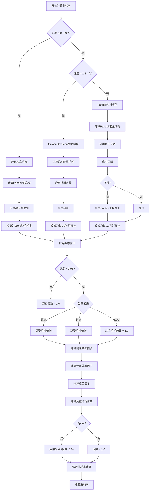
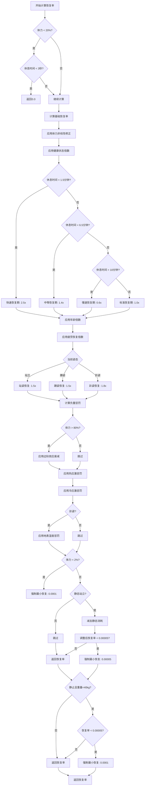
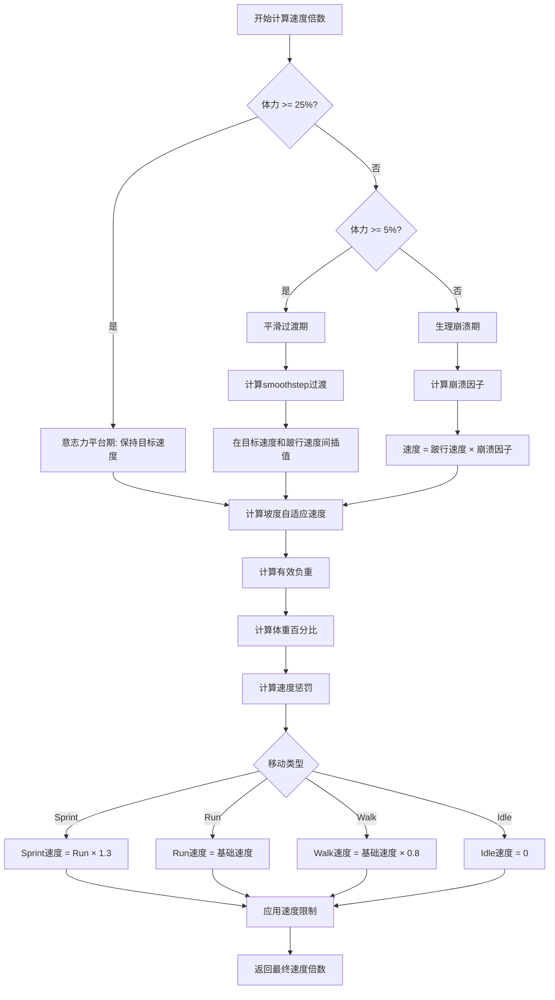
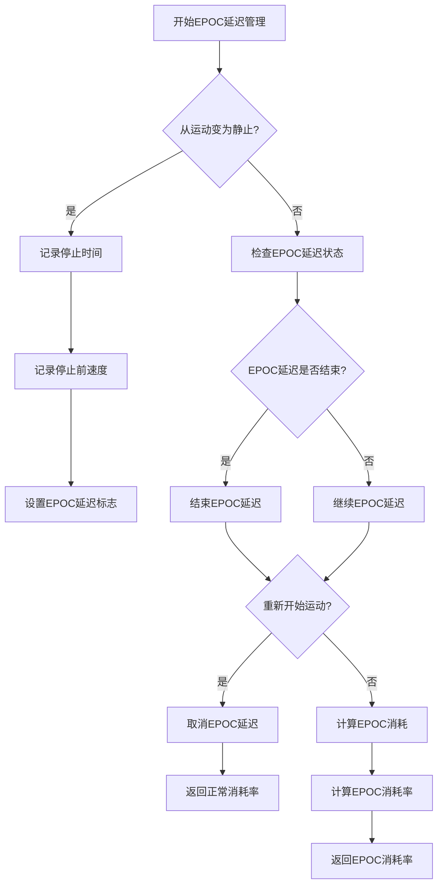

# 数字孪生优化器计算逻辑文档

## 目录
- [一、系统架构](#一系统架构)
- [二、决策树](#二决策树)
- [三、核心公式](#三核心公式)
- [四、数值分类](#四数值分类)
  - [4.1 硬编码常量](#41-硬编码常量)

---

## 一、系统架构

### 1.1 模块结构

```
数字孪生优化器 (RSS Digital Twin)
├── 常量定义 (RSSConstants)
├── 环境因子 (EnvironmentFactor)
├── 移动类型 (MovementType)
├── 姿态 (Stance)
└── 数字孪生主类 (RSSDigitalTwin)
    ├── 静态站立消耗计算
    ├── Santee下坡修正
    ├── Pandolf能量消耗计算 (active)
    ├── Givoni-Goldman跑步模型 *(legacy, unused)*
    ├── 代谢效率因子计算
    ├── 健康状态效率因子计算
    ├── 负重体力消耗倍数计算
    ├── 消耗姿态倍数计算
    ├── 疲劳因子计算
    ├── 消耗率计算
    ├── 恢复率计算
    ├── 单步更新
    └── 场景模拟
```

### 1.2 更新周期

- **更新频率**: 每0.2秒执行一次
- **更新流程**: 速度检测 → EPOC延迟管理 → 消耗率计算 → 恢复率计算 → 净值计算 → 体力更新

---

## 二、决策树

### 2.1 主流程决策树

```mermaid
graph TD
    A[开始: 每0.2秒更新] --> B[检测速度变化]
    B --> C{从运动变为静止?}
    C -->|是| D[启动EPOC延迟]
    C -->|否| E[检查EPOC延迟状态]
    
    D --> F[记录停止时间]
    F --> G[记录停止前速度]
    
    E --> H{EPOC延迟是否结束?}
    H -->|是| I[结束EPOC延迟]
    H -->|否| J[继续EPOC延迟]
    
    I --> K[计算消耗率]
    J --> K
    
    K --> L{速度 < 0.1 m/s?}
    L -->|是| M[静态站立消耗]
    L -->|否| N{速度 > 2.2 m/s?}
    
    N -->|是| O[Givoni-Goldman跑步模型<br/>(已弃用，仅供历史参考)]
    N -->|否| P[Pandolf步行模型]
    
    M --> Q[应用姿态修正]
    O --> Q
    P --> Q
    
    Q --> R[应用效率因子]
    R --> S[应用疲劳因子]
    S --> T[应用Sprint倍数]
    
    T --> U[计算恢复率]
    U --> V{体力 < 20%?}
    V -->|是| W{休息时间 < 3秒?}
    V -->|否| X[继续计算]
    
    W -->|是| Y[返回0.0]
    W -->|否| X
    
    X --> Z[计算基础恢复率]
    Z --> AA[应用体力非线性修正]
    AA --> AB[应用健康状态倍数]
    AB --> AC{休息时间 < 1.5分钟?}
    
    AC -->|是| AD[快速恢复期: 2.5x]
    AC -->|否| AE{休息时间 < 6.5分钟?}
    AE -->|是| AF[中等恢复期: 1.4x]
    AE -->|否| AG{休息时间 > 10分钟?}
    AG -->|是| AH[慢速恢复期: 0.6x]
    AG -->|否| AI[标准恢复期: 1.0x]
    
    AD --> AJ[应用年龄倍数]
    AF --> AJ
    AH --> AJ
    AI --> AJ
    
    AJ --> AK[应用疲劳恢复倍数]
    AK --> AL{当前姿态}
    
    AL -->|站立| AM[站姿恢复: 1.5x]
    AL -->|蹲姿| AN[蹲姿恢复: 1.5x]
    AL -->|趴姿| AO[趴姿恢复: 1.8x]
    
    AM --> AP[计算负重惩罚]
    AN --> AP
    AO --> AP
    
    AP --> AQ{体力 > 80%?}
    AQ -->|是| AR[应用边际效应衰减]
    AQ -->|否| AS[跳过]
    
    AR --> AT[应用热应激惩罚]
    AS --> AT
    AT --> AU[应用冷应激惩罚]
    AU --> AV{趴姿?}
    
    AV -->|是| AW[应用地表湿度惩罚]
    AV -->|否| AX[跳过]
    AW --> AX
    
    AX --> AY{体力 < 2%?}
    AY -->|是| AZ[强制最小恢复: 0.0001]
    AY -->|否| BA[返回恢复率]
    
    BA --> BB[计算净值: 恢复率 - 消耗率]
    AZ --> BB
    
    BB --> BC[更新体力值]
    BC --> BD[限制体力范围: 0.0-1.0]
    BD --> BE[结束]
```

### 2.2 消耗率计算决策树



### 2.3 恢复率计算决策树



### 2.4 速度计算决策树



### 2.5 EPOC延迟管理决策树



---

## 三、核心公式

### 3.1 Pandolf能量消耗模型

**完整公式**:
```python
# W/kg 基础项
base_term = (vb * (1.0 - 0.2 * fit)) + (vc * (vt * vt))

# W/kg 坡度项
g_dec = grade_percent * 0.01
vsq = velocity * velocity
grade_term = g_dec * (gb + gv * vsq)

# Santee下坡修正
if grade_percent < 0 and abs(grade_percent) > 15:
    santee = 1.0 - (abs(grade_percent) * (1.0 - abs(grade_percent) / 15.0) / 2.0)
    grade_term = grade_term / santee

# 总能量消耗 (W/kg)
energy_per_kg = (base_term + grade_term) * terrain_factor

# 转换为总瓦特数
w_mult = clip(current_weight / ref, 0.5, 2.0)
total_watts = energy_per_kg * ref * w_mult

# 转换为体力消耗率
rate = total_watts * ENERGY_TO_STAMINA_COEFF
```

**参数说明**:
- `vb`: PANDOLF_BASE_COEFF (2.7)
- `vc`: PANDOLF_VELOCITY_COEFF (3.2)
- `v0`: PANDOLF_VELOCITY_OFFSET (0.7)
- `gb`: PANDOLF_GRADE_BASE_COEFF (0.23)
- `gv`: PANDOLF_GRADE_VELOCITY_COEFF (1.34)
- `fit`: FITNESS_LEVEL (1.0)
- `ref`: REFERENCE_WEIGHT (90.0)
- `terrain_factor`: 地形系数 (0.5-3.0)
- `ENERGY_TO_STAMINA_COEFF`: 3.5e-05

**文件位置**: [rss_digital_twin_fix.py#L185-L226](f\tools\rss_digital_twin_fix.py#L185-L226)

---

### 3.2 Givoni-Goldman跑步模型 *(已弃用，Pandolf 模型现为唯一活跃路径)*

> **注意**：本公式仅在历史版本中使用。当前优化器和运行时逻辑已完全放弃此模型，
> 所有新生成的配置将不会触发该代码路径。此处保留以便阅读和迁移旧数据。

**公式**:
```python
# 负重倍数
w_mult = clip(current_weight / ref, 0.5, 2.0)

# 速度的指数
vp = power(velocity, GIVONI_VELOCITY_EXPONENT)

# 总能量消耗 (Watts)
total_watts = w_mult * GIVONI_CONSTANT * vp * ref

# 转换为体力消耗率
rate = total_watts * ENERGY_TO_STAMINA_COEFF
```

**参数说明**:
- `GIVONI_CONSTANT`: 0.6
- `GIVONI_VELOCITY_EXPONENT`: 2.2
- `ref`: REFERENCE_WEIGHT (90.0)
- `ENERGY_TO_STAMINA_COEFF`: 3.5e-05

**文件位置**: [rss_digital_twin_fix.py#L228-L246](f\tools\rss_digital_twin_fix.py#L228-L246)

---

### 3.3 静态站立消耗

**Pandolf静态项公式**:
```python
# 基础项 (Watts)
base = c1 * body_weight

# 负重项 (Watts)
if body_weight > 0 and load_weight > 0:
    r = load_weight / body_weight
    load_term = c2 * (body_weight + load_weight) * (r * r)
else:
    load_term = 0.0

# 总静态消耗 (Watts)
static_watts = base + load_term

# 转换为体力消耗率
rate = static_watts * ENERGY_TO_STAMINA_COEFF
```

**参数说明**:
- `c1`: PANDOLF_STATIC_COEFF_1 (1.2)
- `c2`: PANDOLF_STATIC_COEFF_2 (1.6)
- `body_weight`: CHARACTER_WEIGHT (90.0)
- `load_weight`: 负重 (kg)
- `ENERGY_TO_STAMINA_COEFF`: 3.5e-05

**文件位置**: [rss_digital_twin_fix.py#L160-L174](f\tools\rss_digital_twin_fix.py#L160-L174)

---

### 3.4 Santee下坡修正

**公式**:
```python
if grade_percent >= 0:
    return 1.0  # 上坡或平地，不需要修正

ab = abs(grade_percent)

if ab <= 15.0:
    return 1.0  # 缓坡，不需要修正

# 陡坡（超过-15%）
term = ab * (1.0 - ab / 15.0) / 2.0
correction_factor = 1.0 - term
return clip(correction_factor, 0.5, 1.0)
```

**参数说明**:
- `grade_percent`: 坡度百分比（例如 -15% = -15.0）
- 返回值: 修正系数 (0.5-1.0)

**文件位置**: [rss_digital_twin_fix.py#L176-L183](f\tools\rss_digital_twin_fix.py#L176-L183)

---

### 3.5 负重体力消耗倍数

**公式**:
```python
# 有效负重
base = BASE_WEIGHT  # 1.36 kg
eff = max(current_weight - base, 0.0)

# 体重百分比
bw = CHARACTER_WEIGHT  # 90.0 kg
body_mass_percent = eff / bw

# 消耗倍数
coeff = ENCUMBRANCE_STAMINA_DRAIN_COEFF  # 2.0
mult = 1.0 + coeff * body_mass_percent

return clip(mult, 1.0, 3.0)
```

**参数说明**:
- `BASE_WEIGHT`: 1.36 kg
- `CHARACTER_WEIGHT`: 90.0 kg
- `ENCUMBRANCE_STAMINA_DRAIN_COEFF`: 2.0

**示例计算**:
- 30kg负重 (有效负重 = 28.64kg, 体重百分比 = 0.318)
- 消耗倍数 = 1.0 + 2.0 × 0.318 = 1.636倍 (增加63.6%消耗)

**文件位置**: [rss_digital_twin_fix.py#L266-L272](f\tools\rss_digital_twin_fix.py#L266-L272)

---

### 3.6 姿态消耗倍数

**公式**:
```python
if speed <= 0.05:
    return 1.0  # 静止时无姿态修正

if stance == Stance.CROUCH:
    speed_crouch = POSTURE_CROUCH_MULTIPLIER  # 0.7
    mult = 1.0 / max(speed_crouch, 0.4)
    return min(mult, 1.0) * 2.5

if stance == Stance.PRONE:
    speed_prone = POSTURE_PRONE_MULTIPLIER  # 0.3
    mult = 1.0 / max(speed_prone, 0.2)
    return min(mult, 1.0) * 5.0

return 1.0  # 站立姿态
```

**参数说明**:
- `POSTURE_CROUCH_MULTIPLIER`: 0.7
- `POSTURE_PRONE_MULTIPLIER`: 0.3

**文件位置**: [rss_digital_twin_fix.py#L274-L283](f\tools\rss_digital_twin_fix.py#L274-L283)

---

### 3.7 代谢效率因子

**公式**:
```python
aero = AEROBIC_THRESHOLD  # 0.6
anao = ANAEROBIC_THRESHOLD  # 0.8
fa = AEROBIC_EFFICIENCY_FACTOR  # 0.9
fn = ANAEROBIC_EFFICIENCY_FACTOR  # 1.2

if speed_ratio < aero:
    return fa  # 有氧区: 0.9x

if speed_ratio < anao:
    t = (speed_ratio - aero) / (anao - aero)
    return fa + t * (fn - fa)  # 混合区插值

return fn  # 无氧区: 1.2x
```

**参数说明**:
- `AEROBIC_THRESHOLD`: 0.6
- `ANAEROBIC_THRESHOLD`: 0.8
- `AEROBIC_EFFICIENCY_FACTOR`: 0.9
- `ANAEROBIC_EFFICIENCY_FACTOR`: 1.2

**文件位置**: [rss_digital_twin_fix.py#L248-L258](f\tools\rss_digital_twin_fix.py#L248-L258)

---

### 3.8 健康状态效率因子

**公式**:
```python
c = FITNESS_EFFICIENCY_COEFF  # 0.35
lvl = FITNESS_LEVEL  # 1.0

f = 1.0 - c * lvl

return clip(f, 0.7, 1.0)
```

**参数说明**:
- `FITNESS_EFFICIENCY_COEFF`: 0.35
- `FITNESS_LEVEL`: 1.0

**文件位置**: [rss_digital_twin_fix.py#L260-L264](f\tools\rss_digital_twin_fix.py#L260-L264)

---

### 3.9 疲劳因子

**公式**:
```python
start = FATIGUE_START_TIME_MINUTES  # 5.0
coeff = FATIGUE_ACCUMULATION_COEFF  # 0.015
mx = FATIGUE_MAX_FACTOR  # 2.0

eff = max(0.0, exercise_duration_minutes - start)
f = 1.0 + coeff * eff

return clip(f, 1.0, mx)
```

**参数说明**:
- `FATIGUE_START_TIME_MINUTES`: 5.0
- `FATIGUE_ACCUMULATION_COEFF`: 0.015
- `FATIGUE_MAX_FACTOR`: 2.0
- `exercise_duration_minutes`: 运动持续时间（分钟）

**文件位置**: [rss_digital_twin_fix.py#L285-L291](f\tools\rss_digital_twin_fix.py#L285-L291)

---

### 3.10 综合消耗率计算

**公式**:
```python
# 速度比率
speed_ratio = clip(speed / GAME_MAX_SPEED, 0.0, 1.0)

# 负重消耗倍数
enc_mult = _encumbrance_stamina_drain_multiplier(current_weight)

# 姿态修正
posture = _consumption_posture_multiplier(speed, stance)

# 效率因子
total_eff = _fitness_efficiency_factor() * _metabolic_efficiency_factor(speed_ratio)

# 疲劳因子
fatigue = _fatigue_factor()

# Sprint 多余，Pandolf模型涵盖所有速度阶段

# 静态站立消耗
if speed < 0.1:
    load_weight = max(current_weight - body_weight, 0.0)
    static_per_s = _static_standing_cost(body_weight, load_weight)
    raw = static_per_s * 0.2

# 所有移动使用 Pandolf 模型
if speed < 0.1:
    load_weight = max(current_weight - body_weight, 0.0)
    static_per_s = _static_standing_cost(body_weight, load_weight)
    raw = static_per_s * 0.2
else:
    pandolf_per_s = _pandolf_expenditure(speed, current_weight, grade_percent, terrain_factor) * (1.0 + wind_drag)
    raw = pandolf_per_s * 0.2

# 基础消耗（用于恢复计算）
base_for_recovery = max(0.0, raw)

# 综合消耗
if raw <= 0.0:
    base = 0.0
else:
    base = raw * posture * total_eff * fatigue

# 速度线性项
speed_linear = 0.00005 * speed_ratio * total_eff * fatigue

# 速度平方项
speed_sq = 0.0002 * speed_ratio * speed_ratio * total_eff * fatigue

# 负重基础项
enc_base = 0.001 * (enc_mult - 1.0)

# 负重速度项
enc_speed = 0.0002 * (enc_mult - 1.0) * speed_ratio * speed_ratio

# 综合消耗
components = base + speed_linear + speed_sq + enc_base + enc_speed
total_drain = components

return (base_for_recovery, total_drain)
```

**参数说明**:
- `GAME_MAX_SPEED`: 5.2 m/s
- `SPRINT_VELOCITY_THRESHOLD`: 5.2 m/s
- `SPRINT_STAMINA_DRAIN_MULTIPLIER`: 3.0

**文件位置**: [rss_digital_twin_fix.py#L293-L339](f\tools\rss_digital_twin_fix.py#L293-L339)

---

### 3.11 恢复率计算

**基础恢复率**:
```python
stamina_percent_clamped = clip(stamina_percent, 0.0, 1.0)

base_recovery_rate = BASE_RECOVERY_RATE  # 0.00035

recovery_nonlinear_coeff = RECOVERY_NONLINEAR_COEFF  # 0.5
stamina_recovery_multiplier = 1.0 + (recovery_nonlinear_coeff * (1.0 - stamina_percent_clamped))
recovery_rate = base_recovery_rate * stamina_recovery_multiplier
```

**健康状态倍数**:
```python
fitness_recovery_multiplier = 1.0 + (FITNESS_RECOVERY_COEFF * FITNESS_LEVEL)
fitness_recovery_multiplier = clip(fitness_recovery_multiplier, 1.0, 1.5)
recovery_rate *= fitness_recovery_multiplier
```

**休息时间倍数**:
```python
if rest_duration_minutes <= FAST_RECOVERY_DURATION_MINUTES:  # 1.5
    recovery_rate *= FAST_RECOVERY_MULTIPLIER  # 2.5x

elif rest_duration_minutes <= FAST_RECOVERY_DURATION_MINUTES + MEDIUM_RECOVERY_DURATION_MINUTES:  # 6.5
    recovery_rate *= MEDIUM_RECOVERY_MULTIPLIER  # 1.4x

elif rest_duration_minutes >= 10.0:
    transition_duration = 10.0
    transition_progress = min((rest_duration_minutes - 10.0) / transition_duration, 1.0)
    slow_recovery_multiplier = 1.0 - (transition_progress * (1.0 - SLOW_RECOVERY_MULTIPLIER))
    recovery_rate *= slow_recovery_multiplier
```

**姿态恢复倍数**:
```python
if stance == Stance.STAND:
    recovery_rate *= STANDING_RECOVERY_MULTIPLIER  # 1.5x

elif stance == Stance.CROUCH:
    recovery_rate *= CROUCHING_RECOVERY_MULTIPLIER  # 1.5x

elif stance == Stance.PRONE:
    recovery_rate *= PRONE_RECOVERY_MULTIPLIER  # 1.8x
```

**负重惩罚**:
```python
current_weight_for_recovery = current_weight
if stance == Stance.PRONE:
    current_weight_for_recovery = CHARACTER_WEIGHT  # 90.0 kg

if current_weight_for_recovery > 0.0:
    load_ratio = current_weight_for_recovery / 30.0
    load_ratio = clip(load_ratio, 0.0, 2.0)
    load_recovery_penalty = (load_ratio ** LOAD_RECOVERY_PENALTY_EXPONENT) * LOAD_RECOVERY_PENALTY_COEFF
    recovery_rate -= load_recovery_penalty
```

**边际效应衰减**:
```python
threshold = MARGINAL_DECAY_THRESHOLD  # 0.8
coeff = MARGINAL_DECAY_COEFF  # 1.1

if stamina_percent_clamped > threshold:
    excess = stamina_percent_clamped - threshold
    max_excess = 1.0 - threshold
    if max_excess > 0:
        decay_factor = (excess / max_excess) * (coeff - 1.0)
        marginal_decay_multiplier = max(1.0 - decay_factor, 0.2)
        recovery_rate *= marginal_decay_multiplier
```

**环境因子修正**:
```python
if environment_factor:
    # 热应激惩罚
    heat_coeff = ENV_TEMPERATURE_HEAT_PENALTY_COEFF  # 0.02
    heat_stress_penalty = environment_factor.heat_stress * heat_coeff
    recovery_rate *= (1.0 - min(heat_stress_penalty, 0.5))
    
    # 冷应激惩罚
    cold_coeff = ENV_TEMPERATURE_COLD_RECOVERY_PENALTY_COEFF  # 0.05
    cold_stress_penalty = environment_factor.cold_stress * cold_coeff
    recovery_rate *= (1.0 - min(cold_stress_penalty, 0.5))
    
    # 地表湿度惩罚（趴姿）
    if stance == Stance.PRONE:
        wetness_max = ENV_SURFACE_WETNESS_PENALTY_MAX  # 0.15
        surface_wetness_penalty = environment_factor.surface_wetness * wetness_max
        recovery_rate *= (1.0 - surface_wetness_penalty)
```

**最低体力保护**:
```python
if stamina_percent < 0.02:  # 2%
    recovery_rate = max(recovery_rate, 0.0001)
```

**静态消耗处理**:
```python
if base_drain_rate > 0.0 and current_speed < 0.1:
    adjusted_recovery_rate = recovery_rate - base_drain_rate
    if adjusted_recovery_rate < 0.00005:
        recovery_rate = 0.00005
    else:
        recovery_rate = adjusted_recovery_rate

elif base_drain_rate < 0.0:
    recovery_rate += abs(base_drain_rate)
```

**静态保护**:
```python
if current_speed < 0.1 and current_weight < 40.0 and recovery_rate < 0.00005:
    recovery_rate = 0.0001
```

**文件位置**: [rss_digital_twin_fix.py#L341-L441](f\tools\rss_digital_twin_fix.py#L341-L441)

---

### 3.12 EPOC消耗计算

**公式**:
```python
if is_in_epoc_delay:
    epoc_delay_duration = current_time - epoc_delay_start_time
    if epoc_delay_duration >= EPOC_DELAY_SECONDS:  # 0.5秒
        is_in_epoc_delay = False
        epoc_delay_start_time = -1.0
    
    # EPOC消耗率
    speed_ratio = clip(speed_before_stop / 5.2, 0, 1)
    epoc_drain_rate = EPOC_DRAIN_RATE * (1.0 + speed_ratio * 0.5)
    total_drain = max(total_drain, epoc_drain_rate)
```

**参数说明**:
- `EPOC_DELAY_SECONDS`: 0.5
- `EPOC_DRAIN_RATE`: 0.001

**文件位置**: [rss_digital_twin_fix.py#L487-L490](f\tools\rss_digital_twin_fix.py#L487-L490)

---

### 3.13 速度惩罚计算

**公式**:
```python
# 姿态速度倍数
posture_speed_mult = 1.0
if stance == Stance.CROUCH:
    posture_speed_mult = POSTURE_CROUCH_MULTIPLIER  # 0.7
elif stance == Stance.PRONE:
    posture_speed_mult = POSTURE_PRONE_MULTIPLIER  # 0.3

# 有效负重
base_weight = BASE_WEIGHT  # 1.36 kg
body_weight = CHARACTER_WEIGHT  # 90.0 kg
effective_weight = max(current_weight - body_weight - base_weight, 0.0)

# 体重百分比
body_mass_percent = effective_weight / body_weight if body_weight > 0.0 else 0.0

# 速度惩罚
coeff = ENCUMBRANCE_SPEED_PENALTY_COEFF  # 0.20
speed_penalty = coeff * body_mass_percent
speed_penalty = clip(speed_penalty, 0.0, 0.5)

# 有效速度
effective_speed = speed * posture_speed_mult * (1.0 - speed_penalty)
```

**参数说明**:
- `BASE_WEIGHT`: 1.36 kg
- `CHARACTER_WEIGHT`: 90.0 kg
- `ENCUMBRANCE_SPEED_PENALTY_COEFF`: 0.20

**文件位置**: [rss_digital_twin_fix.py#L560-L568](f\tools\rss_digital_twin_fix.py#L560-L568)

---

## 四、数值分类

### 4.1 硬编码常量

以下常量在代码中硬编码，无法通过配置文件修改：

#### 4.1.1 基础游戏参数

| 常量名 | 数值 | 说明 | 文件位置 |
|--------|------|------|----------|
| `GAME_MAX_SPEED` | 5.2 | 游戏最大速度 (m/s) | [rss_digital_twin_fix.py#L22](f\tools\rss_digital_twin_fix.py#L22) |
| `CHARACTER_WEIGHT` | 90.0 | 角色体重 (kg) | [rss_digital_twin_fix.py#L23](f\tools\rss_digital_twin_fix.py#L23) |
| `REFERENCE_WEIGHT` | 90.0 | 参考体重 (kg) | [rss_digital_twin_fix.py#L24](f\tools\rss_digital_twin_fix.py#L24) |

#### 4.1.2 医学模型参数

| 常量名 | 数值 | 说明 | 文件位置 |
|--------|------|------|----------|
| `PANDOLF_VELOCITY_COEFF` | 3.2 | Pandolf速度系数 (W/kg) | [rss_digital_twin_fix.py#L27](f\tools\rss_digital_twin_fix.py#L27) |
| `PANDOLF_VELOCITY_OFFSET` | 0.7 | Pandolf速度偏移 (m/s) | [rss_digital_twin_fix.py#L28](f\tools\rss_digital_twin_fix.py#L28) |
| `PANDOLF_BASE_COEFF` | 2.7 | Pandolf基础系数 (W/kg) | [rss_digital_twin_fix.py#L29](f\tools\rss_digital_twin_fix.py#L29) |
| `PANDOLF_GRADE_BASE_COEFF` | 0.23 | Pandolf坡度基础系数 (W/kg) | [rss_digital_twin_fix.py#L30](f\tools\rss_digital_twin_fix.py#L30) |
| `PANDOLF_GRADE_VELOCITY_COEFF` | 1.34 | Pandolf坡度速度系数 (W/kg) | [rss_digital_twin_fix.py#L31](f\tools\rss_digital_twin_fix.py#L31) |
| `PANDOLF_STATIC_COEFF_1` | 1.2 | Pandolf静态基础系数 (W/kg) | [rss_digital_twin_fix.py#L32](f\tools\rss_digital_twin_fix.py#L32) |
| `PANDOLF_STATIC_COEFF_2` | 1.6 | Pandolf静态负重系数 (W/kg) | [rss_digital_twin_fix.py#L33](f\tools\rss_digital_twin_fix.py#L33) |
| `GIVONI_CONSTANT` | 0.6 | *(legacy, unused)* Givoni-Goldman跑步常数 (W/kg·m²/s²) | [rss_digital_twin_fix.py#L35](f\tools\rss_digital_twin_fix.py#L35) |
| `GIVONI_VELOCITY_EXPONENT` | 2.2 | *(legacy, unused)* Givoni-Goldman速度指数 | [rss_digital_twin_fix.py#L36](f\tools\rss_digital_twin_fix.py#L36) |

#### 4.1.3 能量转换参数

| 常量名 | 数值 | 说明 | 文件位置 |
|--------|------|------|----------|
| `ENERGY_TO_STAMINA_COEFF` | 3.5e-05 | 能量到体力转换系数 | [rss_digital_twin_fix.py#L43](f\tools\rss_digital_twin_fix.py#L43) |

#### 4.1.4 恢复系统参数

| 常量名 | 数值 | 说明 | 文件位置 |
|--------|------|------|----------|
| `BASE_RECOVERY_RATE` | 0.00035 | 基础恢复率（每0.2秒） | [rss_digital_twin_fix.py#L46](f\tools\rss_digital_twin_fix.py#L46) |
| `RECOVERY_NONLINEAR_COEFF` | 0.5 | 恢复非线性系数 | [rss_digital_twin_fix.py#L47](f\tools\rss_digital_twin_fix.py#L47) |
| `FAST_RECOVERY_DURATION_MINUTES` | 1.5 | 快速恢复期持续时间（分钟） | [rss_digital_twin_fix.py#L48](f\tools\rss_digital_twin_fix.py#L48) |
| `FAST_RECOVERY_MULTIPLIER` | 2.5 | 快速恢复期倍数 | [rss_digital_twin_fix.py#L49](f\tools\rss_digital_twin_fix.py#L49) |
| `MEDIUM_RECOVERY_DURATION_MINUTES` | 5.0 | 中等恢复期持续时间（分钟） | [rss_digital_twin_fix.py#L50](f\tools\rss_digital_twin_fix.py#L50) |
| `MEDIUM_RECOVERY_MULTIPLIER` | 1.4 | 中等恢复期倍数 | [rss_digital_twin_fix.py#L51](f\tools\rss_digital_twin_fix.py#L51) |
| `SLOW_RECOVERY_MULTIPLIER` | 0.6 | 慢速恢复期倍数 | [rss_digital_twin_fix.py#L52](f\tools\rss_digital_twin_fix.py#L52) |

#### 4.1.5 姿态恢复倍数

| 常量名 | 数值 | 说明 | 文件位置 |
|--------|------|------|----------|
| `STANDING_RECOVERY_MULTIPLIER` | 1.5 | 站姿恢复倍数 | [rss_digital_twin_fix.py#L55](f\tools\rss_digital_twin_fix.py#L55) |
| `CROUCHING_RECOVERY_MULTIPLIER` | 1.5 | 蹲姿恢复倍数 | [rss_digital_twin_fix.py#L56](f\tools\rss_digital_twin_fix.py#L56) |
| `PRONE_RECOVERY_MULTIPLIER` | 1.8 | 趴姿恢复倍数 | [rss_digital_twin_fix.py#L57](f\tools\rss_digital_twin_fix.py#L57) |

#### 4.1.6 负重惩罚参数

| 常量名 | 数值 | 说明 | 文件位置 |
|--------|------|------|----------|
| `BASE_WEIGHT` | 1.36 | 基准负重（kg） | [rss_digital_twin_fix.py#L60](f\tools\rss_digital_twin_fix.py#L60) |
| `ENCUMBRANCE_SPEED_PENALTY_COEFF` | 0.20 | 负重速度惩罚系数 | [rss_digital_twin_fix.py#L61](f\tools\rss_digital_twin_fix.py#L61) |
| `ENCUMBRANCE_STAMINA_DRAIN_COEFF` | 2.0 | 负重体力消耗系数 | [rss_digital_twin_fix.py#L62](f\tools\rss_digital_twin_fix.py#L62) |
| `LOAD_RECOVERY_PENALTY_COEFF` | 0.0004 | 负重恢复惩罚系数 | [rss_digital_twin_fix.py#L63](f\tools\rss_digital_twin_fix.py#L63) |
| `LOAD_RECOVERY_PENALTY_EXPONENT` | 2.0 | 负重恢复惩罚指数 | [rss_digital_twin_fix.py#L64](f\tools\rss_digital_twin_fix.py#L64) |

#### 4.1.7 阈值参数

| 常量名 | 数值 | 说明 | 文件位置 |
|--------|------|------|----------|
| `SPRINT_VELOCITY_THRESHOLD` | 5.2 | Sprint速度阈值 (m/s) | [rss_digital_twin_fix.py#L67](f\tools\rss_digital_twin_fix.py#L67) |
| `RUN_VELOCITY_THRESHOLD` | 3.7 | Run速度阈值 (m/s) | [rss_digital_twin_fix.py#L68](f\tools\rss_digital_twin_fix.py#L68) |

#### 4.1.8 Sprint参数

| 常量名 | 数值 | 说明 | 文件位置 |
|--------|------|------|----------|
| `SPRINT_STAMINA_DRAIN_MULTIPLIER` | 3.0 | Sprint体力消耗倍数 | [rss_digital_twin_fix.py#L71](f\tools\rss_digital_twin_fix.py#L71) |
| `SPRINT_SPEED_BOOST` | 0.30 | Sprint速度加成（30%） | [rss_digital_twin_fix.py#L72](f\tools\rss_digital_twin_fix.py#L72) |

#### 4.1.9 疲劳参数

| 常量名 | 数值 | 说明 | 文件位置 |
|--------|------|------|----------|
| `FATIGUE_ACCUMULATION_COEFF` | 0.015 | 疲劳累积系数 | [rss_digital_twin_fix.py#L75](f\tools\rss_digital_twin_fix.py#L75) |
| `FATIGUE_MAX_FACTOR` | 2.0 | 最大疲劳因子 | [rss_digital_twin_fix.py#L76](f\tools\rss_digital_twin_fix.py#L76) |

#### 4.1.10 代谢效率参数

| 常量名 | 数值 | 说明 | 文件位置 |
|--------|------|------|----------|
| `AEROBIC_THRESHOLD` | 0.6 | 有氧阈值 | [rss_digital_twin_fix.py#L38](f\tools\rss_digital_twin_fix.py#L38) |
| `ANAEROBIC_THRESHOLD` | 0.8 | 无氧阈值 | [rss_digital_twin_fix.py#L39](f\tools\rss_digital_twin_fix.py#L39) |
| `AEROBIC_EFFICIENCY_FACTOR` | 0.9 | 有氧区效率因子 | [rss_digital_twin_fix.py#L79](f\tools\rss_digital_twin_fix.py#L79) |
| `ANAEROBIC_EFFICIENCY_FACTOR` | 1.2 | 无氧区效率因子 | [rss_digital_twin_fix.py#L80](f\tools\rss_digital_twin_fix.py#L80) |

#### 4.1.11 Fitness参数

| 常量名 | 数值 | 说明 | 文件位置 |
|--------|------|------|----------|
| `FATIGUE_START_TIME_MINUTES` | 5.0 | 疲劳开始时间（分钟） | [rss_digital_twin_fix.py#L40](f\tools\rss_digital_twin_fix.py#L40) |
| `FITNESS_LEVEL` | 1.0 | 健康状态水平 | [rss_digital_twin_fix.py#L109](f\tools\rss_digital_twin_fix.py#L109) |
| `FITNESS_EFFICIENCY_COEFF` | 0.35 | 健康状态效率系数 | [rss_digital_twin_fix.py#L110](f\tools\rss_digital_twin_fix.py#L110) |
| `FITNESS_RECOVERY_COEFF` | 0.25 | 健康状态恢复系数 | [rss_digital_twin_fix.py#L111](f\tools\rss_digital_twin_fix.py#L111) |

#### 4.1.12 姿态移动速度倍数

| 常量名 | 数值 | 说明 | 文件位置 |
|--------|------|------|----------|
| `POSTURE_CROUCH_MULTIPLIER` | 0.7 | 蹲姿速度倍数 | [rss_digital_twin_fix.py#L83](f\tools\rss_digital_twin_fix.py#L83) |
| `POSTURE_PRONE_MULTIPLIER` | 0.3 | 趴姿速度倍数 | [rss_digital_twin_fix.py#L84](f\tools\rss_digital_twin_fix.py#L84) |

#### 4.1.13 动作消耗参数

| 常量名 | 数值 | 说明 | 文件位置 |
|--------|------|------|----------|
| `JUMP_STAMINA_BASE_COST` | 0.035 | 跳跃基础消耗 | [rss_digital_twin_fix.py#L87](f\tools\rss_digital_twin_fix.py#L87) |
| `VAULT_STAMINA_START_COST` | 0.02 | 翻越起始消耗 | [rss_digital_twin_fix.py#L88](f\tools\rss_digital_twin_fix.py#L88) |
| `CLIMB_STAMINA_TICK_COST` | 0.01 | 持续攀爬消耗 | [rss_digital_twin_fix.py#L89](f\tools\rss_digital_twin_fix.py#L89) |
| `JUMP_CONSECUTIVE_PENALTY` | 0.5 | 连续跳跃惩罚系数 | [rss_digital_twin_fix.py#L90](f\tools\rss_digital_twin_fix.py#L90) |

#### 4.1.14 环境参数

| 常量名 | 数值 | 说明 | 文件位置 |
|--------|------|------|----------|
| `ENV_HEAT_STRESS_MAX_MULTIPLIER` | 1.5 | 热应激最大倍数 | [rss_digital_twin_fix.py#L93](f\tools\rss_digital_twin_fix.py#L93) |
| `ENV_TEMPERATURE_HEAT_PENALTY_COEFF` | 0.02 | 热应激惩罚系数 | [rss_digital_twin_fix.py#L94](f\tools\rss_digital_twin_fix.py#L94) |
| `ENV_TEMPERATURE_COLD_RECOVERY_PENALTY_COEFF` | 0.05 | 冷应激恢复惩罚系数 | [rss_digital_twin_fix.py#L95](f\tools\rss_digital_twin_fix.py#L95) |
| `ENV_SURFACE_WETNESS_PENALTY_MAX` | 0.15 | 地表湿度惩罚最大值 | [rss_digital_twin_fix.py#L96](f\tools\rss_digital_twin_fix.py#L96) |

#### 4.1.15 高级恢复参数

| 常量名 | 数值 | 说明 | 文件位置 |
|--------|------|------|----------|
| `MARGINAL_DECAY_THRESHOLD` | 0.8 | 边际效应衰减阈值 | [rss_digital_twin_fix.py#L99](f\tools\rss_digital_twin_fix.py#L99) |
| `MARGINAL_DECAY_COEFF` | 1.1 | 边际效应衰减系数 | [rss_digital_twin_fix.py#L100](f\tools\rss_digital_twin_fix.py#L100) |
| `MIN_RECOVERY_STAMINA_THRESHOLD` | 0.2 | 最低恢复体力阈值 | [rss_digital_twin_fix.py#L101](f\tools\rss_digital_twin_fix.py#L101) |
| `MIN_RECOVERY_REST_TIME_SECONDS` | 3.0 | 最低体力时需要的休息时间（秒） | [rss_digital_twin_fix.py#L102](f\tools\rss_digital_twin_fix.py#L102) |

#### 4.1.16 EPOC参数

| 常量名 | 数值 | 说明 | 文件位置 |
|--------|------|------|----------|
| `EPOC_DELAY_SECONDS` | 0.5 | EPOC延迟时间（秒） | [rss_digital_twin_fix.py#L105](f\tools\rss_digital_twin_fix.py#L105) |
| `EPOC_DRAIN_RATE` | 0.001 | EPOC期间基础消耗率 | [rss_digital_twin_fix.py#L106](f\tools\rss_digital_twin_fix.py#L106) |

#### 4.1.17 场景模拟参数

| 常量名 | 数值 | 说明 | 文件位置 |
|--------|------|------|----------|
| `_cache_size` | 10000 | 缓存大小 | [rss_digital_twin_fix.py#L137](f\tools\rss_digital_twin_fix.py#L137) |
| `_scenario_cache` | {} | 场景缓存 | [rss_digital_twin_fix.py#L137](f\tools\rss_digital_twin_fix.py#L137) |
| `max_history_length` | 5000 | 最大历史长度 | [rss_digital_twin_fix.py#L158](f\tools\rss_digital_twin_fix.py#L158) |

---

## 附录

### A. 测试场景

#### A.1 ACFT 2英里测试

**场景配置**:
```python
speed_profile = [(0, 3.7), (927, 3.7)]  # 3.7m/s 跑927秒
current_weight = 90.0 + 0.0  # 空载
grade_percent = 0.0
terrain_factor = 1.0
stance = Stance.STAND
movement_type = MovementType.RUN
```

**验证标准**:
- 完成时间: ≤ 950秒（目标927秒）
- 最低体力: ≥ 0.2

**文件位置**: [rss_digital_twin_fix.py#L595-L628](f\tools\rss_digital_twin_fix.py#L595-L628)

#### A.2 静态负重测试

**场景配置**:
```python
speed_profile = [(0, 0.0), (10, 0.0)]  # 站立不动10秒
current_weight = 90.0 + 29.0  # 29kg负重
grade_percent = 0.0
terrain_factor = 1.0
stance = Stance.STAND
movement_type = MovementType.IDLE
```

**验证标准**:
- 初始体力: 0.5
- 最终体力: > 0.5（应该恢复）

**文件位置**: [rss_digital_twin_fix.py#L632-L664](f\tools\rss_digital_twin_fix.py#L632-L664)

#### A.3 城市战斗场景

**场景配置**:
```python
speed_profile = [(0, 2.5), (60, 3.7), (120, 2.5), (180, 2.5), (210, 2.5), (300, 2.5)]
current_weight = 90.0 + 30.0  # 30kg负重
grade_percent = 0.0
terrain_factor = 1.2
stance = Stance.STAND
movement_type = MovementType.RUN
```

**验证标准**:
- 完成时间: 300秒
- 体力消耗: 30-70%

**文件位置**: [rss_digital_twin_fix.py#L668-L701](f\tools\rss_digital_twin_fix.py#L668-L701)

#### A.4 山地战斗场景

**场景配置**:
```python
speed_profile = [(0, 1.8), (120, 2.5), (240, 1.8), (360, 1.8)]
current_weight = 90.0 + 25.0  # 25kg负重
grade_percent = 15.0
terrain_factor = 1.5
stance = Stance.STAND
movement_type = MovementType.WALK
```

**验证标准**:
- 完成时间: 360秒
- 体力消耗: 20-60%

**文件位置**: [rss_digital_twin_fix.py#L705-L738](f\tools\rss_digital_twin_fix.py#L705-L738)

#### A.5 重载撤离场景

**场景配置**:
```python
speed_profile = [(0, 2.5), (90, 3.2), (180, 2.5), (270, 2.5)]
current_weight = 90.0 + 40.0  # 40kg负重
grade_percent = 5.0
terrain_factor = 1.3
stance = Stance.STAND
movement_type = MovementType.RUN
```

**验证标准**:
- 完成时间: 270秒
- 体力消耗: 30-70%

**文件位置**: [rss_digital_twin_fix.py#L742-L775](f\tools\rss_digital_twin_fix.py#L742-L775)

### B. 枚举定义

#### B.1 MovementType

```python
class MovementType:
    IDLE = 0
    WALK = 1
    RUN = 2
    SPRINT = 3
```

**文件位置**: [rss_digital_twin_fix.py#L125-L129](f\tools\rss_digital_twin_fix.py#L125-L129)

#### B.2 Stance

```python
class Stance:
    STAND = 0
    CROUCH = 1
    PRONE = 2
```

**文件位置**: [rss_digital_twin_fix.py#L131-L134](f\tools\rss_digital_twin_fix.py#L131-L134)

### C. 环境因子类

```python
class EnvironmentFactor:
    def __init__(self, constants):
        self.constants = constants
        self.heat_stress = 0.0
        self.cold_stress = 0.0
        self.surface_wetness = 0.0
```

**文件位置**: [rss_digital_twin_fix.py#L118-L124](f\tools\rss_digital_twin_fix.py#L118-L124)

### D. 数字孪生主类

```python
class RSSDigitalTwin:
    def __init__(self, constants):
        self.constants = constants
        self.environment_factor = EnvironmentFactor(constants)
        self.reset()
    
    def reset(self):
        self.stamina = 1.0
        self.stamina_history = []
        self.speed_history = []
        self.time_history = []
        self.current_time = 0.0
        self.last_speed = 0.0
        self.epoc_delay_start_time = -1.0
        self.is_in_epoc_delay = False
        self.speed_before_stop = 0.0
        self.rest_duration_minutes = 0.0
        self.exercise_duration_minutes = 0.0
        self.last_movement_time = 0.0
        self.max_history_length = 5000
```

**文件位置**: [rss_digital_twin_fix.py#L136-L159](f\tools\rss_digital_twin_fix.py#L136-L159)

---

## 文档版本

- **版本**: 1.0
- **最后更新**: 2026-01-30
- **作者**: Realistic Stamina System Team

## 参考文档

- [rss_digital_twin_fix.py](f\tools\rss_digital_twin_fix.py) — 数字孪生仿真器，被 rss_super_pipeline.py 调用
- [rss_super_pipeline.py](f\tools\rss_super_pipeline.py) — 主优化流水线（内置多目标优化与约束）
